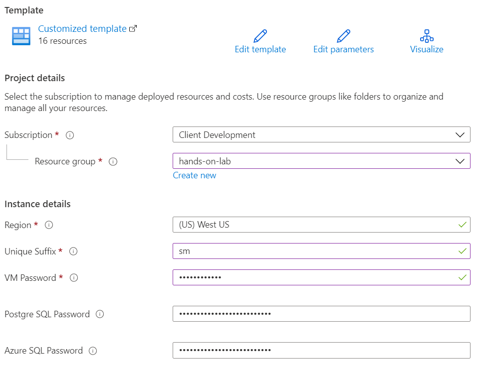
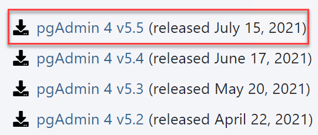
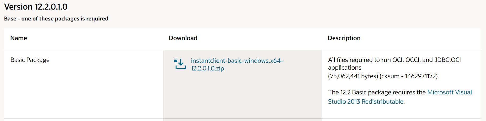
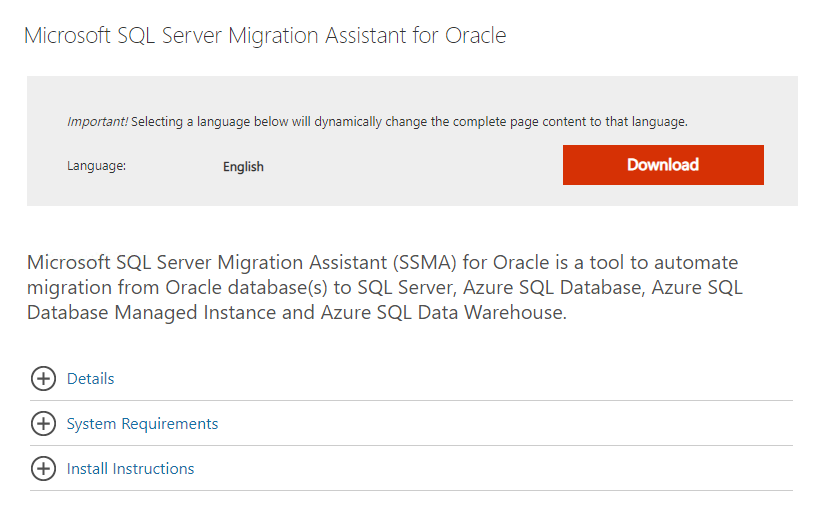
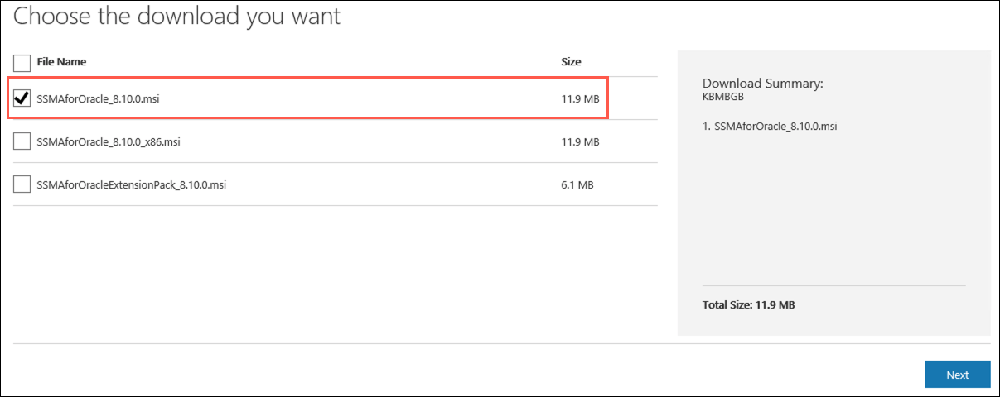
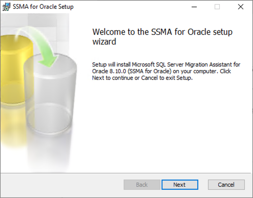
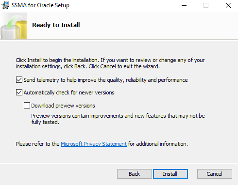

Migrating Oracle to Azure SQL and PostgreSQL

Before the hands-on lab setup guide

September 2021

Information in this document, including URL and other Internet Web site references, is subject to change without notice. Unless otherwise noted, the example companies, organizations, products, domain names, e-mail addresses, logos, people, places, and events depicted herein are fictitious, and no association with any real company, organization, product, domain name, e-mail address, logo, person, place or event is intended or should be inferred. Complying with all applicable copyright laws is the responsibility of the user. Without limiting the rights under copyright, no part of this document may be reproduced, stored in or introduced into a retrieval system, or transmitted in any form or by any means (electronic, mechanical, photocopying, recording, or otherwise), or for any purpose, without the express written permission of Microsoft Corporation.

Microsoft may have patents, patent applications, trademarks, copyrights, or other intellectual property rights covering subject matter in this document. Except as expressly provided in any written license agreement from Microsoft, the furnishing of this document does not give you any license to these patents, trademarks, copyrights, or other intellectual property.

The names of manufacturers, products, or URLs are provided for informational purposes only and Microsoft makes no representations and warranties, either expressed, implied, or statutory, regarding these manufacturers or the use of the products with any Microsoft technologies. The inclusion of a manufacturer or product does not imply endorsement of Microsoft of the manufacturer or product. Links may be provided to third party sites. Such sites are not under the control of Microsoft and Microsoft is not responsible for the contents of any linked site or any link contained in a linked site, or any changes or updates to such sites. Microsoft is not responsible for webcasting or any other form of transmission received from any linked site. Microsoft is providing these links to you only as a convenience, and the inclusion of any link does not imply endorsement of Microsoft of the site or the products contained therein.

© 2021 Microsoft Corporation. All rights reserved.

Microsoft and the trademarks listed at <https://www.microsoft.com/en-us/legal/intellectualproperty/Trademarks/Usage/General.aspx> are trademarks of the Microsoft group of companies. All other trademarks are property of their respective owners.

**Contents**

- [Migrating Oracle to Azure SQL and PostgreSQL before the hands-on lab setup guide](#migratingoracletoazuresql-andpostgresql-before-the-hands-on-lab-setup-guide)
  - [Requirements](#requirements)
  - [Before the hands-on lab](#before-the-hands-on-lab)
    - [Task 1: Provision a resource group](#task-1-provision-a-resource-group)
    - [Task 2: Register the Microsoft DataMigration resource provider](#task-2-register-the-microsoft-datamigration-resource-provider)
    - [Task 3: Deploy the Lab ARM Template](#task-3-deploy-the-lab-arm-template)
    - [Task 4: Connect to the Lab VM](#task-4-connect-to-the-lab-vm)
    - [Task 5: Install Oracle XE](#task-5-install-oracle-xe)
    - [Task 6: Install Oracle Data Access components](#task-6-install-oracle-data-access-components)
    - [Task 7: Install SQL Developer Tool](#task-7-install-sql-developer-tool)
    - [Task 8 (Migrate to PostgreSQL): Install pgAdmin on the LabVM](#task-8-migrate-to-postgresql-install-pgadmin-on-the-labvm)
    - [Task 9 (Migrate to PostgreSQL): Install the ora2pg utility](#task-9-migrate-to-postgresql-install-the-ora2pg-utility)
    - [Task 10 (Migrate to Azure SQL Optional Homogenous Migration): Connect to the SqlServer2008 VM](#task-10-migrate-to-azure-sql-optional-homogenous-migration-connect-to-the-sqlserver2008-vm)
    - [Task 11 (Migrate to Azure SQL Optional Homogenous Migration): Install Data Migration Assistant on the SQL Server 2008 VM](#task-11-migrate-to-azure-sql-optional-homogenous-migration-install-data-migration-assistant-on-the-sql-server-2008-vm)
    - [Task 12 (Migrate to Azure SQL): Install SQL Server Migration Assistant for Oracle on LabVM](#task-12-migrate-to-azure-sql-install-sql-server-migration-assistant-for-oracle-on-labvm)

# Migrating Oracle to Azure SQL and PostgreSQL before the hands-on lab setup guide

## Requirements

- Microsoft Azure subscription must be pay-as-you-go or MSDN.
  - Trial subscriptions will not work.
- A virtual machine configured with:
  - Visual Studio 2019 Community (latest release)

In this lab, there are three major migration paths:

  - Migrating Oracle to Azure SQL
  - Migrating SQL Server 2008 R2 Data Warehouse to Azure SQL (*homogenous* migration)
  - Migrating Oracle to Azure Database for PostgreSQL

Regardless of which path(s) you complete, follow Tasks 1-7. After that, the Task titles indicate which migration paths they are intended for.

## Before the hands-on lab

Duration: 45 minutes

In the Before the hands-on lab exercise, you will set up your environment for use in the rest of the hands-on lab. You should follow all the steps provided in the Before the hands-on lab section to prepare your environment **before attending** the hands-on lab. Failure to do so will significantly impact your ability to complete the lab within the time allowed.

> **Important**: Most Azure resources require unique names. Throughout this lab, you will see the word “SUFFIX” as part of resource names. You should replace this with your Microsoft alias, initials, or another value to ensure the resource is uniquely named.

### Task 1: Provision a resource group

In this task, you will create an Azure resource group for the resources used throughout this lab.

1. In the [Azure portal](https://portal.azure.com), select **Resource groups** from the Azure services list.

    

2. On the Resource groups blade, select **+Add**.

    

3. Enter the following in the Create an empty resource group blade:

    - **Subscription**: Select the subscription you are using for this hands-on lab.
    - **Resource group**: Enter hands-on-lab-SUFFIX.
    - **Region**: Select the region you would like to use for resources in this hands-on lab. Remember this location so you can use it for the other resources you'll provision throughout this lab.

    

4. Select **Review + Create**.

5. On the Review + Create tab, select **Create** to provision the resource group.

### Task 2: Register the Microsoft DataMigration resource provider

In this task, you will register the `Microsoft.DataMigration` resource provider with your subscription in Azure. Azure Database Migration Service is used for the optional homogenous data migration.

1. In the [Azure portal](https://portal.azure.com/), navigate to the Home page and then select **Subscriptions** from the Navigate list found midway down the page.

    

2. Select the subscription you are using for this hands-on lab from the list, select **Resource providers**, enter "migration" into the filter box, and then select **Register** next to **Microsoft.DataMigration**.

    

### Task 3: Deploy the Lab ARM Template 

This lab uses an ARM template to automate the setup of lab resources. In this task, you will learn how to configure the ARM template.

1. Select the **Deploy to Azure** button to open the ARM template in the Azure portal.

    

2. Before you deploy the ARM template, you need to provide multiple parameters.

   - **Subscription**: Select the Azure subscription you are using to complete the lab
   - **Resource group**: Select the hands-on-lab-SUFFIX resource group you created earlier
   - **Region**: This will auto-populate depending on the region you created your resource group in
   - **Unique Suffix**: Since certain Azure resources require globally unique names, provide a short suffix that does not end with a number or hyphen
   - **VM Password**: This will be used for the Lab VM, and if you are completing the optional homogenous migration, the SQL Server 2008 R2 VM
   - **Postgre SQL Password**: This is the administrator password for the PostgreSQL instance. If you don't provide a value, it will just be the `VM Password` you provided
   - **Azure SQL Password**: This is the administrator password for the Azure SQL Database instance. Again, it will default to the `VM Password` value

    

3. Select **Review + create**. Let validation pass.

4. Select **Create**. It should take 10-20 minutes to deploy, depending on whether you deploy the optional homogenous migration resources.

### Task 4: Connect to the Lab VM

In this task, you will create an RDP connection to your Lab virtual machine (VM) and disable Internet Explorer Enhanced Security Configuration.

1. In the [Azure portal](https://portal.azure.com), select **Resource groups** from the Azure services list.

    

2. On the Resource groups blade, enter your resource group name (hands-on-lab-SUFFIX) into the filter box, and select it from the list.

    

3. In the list of resources for your resource group, select the LabVM Virtual Machine.

    

4. On your Lab VM blade, select **Connect** from the top menu.

    

5. Select **Download RDP file**, then open the downloaded RDP file.

    

6. Select **Connect** on the Remote Desktop Connection dialog.

    

7. Enter the following credentials when prompted:

    - **Username**: demouser
    - **Password**: The password you provided when provisioning the ARM template resources

8. Select **Yes** to connect, if prompted that the identity of the remote computer cannot be verified.

    

9. Once logged in, launch the **Server Manager**. This should start automatically, but you can access it via the Start menu if it does not.

    

10. Select **Local Server**, then select **On** next to **IE Enhanced Security Configuration**.

    

11. In the Internet Explorer Enhanced Security Configuration dialog, select **Off** under both Administrators and Users, and then select **OK**.

    

12. Close the Server Manager.

### Task 5: Install Oracle XE

If you want to complete the Oracle to PostgreSQL or Oracle to Azure SQL Database labs, you need to complete this step to install the Express Edition (XE) of Oracle database.

The same applies to Tasks 6 and 7.

1. In a web browser on your Lab VM, navigate to <https://www.oracle.com/database/technologies/xe-downloads.html>.

2. On the Oracle Database XE Downloads page, select **Oracle Database 18c Express Edition for Windows x64** download link.

   

3. Accept the license agreement, when prompted, and then select **Download OracleXE184_Win64.zip**. You might need to select the **Oracle License Agreement** link and scroll to the bottom of the agreement to enable the checkbox.

   

4. Sign in with your Oracle account to complete the download. If you don't already have a free Oracle account, you will need to create one.

   

5. After signing in, the file will download.

6. Extract the ZIP file. Right-click `setup.exe`, and select **Run as administrator**.

   

7. Select **Next** to step through each screen of the installer, accepting the license agreement and default values, until you get to the **Specify Database Passwords** screen.

8.  On the **Oracle Database Information** screen, set the password to **Password.1!!**, and select **Next**.

    

9.  Select **Install**. Once the installation completes, take note of the ports assigned.

    

10. Select **Finish** on the final dialog to complete the installation.

### Task 6: Install Oracle Data Access components

1. On your Lab VM, navigate to <http://www.oracle.com/technetwork/database/windows/downloads/index-090165.html>.

2. On the 64-bit Oracle Data Access Components (ODAC) Downloads page, scroll down and locate the **64-bit ODAC 12.2c Release 1 (12.2.0.1.1) for Windows x64** section, and then select the **ODAC122011_x64.zip** link.

    Downloads screen")

3. Accept the license agreement, and then select **Download ODAC122011_x64.zip**.

   

4. When the download completes, extract the contents of the ZIP file to a local drive.

5. Navigate to the folder containing the extracted ZIP file, and right-click `setup.exe`, then select **Run as administrator** to begin the installation.

6. Select **Next** to accept the default language, English, on the first screen.

7. On the Specify Oracle Home User screen, accept the default, Use Windows Built-in Account, and select **Next**.

8. Accept the default installation locations, and select **Next**.

9. On the **Available Product Components**, uncheck **Oracle Data Access Components Documentation for Visual Studio**, and select **Next**.

   

10. On the ODP.NET screen, check the box for **Configure ODP.NET and/or Oracle Providers for ASP.NET at machine-wide level**, and select **Next**.

    

11. If the Next button is disabled on the Perform Prerequisite Checks screen, check the **Ignore All** box, and then select **Next**. This screen will be skipped by the installer if no missing prerequisites are found.

    

12. On the Summary screen, select **Install**.

13. On the Finish screen, select **Close**.

### Task 7: Install SQL Developer Tool

In this task, you will install Oracle SQL Developer, a common IDE to interact with Oracle databases.

1. On your Lab VM, open a web browser and navigate to <https://www.oracle.com/tools/downloads/sqldev-downloads.html>.

2. Scroll down on the page and download **Windows 64-bit with JDK 8 included**.

   

3. Accept the license terms. Extract the files to `C:\Tools`.

4. Navigate to `C:\Tools\sqldeveloper`. Select and run the executable file. Ensure that SQL Developer loads.

   

   >**Note**: If you are prompted to import preferences from a previous installation, select **No**.

### Task 8 (Migrate to PostgreSQL): Install pgAdmin on the LabVM

PgAdmin greatly simplifies database administration and configuration tasks by providing an intuitive GUI. Hence, we will be using it to create a new application user and test the migration.

1. You will need to navigate to <https://www.pgadmin.org/download/pgadmin-4-windows/> to obtain **pgAdmin 4**. At the time of writing, **v5.5** is the most recent version. Select the link to the installer, as shown below.

    

2. Download the **pgadmin4-5.5-x64.exe** file.

3. Once the installer launches, accept all defaults. Complete the installation steps.

4. To open pgAdmin, use the Windows Search utility. Type `pgAdmin`.

   

5. PgAdmin will prompt you to set a password to govern access to database credentials. Enter `oracledemo123`. Confirm your choice. For now, our configuration of pgAdmin is complete.

### Task 9 (Migrate to PostgreSQL): Install the ora2pg utility

**Ora2pg** is the tool we will use to migrate database objects and data. Microsoft's Data Migration Team has greatly simplified the process of obtaining this tool by providing the **installora2pg.ps1** script. You can access the script at the `C:\handsonlab\MCW-Migrating-Oracle-to-Azure-SQL-and-PostgreSQL\Hands-on lab\lab-files\installora2pg.ps1` location.

1. Navigate to the location mentioned above and right-click `installora2pg.ps1`. Then, select **Run with PowerShell**.

    

    >**Note:** If you are warned about a PS execution policy change, accept ALL of the policy changes.

    You should see the script executing.

    

2. Install the ora2pg utility dependencies.

   - Install Perl. It will take five minutes.
   - Install the Oracle client library and SDK. To do this, you will first need to navigate to [Oracle Downloads](https://www.oracle.com/database/technologies/instant-client/winx64-64-downloads.html). Then, scroll to **Version 12.2.X**. Select the installer for the **Basic Package**.
   - Download the zip file.

    

3. On the same Oracle link as above under the **version** section, locate the **SDK Package** installer under the **Development and Runtime - optional packages** section. Keep the zipped file in the Downloads directory.

    

4. Navigate to the directory where the zipped instant client packages reside.

    - For the basic package, right-click it, and select **Extract All...**.
    - When prompted to choose the destination directory, navigate to the `C:\` location.
    - Select **Extract**.
    - Repeat this process for the zipped SDK.

    

    Your folder path should show:

    

5. Install the Git client and ora2pg utility.  
    - Return to the PowerShell script.
    - Press any key to terminate the script's execution, if the PS window is still visible.
    - Open Explorer and rename the  `C:\instantclient_12_2` folder to `C:\instantclient`.
    - Launch the script one more time for install path validation purposes.
    - If the previous steps were successful, the script should be able to locate **oci.dll** under `C:\instantclient\oci.dll`.

        >**Note**: If the script still cannot find `oci.dll`, rename the Instant Client extract folder name to `C:\instantclient` exactly.

    

    If the path is correct, you should see the script downloading the Git installer.

    

    >**Note**: The script may throw errors of not being able to find a Git executable at a certain location. This should not impact the installation.

    A successful installation should have a PowerShell screen that resembles this:

    

6. Once ora2pg installs, you will need to configure PATH variables.

    - Search for **View advanced system settings** in Windows.
    - Select the result, and the **System Properties** dialog box should open.
    - By default, the **Advanced** tab should be showing, but if not, navigate to it.
    - Then, select **Environment Variables...**.

    

7. Under **System variables**, select **Path**. Select **Edit...**.

    

8. The **Edit environment variable** box should be displaying.

    - Select **New**.
    - Enter **C:\instantclient**.
    - Repeat this process, but enter **%%PATH%%** instead.

    

### Task 10 (Migrate to Azure SQL Optional Homogenous Migration): Connect to the SqlServer2008 VM

In this task, you will create an RDP connection to the SqlServer2008 VM and disable Internet Explorer Enhanced Security Configuration.

1. In the [Azure portal](https://portal.azure.com), select **Resource groups** from the Azure services list.

    

2. On the Resource groups blade, enter your resource group name (hands-on-lab-SUFFIX) into the filter box, and select it from the list.

    

3. In the list of resources for your resource group, select the SqlServer2008 Virtual Machine.

    

4. On the SqlServer2008 blade in the [Azure portal](https://portal.azure.com), select **Overview** from the left-hand menu, and then select **Connect** from the top menu.

    

5. Select **Download RDP file**, then open the downloaded RDP file.

    

6. Select **Connect** on the Remote Desktop Connection dialog.

    

7. Enter the following credentials when prompted:

    - **Username**: demouser
    - **Password**: The password you provided when provisioning the ARM template resources

8. Select **Yes** to connect, if prompted that the identity of the remote computer cannot be verified.

    

9. Once logged in, launch the **Server Manager**. This should open automatically, but you can access it via the taskbar or Start menu if it does not.

    

10. In Server Manager, select **Configure IE ESC** in the Security Information section of the Server Summary.

    

11. On the Internet Explorer Enhanced Security Configuration dialog, select **Off** under both Administrators and Users, and then select **OK**.

    

12. Close the Server Manager.

### Task 11 (Migrate to Azure SQL Optional Homogenous Migration): Install Data Migration Assistant on the SQL Server 2008 VM

In the optional homogenous migration, you will use the Data Migration Assistant to assess the SQL Server 2008 R2 instance for incompatibilities with Azure SQL Database and then migrate the database schema using the tool.

1. On the SqlServer2008 VM, install the .NET Framework 4.8 Runtime, a requirement for Data Migration Assistant to run. Locate the downloader [here.](https://dotnet.microsoft.com/download/dotnet-framework/net48) Restart the system.

2. Download the [Data Migration Assistant v5.x](https://www.microsoft.com/download/confirmation.aspx?id=53595) and run the downloaded installer.

3. Select **Next** on each of the screens, accepting the license terms and privacy policy in the process.

4. Select **Install** on the Privacy Policy screen to begin the installation.

5. On the final screen, optionally check the **Launch Microsoft Data Migration Assistant** check box, and select **Finish**.

   

### Task 12 (Migrate to Azure SQL): Install SQL Server Migration Assistant for Oracle on LabVM

In the Oracle to Azure SQL migration lab, we will use the SQL Server Migration Assistant for Oracle to complete the schema and data migration.

1. Navigate to the [SSMA download site](https://www.microsoft.com/download/details.aspx?id=54258) on LabVM. Select **Download**.

    

2. You will then be prompted to select the SSMA installation package you need. Select `SSMAforOracle_8.x.msi`. Then, select **Next**.

    

3. Once the installer finishes downloading, launch it. The launch page for SSMA 8.x will open. Select **Next**.

    

4. Accept the license agreement. Select **Next**.

5. On the **Choose Setup Type** window, select **Typical**.

    

6. On the **Ready to Install** window, accept the defaults. Then, select **Install**.

    

7. Wait for the installation to complete.

You should follow all steps provided *before* performing the Hands-on lab.
