<div class="MCWHeader1">
Migrating Oracle to Azure SQL
</div>

<div class="MCWHeader2">
Hands-on lab step-by-step
</div>

<div class="MCWHeader3">
September 2021
</div>

Information in this document, including URL and other Internet Web site references, is subject to change without notice. Unless otherwise noted, the example companies, organizations, products, domain names, e-mail addresses, logos, people, places, and events depicted herein are fictitious, and no association with any real company, organization, product, domain name, e-mail address, logo, person, place or event is intended or should be inferred. Complying with all applicable copyright laws is the responsibility of the user. Without limiting the rights under copyright, no part of this document may be reproduced, stored in or introduced into a retrieval system, or transmitted in any form or by any means (electronic, mechanical, photocopying, recording, or otherwise), or for any purpose, without the express written permission of Microsoft Corporation.

Microsoft may have patents, patent applications, trademarks, copyrights, or other intellectual property rights covering subject matter in this document. Except as expressly provided in any written license agreement from Microsoft, the furnishing of this document does not give you any license to these patents, trademarks, copyrights, or other intellectual property.

The names of manufacturers, products, or URLs are provided for informational purposes only and Microsoft makes no representations and warranties, either expressed, implied, or statutory, regarding these manufacturers or the use of the products with any Microsoft technologies. The inclusion of a manufacturer or product does not imply endorsement of Microsoft of the manufacturer or product. Links may be provided to third party sites. Such sites are not under the control of Microsoft and Microsoft is not responsible for the contents of any linked site or any link contained in a linked site, or any changes or updates to such sites. Microsoft is not responsible for webcasting or any other form of transmission received from any linked site. Microsoft is providing these links to you only as a convenience, and the inclusion of any link does not imply endorsement of Microsoft of the site or the products contained therein.

© 2020 Microsoft Corporation. All rights reserved.

Microsoft and the trademarks listed at <https://www.microsoft.com/en-us/legal/intellectualproperty/Trademarks/Usage/General.aspx> are trademarks of the Microsoft group of companies. All other trademarks are property of their respective owners.

**Contents**

- [Migrating Oracle to Azure SQL hands-on lab step-by-step](#migratingoracletoazuresql-hands-on-lab-step-by-step)
  - [Abstract and learning objectives](#abstract-and-learning-objectives)
  - [Overview](#overview)
  - [Solution architecture](#solution-architecture)
  - [Requirements](#requirements)
  - [Exercise 1: Setup Oracle 18c Express Edition](#exercise-1-setup-oracle-18c-express-edition)
    - [Task 1: Create the Northwind database in Oracle 18c XE](#task-1-create-the-northwind-database-in-oracle-18c-xe)
    - [Task 2: Configure the Starter Application to use Oracle](#task-2-configure-the-starter-application-to-use-oracle)
  - [Exercise 2: Assess the Oracle 18c Database before Migrating to Azure SQL Database](#exercise-2-assess-the-oracle-18c-database-before-migrating-to-azure-sql-database)
    - [Task 1: Update Statistics and Identify Invalid Objects](#task-1-update-statistics-and-identify-invalid-objects)
  - [Exercise 3: Migrate the Oracle database to Azure SQL Database](#exercise-3-migrate-the-oracle-database-to-azure-sql-database)
    - [Task 1: Migrate the Oracle database to Azure SQL Database using SSMA](#task-1-migrate-the-oracle-database-to-azure-sql-database-using-ssma)
    - [Task 2: Additional SSMA Usage Details](#task-2-additional-ssma-usage-details)
  - [Exercise 4: Migrate the Application](#exercise-4-migrate-the-application)
    - [Task 1: Create new Entity Models against Azure SQL Database and Scaffold Views](#task-1-create-new-entity-models-against-azure-sql-database-and-scaffold-views)
    - [Task 2: Ensure Application Compatibility with the Stored Procedure](#task-2-ensure-application-compatibility-with-the-stored-procedure)
  - [Exercise 5: Configure SQL Server instances (Optional Homogenous Migration)](#exercise-5-configure-sql-server-instances-optional-homogenous-migration)
    - [Task 1: Connect to the SqlServer2008 VM](#task-1-connect-to-the-sqlserver2008-vm)
    - [Task 2: Install AdventureWorks sample database](#task-2-install-adventureworks-sample-database)
    - [Task 3: Update SQL Server settings using Configuration Manager](#task-3-update-sql-server-settings-using-configuration-manager)
  - [Exercise 6: Migrate SQL Server to Azure SQL Database using DMS (Optional Homogenous Migration)](#exercise-6-migrate-sql-server-to-azure-sql-database-using-dms-optional-homogenous-migration)
    - [Task 1: Assess the on-premises database](#task-1-assess-the-on-premises-database)
    - [Task 2: Migrate the database schema](#task-2-migrate-the-database-schema)
    - [Task 3: Create a migration project](#task-3-create-a-migration-project)
    - [Task 4: Run the migration](#task-4-run-the-migration)
    - [Task 5: Verify data migration](#task-5-verify-data-migration)
  - [Exercise 7: Post upgrade enhancement (Optional Homogenous Migration)](#exercise-7-post-upgrade-enhancement-optional-homogenous-migration)
    - [Task 1: Table compression](#task-1-table-compression)
    - [Task 2: Clustered ColumnStore index](#task-2-clustered-columnstore-index)
  - [After the hands-on lab](#after-the-hands-on-lab)
    - [Task 1: Delete the resource group](#task-1-delete-the-resource-group)

# Migrating Oracle to Azure SQL hands-on lab step-by-step

## Abstract and learning objectives

In this hands-on lab, you implement a proof of concept (POC) for conducting a site analysis for a customer to compare cost, performance, and level of effort required to migrate from Oracle to SQL Server. You evaluate the dependent applications and reports that need to be updated and come up with a migration plan. Also, you help the customer take advantage of new SQL Server features to improve performance and resiliency and perform a migration from an old version of SQL Server to Azure SQL Database.

At the end of this hands-on lab, you will be better able to design and build a database migration plan and implement any required application changes associated with changing database technologies.

## Overview

Wide World Importers (WWI) has experienced significant growth in the last few years. In addition to predictable growth, they’ve had a substantial amount of growth in the data they store in their data warehouse. Their data warehouse is starting to show its age, slowing down during extract, transform, and load (ETL) operations and during critical queries. The data warehouse is running on SQL Server 2008 R2 Standard Edition.

The WWI CIO has recently read about new performance enhancements of Azure SQL Database and SQL Server 2017. She is excited about the potential performance improvements related to clustered ColumnStore indexes. She is also hoping that table compression can improve performance and backup times.

WWI is concerned about upgrading their database to Azure SQL Database or SQL Server 2017. The data warehouse has been successful for a long time. As it has grown, it has filled with data, stored procedures, views, and security. WWI wants assurance that if it moves its data store, it won’t run into any incompatibilities with the storage engine of Azure SQL Database or SQL Server 2017.

WWI’s CIO would like a POC of a data warehouse move and proof that the new technology can help ETL and query performance.

## Solution architecture

Below is a diagram of the solution architecture you build in this lab. Please study this carefully, so you understand the whole of the solution as you are working on the various components.

![This solution diagram is divided into Microsoft Azure and on-premises. Microsoft Azure includes two Azure SQL Database instances and the Azure Data Factory SSIS Integration Runtime to execute SSIS packages hosted in Azure Files. It also includes Azure Analysis Services, Power BI, and SSRS on an Azure VM as a lift-and-shift alternative to Power BI for their reporting needs. On-premises includes the following elements: API App for vendor connections; Web App for Internet Sales Transactions; ASP.NET Core App for inventory management; and Excel for reporting.](./media/new-suggested-architecture.png "Preferred Solution diagram")

The Oracle XE database supporting the application will be migrated to an Azure SQL Database instance using SQL Server Migration Assistant (SSMA) 8.x for Oracle. Once the Oracle database has been migrated, the Northwind MVC application will be updated, so it targets Azure SQL Database instead of Oracle. The entity models are updated against Azure SQL Database, new controllers and views are scaffolded, and code updates are made to use the new Entity Framework Core context. Corrections to stored procedures are made due to differences in how stored procedures are accessed in Oracle PL/SQL versus T-SQL.

For the homogenous migration, the solution begins with using the Microsoft Data Migration Assistant to assess what potential issues might exist for upgrading the database to Azure SQL Database. After correcting any problems, the SQL Server 2008 R2 database is migrated to Azure SQL Database using the Azure Database Migration Service. Two features of Azure SQL Database, Table Compression and ColumnStore Index, will be applied to demonstrate value and performance improvements from the upgrade. For the ColumnStore Index, a new table based on the existing FactResellerSales table will be created, and a ColumnStore index applied. 

## Requirements

- Microsoft Azure subscription must be pay-as-you-go or MSDN.
  - Trial subscriptions will not work.
- A virtual machine configured with Visual Studio 2019 Community edition.

## Exercise 1: Setup Oracle 18c Express Edition

Duration: 45 minutes

In this exercise, you will load a sample database supporting the application. Ensure that you installed Oracle XE, Oracle Data Access Components, and Oracle SQL Developer, as detailed in the Before the Hands-on Lab documents.

### Task 1: Create the Northwind database in Oracle 18c XE

WWI has provided you with a copy of their application, including a database script to create their Oracle database. They have asked that you use this as a starting point for migrating their database and application to Azure SQL DB. In this task, you will create a connection to the Oracle database on your Lab VM.

1. In a web browser on LabVM, download a copy of the [Migrating Oracle to  Azure SQL and PostgreSQL upgrade and migration MCW repo](https://github.com/saimachi/MCW-Migrating-Oracle-to-Azure-SQL-and-PostgreSQL/archive/refs/heads/september-2021-update.zip).

2. Unzip the contents to **C:\handsonlab**.

3. Launch SQL Developer from the `C:\Tools\sqldeveloper` path from earlier. In the **Database Connection** window, select **Create a Connection Manually**.

   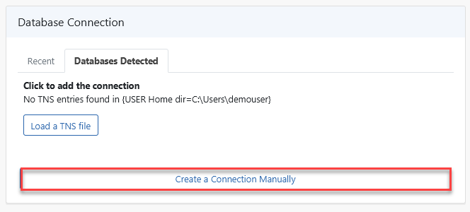

4. Provide the following parameters to the **New / Select Database Connection** window. Select **Connect** when you are complete.

   - **Name**: Northwind
   - **Username**: system
   - **Password**: Password.1!!
   - Keep the **Details** at their defaults

   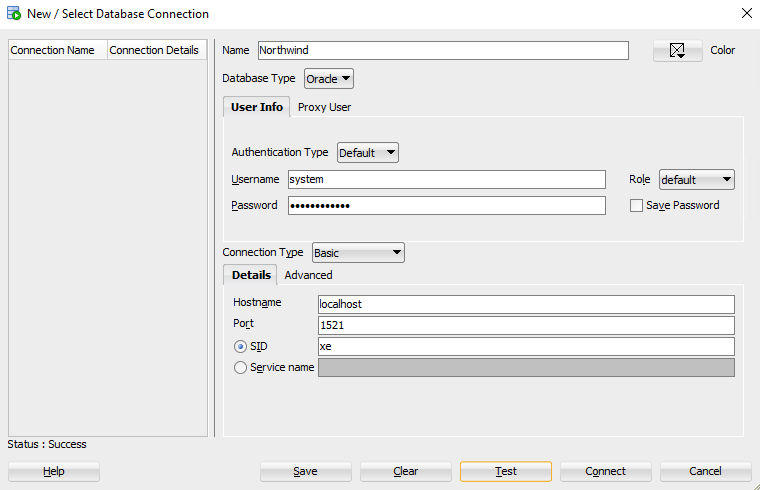

5. Once the connection completes, select the **Open File** icon (1). Navigate to `C:\handsonlab\MCW-Migrating-Oracle-to-Azure-SQL-and-PostgreSQL-master\Hands-on lab\lab-files\starter-project\Oracle Scripts\1.northwind.oracle.schema`. Then, execute the DDL statements (2).

   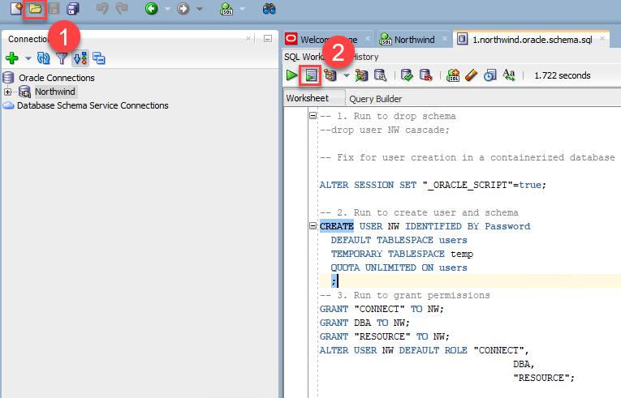

6. Right-click the **Northwind** connection and select **Properties**. Then, edit the **Username** to `NW`, and the **Password** to `oracledemo123`. Select **Connect**. Note that you may be asked to enter the password again.

7. In the Open File dialog, navigate to `C:\handsonlab\MCW-Migrating-Oracle-to-Azure-SQL-and-PostgreSQL-master\Hands-on lab\lab-files\starter-project\Oracle Scripts`, select the file `2.northwind.oracle.tables.views.sql`, and then select **Open**.

8. As you did previously, run the script. Note that SQL Developer provides an output pane to view any errors.

   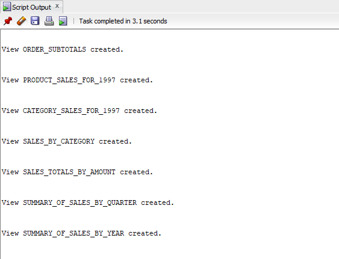

9. Repeat steps 7 - 8, replacing the file name in step 26 with each of the following:

    - `3.northwind.oracle.packages.sql`

    - `4.northwind.oracle.sps.sql`

      - During the Execute script step for this file, you will need to execute each CREATE OR REPLACE statement independently.

      - Using your mouse, select the first statement, starting with CREATE and going to END. Then, run the selection, as highlighted in the image.

      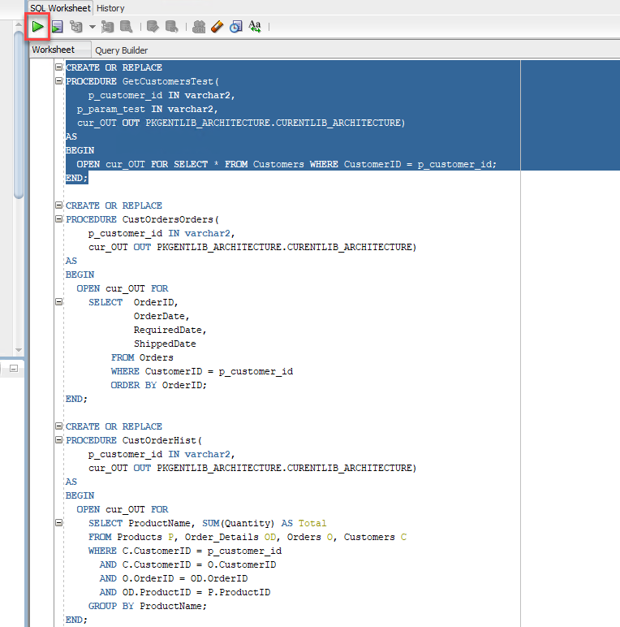

      - Repeat this for each of the remaining CREATE OR REPLACE... END; blocks in the script file (there are 7 more to execute, for 8 total).

    - `5.northwind.oracle.seed.sql`

      > **Important**: This query can take several minutes to run, so make sure you wait until you see the **Commit complete** message in the output window before executing the next file.

    - `6.northwind.oracle.constraints.sql`

10. After you finish running these scripts, validate that the database objects were created. The image below demonstrates the Tables and the Views created by the script.

    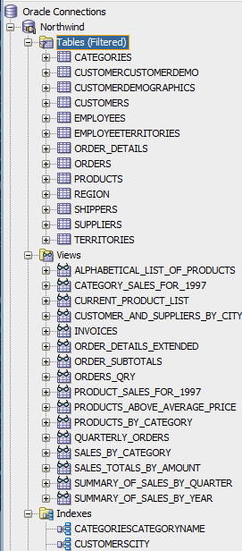

### Task 2: Configure the Starter Application to use Oracle

In this task, you will add the necessary configuration to the `NorthwindMVC` solution to connect to the Oracle database you created in the previous task.

1. In Visual Studio on your LabVM, select **Build** from the menu, then select **Build Solution**.

   

2. Open the `appsettings.json` file in the `NorthwindMVC` project by double-clicking the file in the Solution Explorer, on the right-hand side in Visual Studio.

3. In the `appsettings.json` file, locate the `ConnectionStrings` section, and verify the connection string named **OracleConnectionString** matches the values you have used in this hands-on lab:

   ```xml
   DATA SOURCE=localhost:1521/XE;PASSWORD=oracledemo123;USER ID=NW
   ```

   ```json
   "ConnectionStrings": {
      "OracleConnectionString": "DATA SOURCE=localhost:1521/XE;PASSWORD=oracledemo123;USER ID=NW"
   }
   ```

4. Run the solution by selecting the green **Start** button on the Visual Studio toolbar.

   

5. You should see the Northwind Traders Dashboard load in your browser.

   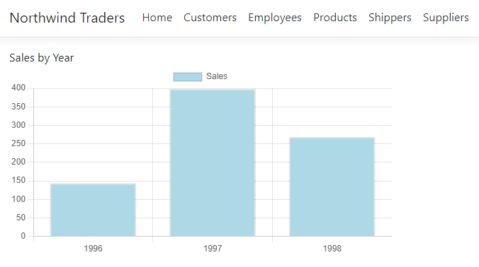

6. Close the browser to stop debugging the application, and return to Visual Studio.

## Exercise 2: Assess the Oracle 18c Database before Migrating to Azure SQL Database

Duration: 15 mins

In this exercise, you will prepare the existing Oracle database for its migration to Azure SQL DB. Preparation involves two main steps. The first step is to update the database statistics. Statistics about the database become outdated as data volumes and activity change over time. Second, you will need to identify invalid objects in the Oracle database to minimize disturbances to the migration.

### Task 1: Update Statistics and Identify Invalid Objects

1. Launch SQL Developer. Open the **Northwind** database connection.

2. Create a new SQL file using the **New** button (1). Select **Database Files** (2) and **SQL File** (3). Select **OK** (4). 

    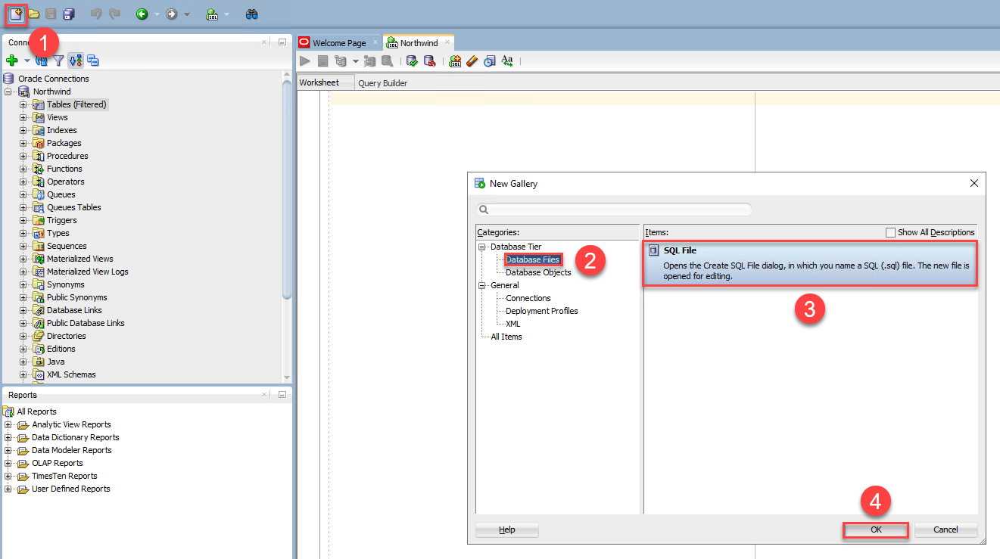
   
3. Call the new SQL File `update-18c-stats.sql`. Save it in a location of your choice, such as the `Oracle Scripts` directory from earlier.

4. Now, you will populate the new file with the following statements. Run the file as you did when you populated database objects.

    ```sql
    -- 18c script
    EXECUTE DBMS_STATS.GATHER_SCHEMA_STATS(ownname => 'NW');
    EXECUTE DBMS_STATS.GATHER_DATABASE_STATS;
    EXECUTE DBMS_STATS.GATHER_DICTIONARY_STATS;
    ```

    >**Note**: This script can take over one minute to run. Ensure that you receive confirmation that that the script has executed successfully.

5. Now, we will utilize a query that lists database objects that are invalid. It is recommended to fix any errors and compile the objects before starting the migration process. Create a new file named `show-invalid-objects.sql` and save it in the same directory. Run this query to find all of the invalid objects.

    ```sql
    SELECT owner, object_type, object_name
    FROM all_objects
    WHERE status = 'INVALID';
    ```

    >**Note**: You should not see any invalid objects.

## Exercise 3: Migrate the Oracle database to Azure SQL Database

Duration: 30 minutes

In this exercise, you will migrate the Oracle database to Azure SQL DB using SSMA.

### Task 1: Migrate the Oracle database to Azure SQL Database using SSMA

1. On your LabVM, launch **Microsoft SQL Server Migration Assistant for Oracle** from the Start Menu.

2. Select **File**, then **New Project...**

   

3. In the New Project dialog, accept the default name and location, select **Azure SQL Database** for the Migrate To value, and select **OK**.

   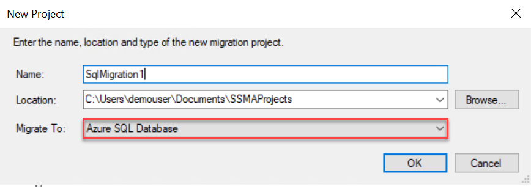

4. Select **Connect to Oracle** in the SSMA toolbar.

   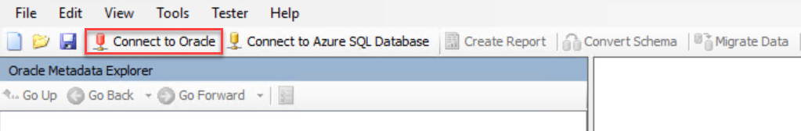

5. In the Connect to Oracle dialog, enter the following:

   - **Provider**: Leave set to the default value, Oracle Data Provider for .NET.
   - **Mode**: Leave set to Standard mode.
   - **Server name**: localhost
   - **Server port**: Set to 1521.
   - **Oracle SID**: XE
   - **Username**: NW
   - **Password**: oracledemo123

   

   >**Note**: You can also connect to SSMA using a connection string through the **Mode** dropdown. Irrespective of how you connect to Oracle from SSMA, using the **Oracle Data Provider for .NET** is the best-practice technology.

6. Select **Connect**.

7. In the Filter objects dialog, uncheck **Load all user objects**. Then, select the **NW** schema. Note that the **Sys** and **System** schemas are automatically checked. 

   

   >**Note**: In production Oracle environments, you must ensure that you have sufficient permissions to run SSMA. See Microsoft's complete list [here.](https://docs.microsoft.com/sql/ssma/oracle/connecting-to-oracle-database-oracletosql)

8. In the Output window, you will see a message that the connection was established successfully, similar to the following:

   

9. Under Oracle Metadata Explorer, expand the localhost node, Schemas, and confirm you can see the NW schema, which will be the source for the migration.

   

10. In the Oracle Metadata Explorer, check the box next to NW, expand the NW database, and uncheck **Packages**. Next, select NW to make sure it is selected in the tree.

    

11. Right-click the **NW** schema. Select **Create Report**. SSMA will use the metadata it has compiled about objects in the **NW** schema to produce a useful report. SSMA also allows you to create reports at the object-level.

12. Once the report is generated, expand the hierarchy on the left-hand side of the page. Select an object that is marked by an error, such as the `CUSTORDERSDETAILS` procedure. On the left side, observe the PL/SQL code, and on the right side, observe the T-SQL code generated by SSMA.
    
    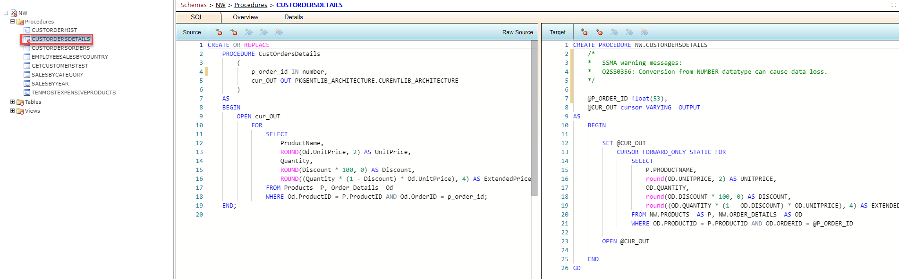

13. You can use the report to navigate through the issues that SSMA encountered during the conversion. Use the error navigation tool highlighted in the **Source** tab.

    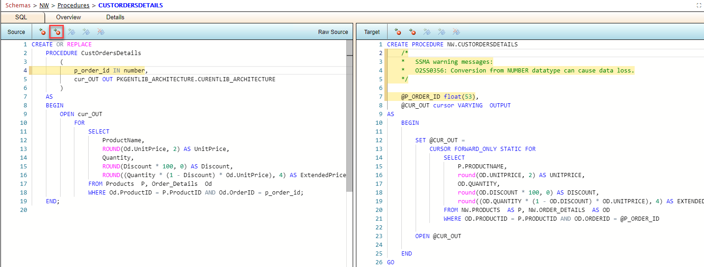

14. Note that while SSMA can generate an HTML report, it can also generate an XML file that may be suited better to your migration environment. With the default SSMA installation, you can find the XML report in the following location: `C:\Users\demouser\Documents\SSMAProjects\[PROJECT NAME]\report\[REPORT NAME]\report.xml`.

    Here is an image of an XML report in Excel.

    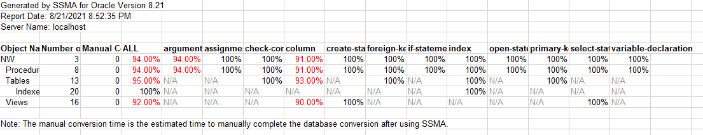

15. Next, select **Connect to Azure SQL Database** from the SSMA toolbar, to add your Azure SQL DB connection.

    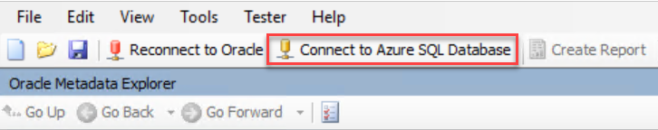

16. In the Connect to Azure SQL Database dialog, provide the following:

    - **Server name**: Enter the DNS name of your Azure SQL DB. It is going to be `northwind-server-[SUFFIX].database.windows.net`, where `[SUFFIX]` represents the parameter you provided to the ARM template.

    - **Database**: Northwind
    - **Authentication**: Set to **SQL Server Authentication**
      - **Username**: `demouser`
      - **Password**: Use the value you provided to the ARM template
    - **Encrypt Connection**: Check this box.
    - **Trust Server Certificate**: Check this box.

    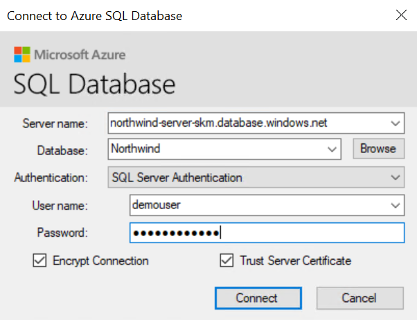

17. Select **Connect**.

18. You will see a success message in the output window.

    

19. In the Azure SQL Database Metadata Explorer, expand the server node, then Databases. You should see Northwind listed.

    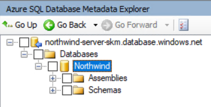

20. In the Azure SQL Database Metadata explorer, check the box next to Northwind.

    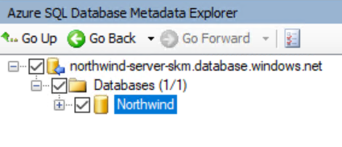

21. In the SSMA toolbar, select **Convert Schema**. There is a bug in SSMA which prevents this button to being properly enabled, so if the button is disabled, you can select the NW node in the Oracle Metadata Explorer, which should cause the Convert Schema button to become enabled. You can also right-click on the NW database in the Oracle Metadata Explorer, and select Convert Schema if that does not work.

    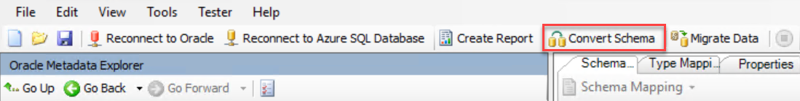

22. After about a minute the conversion should have completed.

23. In the Azure SQL Database Metadata Explorer, observe that new schema objects have been added. For example, under Northwind, Schemas, NW, Tables you should see the tables from the Oracle database. Note that these objects have not been persisted to the Azure SQL Database instance yet.

    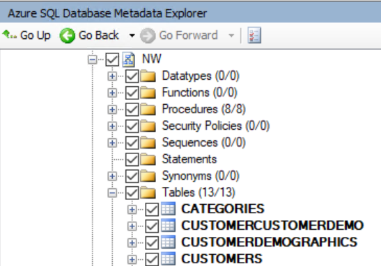

24. In the output pane, you will notice a message that the conversion finished with no errors and 17 warnings.

    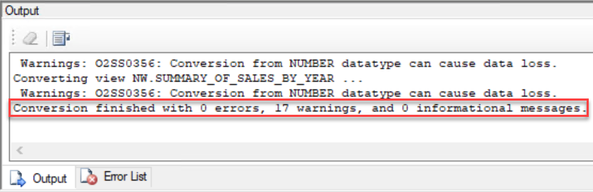

    It is important to note the meaning of errors and warnings. They are not issues with the SSMA program; they indicate objects that cannot be migrated automatically by SSMA or important considerations as you complete the migration. [Here](https://docs.microsoft.com/sql/ssma/oracle/messages/o2ss0007) is an example SSMA error code in the Microsoft documentation.

25. **Optional**: Save the project. This can take a while, and is not necessary to complete the hands-on lab.

26. To apply the resultant schema to the Northwind database in Azure SQL Database, use the Azure SQL Database Metadata Explorer to view the Northwind database. Right-click Northwind, and select **Synchronize with Database**.

    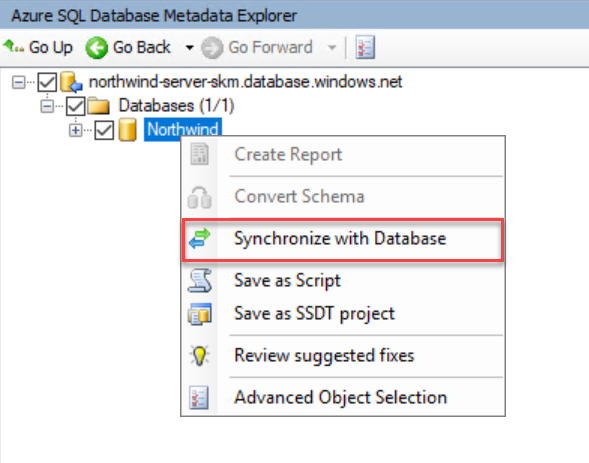

27. Select **OK** in the Synchronize with the Database dialog. Wait until you see **Synchronization operation is complete** in the output window.

28. Now you need to migrate the data. In the Oracle Metadata Explorer, select **NW** and from the command bar, select **Migrate Data**.

    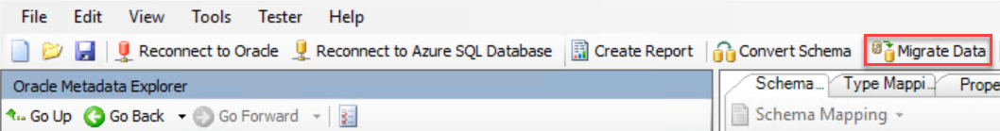

29. You will be prompted to re-enter your Oracle credentials for use by the migration connection.

    - Recall the Oracle credentials are:

      - **Server name**: localhost
      - **Server port**: 1521
      - **Oracle SID**: XE
      - **Username**: NW
      - **Password**: oracledemo123

    - The Azure SQL Database credentials are:

      - **Server name**: Follows the format `northwind-server-[SUFFIX].database.windows.net`
      - **Authentication**: SQL Server Authentication
        - **Username**: `demouser`
        - **Password**: Use the value you provided to the ARM template

30. Select **Connect**.

31. After the migration completes, you will be presented with a Data Migration Report, similar to the following:

    

32. Select **Close** on the migration report.

### Task 2: Additional SSMA Usage Details

This lab explores a relatively simple migration. This Task will provide additional considerations that you can refer to as you attempt more complex migrations.

1. To facilitate the migration, SSMA migrates certain .NET assemblies to the target Azure SQL Database instance, as indicated by the first image. Be mindful that SQL Server 2017 and above enforce *CLR strict security*, which you must consider during your migration. As you complete other migrations, be mindful of errors such as the second image.

   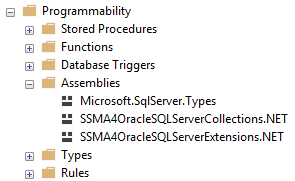

   

2. To help you resolve errors during your migrations, utilize SSMA's comprehensive logs. Follow the steps below to access them.
   
   - Select **Tools** in the upper left-hand corner of SSMA 
   - Select **Global Settings**
   - Select the **Logging** tab on the **Global Settings** window
   - Observe the **Log file path**

   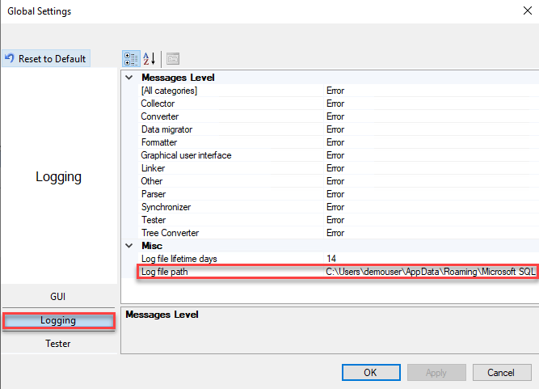

3. Besides the default data integrity mechanism in SSMA (comparing hashes), SSMA also provides a powerful testing suite that follows the flow outlined below.

   - Initialize test case
   - Select and configure objects
   - Select and configure affected objects
   - Call Ordering
   - Finalize test case

   Access the **Test Case Wizard**, which guides you through these steps, by selecting **Tester** and **New Test Case**.

   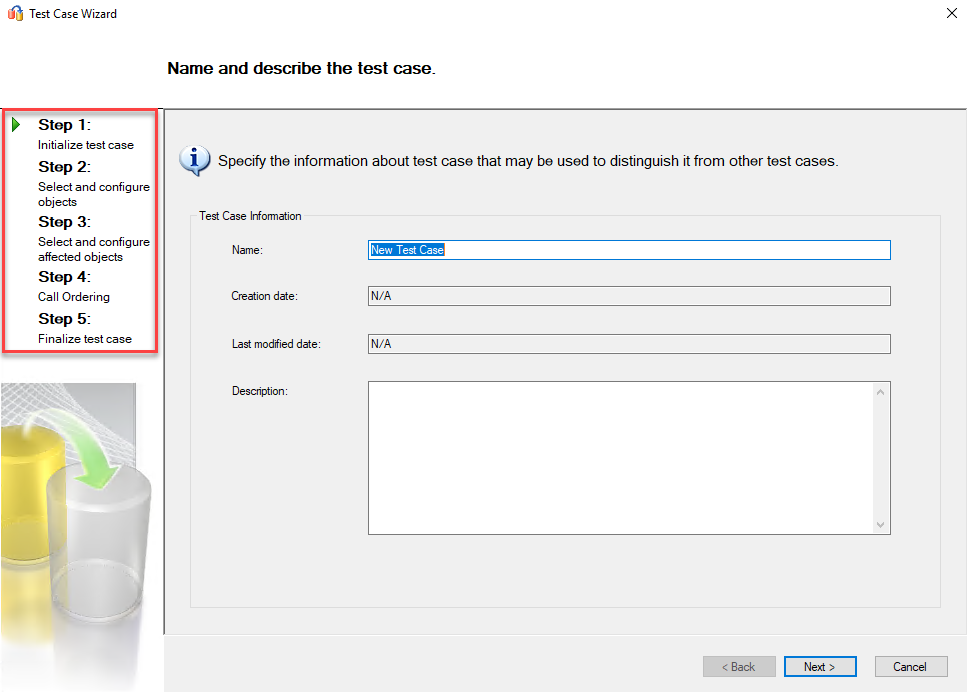

4. Note that SSMA for Oracle also allows developers to port ad-hoc queries from Oracle to the target database engine syntax, T-SQL. To do this, in the Oracle Metadata Explorer, right-click **Statements** and select **Add Statement**.

5. In the statement editor window, paste the following code. The Oracle `ROWNUM` pseudo-column limits the number of rows in the result set. 

   ```sql
   SELECT *
   FROM NW.CATEGORIES
   WHERE ROWNUM <= 5;
   ```

   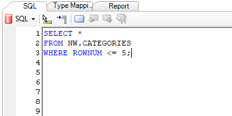

6. Right-click the new statement in the Oracle Metadata Explorer and select **Convert Schema**. Immediately, a T-SQL version of the statement should appear next to the **Azure SQL Database Metadata Explorer**.

   Notice how the `ROWNUM` Oracle pseudo-column is substituted for the T-SQL `TOP` keyword.
   
   ```sql
   SELECT TOP (5) CATEGORIES.CATEGORYID, CATEGORIES.CATEGORYNAME, CATEGORIES.DESCRIPTION, CATEGORIES.PICTURE
   FROM NW.CATEGORIES
   GO
   ```

7. Just like other objects it migrates, SSMA produces a report for the statement conversion. Simply select the **Report** tab.

   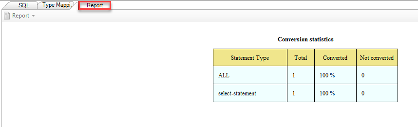

## Exercise 4: Migrate the Application

Duration: 15 minutes

In this exercise, you will modify the `NorthwindMVC` application so it targets Azure SQL Database instead of Oracle.

### Task 1: Create new Entity Models against Azure SQL Database and Scaffold Views

1. On your Lab VM, return to Visual Studio, and open `appsettings.json` from the Solution Explorer.

2. Add a connection string called `AzureSqlConnectionString`. Ensure that it correctly references the remote Azure SQL Database credentials.

   - Replace the value of `Server` with your Azure SQL Database DNS name
   - Verify the value of `Password` is set

   ```json
   "ConnectionStrings": {
      "OracleConnectionString": "DATA SOURCE=localhost:1521/XE;PASSWORD=oracledemo123;USER ID=NW",
      "AzureSqlConnectionString": "Server={Server},1433;Initial Catalog=Northwind;Persist Security Info=False;User ID=demouser;Password={Password};MultipleActiveResultSets=False;Encrypt=True;TrustServerCertificate=False;Connection Timeout=30;"
   }
   ```

3. Save the `appsettings.json` file.

    >**Note**: In production scenarios, it is not recommended to store connection strings in files that are checked into version control. Consider using Azure Key Vault references in production and [user secrets](https://docs.microsoft.com/aspnet/core/security/app-secrets) in development.

4. Open the Package Manager console by selecting **Tools** (1), **NuGet Package Manager** (2), and **Package Manager Console** (3).

    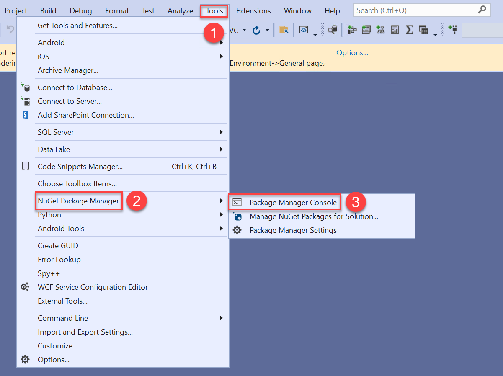

5. Enter the following command in the Package Manager console to create the models. The `-Force` flag eliminates the need to manually clear the `Data` directory.

    ```powershell
    Scaffold-DbContext Name=ConnectionStrings:AzureSqlConnectionString Microsoft.EntityFrameworkCore.SqlServer -OutputDir Data -Context DataContext -Schemas NW -Force
    ```

    >**Note**: This command will reverse-engineer more tables than are actually needed. The `-Tables` flag, referencing schema-qualified table names, provides a more accurate approach.

6. Attempt to build the solution to identify errors.

    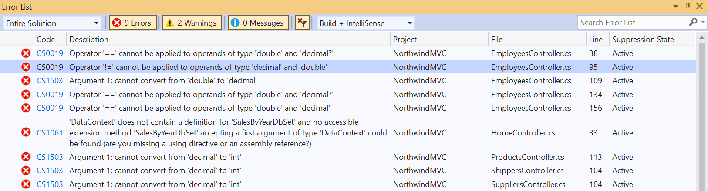

7. Expand the **Views** folder. Delete the following folders, each of which contain five views:

   - **Customers**
   - **Employees**
   - **Products**
   - **Shippers**
   - **Suppliers**

8. Expand the **Controllers** folder. Delete all controllers, except **HomeController.cs**.

9. Open **DataContext.cs**. Add the following line to the top of the file, below the other `using` directives.

    ```csharp
    using NorthwindMVC.Models;
    ```

    Add the following below the other property definitions.

    ```csharp
    // Existing property definitions
    public virtual DbSet<Supplier> Suppliers { get; set; }
    public virtual DbSet<Territory> Territories { get; set; }

    // Add SalesByYearDbSet
    public virtual DbSet<SalesByYear> SalesByYearDbSet { get; set; }
    ```

    Lastly, add the following statement to the `OnModelCreating()` method, after setting the collation information. 

    ```csharp
    protected override void OnModelCreating(ModelBuilder modelBuilder)
    {
        // Collation information

        // Add this:
        modelBuilder.Entity<SalesByYear>(entity =>
        {
            entity.HasNoKey();
        });

        // Other Fluent API configuration
    }
    ```

10. Build the solution. Ensure that no errors appear. We added `SalesByYearDbSet` to **DataContext** because **HomeController.cs** references it. We deleted the controllers and their associated views because we will scaffold them again from the models.

11. Right-click the **Controllers** folder and select **Add** (1). Select **New Scaffolded Item...** (2).

   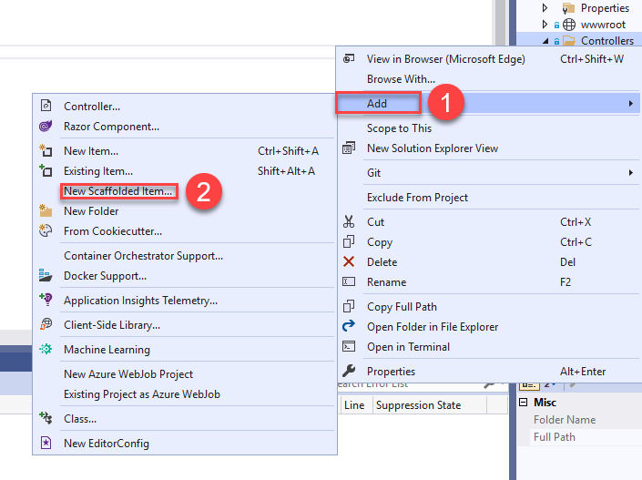

12. Select **MVC Controller with views, using Entity Framework**. Then, select **Add**.

   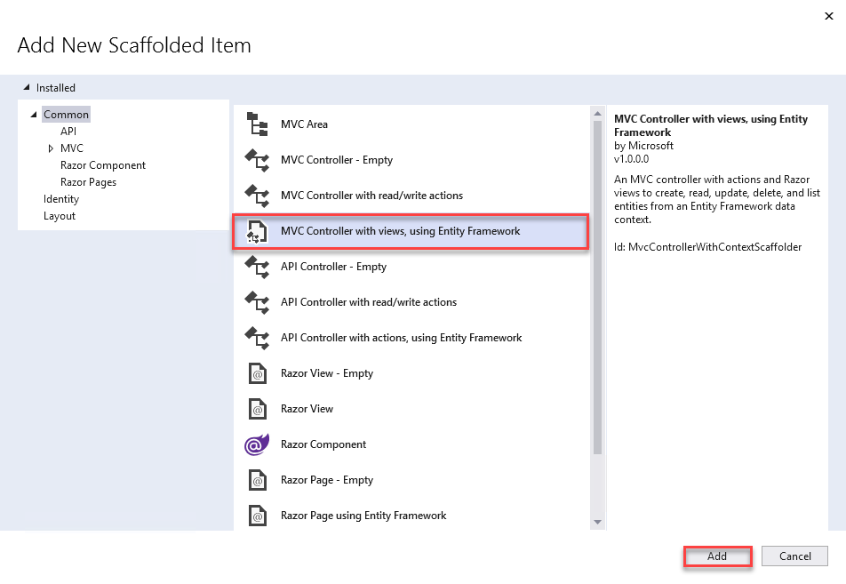

13. In the **ADD MVC Controller with views, using Entity Framework** dialog box, provide the following details. Then, select **Add**. Visual Studio will build the project.

    - **Model class**: Select `Customer`
    - **Data context class**: Select `DataContext`
    - Select all three checkboxes below **Views**
    - **Controller name**: Keep it set to `CustomersController`

   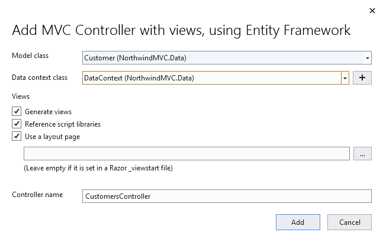

14. Repeat steps 11-13, according to the following details:

    - **EmployeesController.cs**
      - Based on the **Employee** model class
    - **ProductsController.cs**
      - Based on the **Product** model class
    - **ShippersController.cs**
      - Based on the **Shipper** model class
    - **SuppliersController.cs**
      - Based on the **Supplier** model class

15. Navigate to **Startup.cs**. Ensure that SQL Server is configured as the correct provider and the appropriate connection string is referenced.

    ```csharp
    // This method gets called by the runtime. Use this method to add services to the container.
    public void ConfigureServices(IServiceCollection services)
    {
        services.AddControllersWithViews();

        // Verify this line:
        services.AddDbContext<DataContext>(options => options.UseSqlServer(Configuration.GetConnectionString("AzureSqlConnectionString")));
    }
    ```

### Task 2: Ensure Application Compatibility with the Stored Procedure

1. Open the file `HomeController.cs`, in the Controllers folder in the Solution Explorer.

   

2. Comment out the code under the Oracle comment. First, select the lines for the Oracle code, then select the Comment button in the toolbar.

   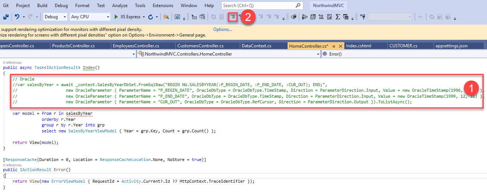

3. Next, add the following code below the commented Oracle stored procedure call. Notice how it excludes the cursor output parameter.

   ```csharp
   var salesByYear = await _context.SalesByYearDbSet.FromSqlRaw(
      "exec [NW].[SALESBYYEAR] @p_begin_date, @p_end_date ",
      new SqlParameter("p_begin_date", "1996-1-1"),
      new SqlParameter("p_end_date", "1999-1-1")).ToListAsync();
   ```

4. Save the changes to `HomeController.cs`.

5. Open the file, `SALESBYYEAR.cs`, in the Models folder in the Solution Explorer.

    

6. Change the `YEAR` property from string to int.

    

7. Save the file.

8. Open the `SalesByYearViewModel.cs` file from the Models folder in the Solution Explorer.

    

9. Change the type of the `YEAR` property from string to int, then save the file.

    

10. Run the solution by selecting the green Start button on the toolbar.

    

11. You will get an exception that the stored procedure call has failed. This is because of an error in migrating the stored procedure.

    

12. Select the red Stop button to end execution of the application.

    

13. To resolve the error, open the `SALES_BY_YEAR_fix.sql` file, located under Solution Items in the Solution Explorer.

14. From the Visual Studio menu, select **View**, and then **Server Explorer**.

    

15. In the Server Explorer, right-click on **Data Connections**, and select **Add Connections...**

    

16. On the Choose Data Source dialog, select **Microsoft SQL Server**, and select **Continue**.

    

17. On the Add Connection dialog, enter the following:

    - **Data source**: Leave Microsoft SQL Server (SqlClient).
    - **Server name**: Enter the DNS name of the Azure SQL DB instance
    - **Authentication**: Select SQL Server Authentication.
    - **Username**: demouser
    - **Password**: Provide the password you configured for `demouser`
    - **Connect to a database**: Choose Select or enter database name, and enter Northwind.
    - Select **Test Connection** to verify your settings are correct, and select **OK** to close the successful connection dialog.

    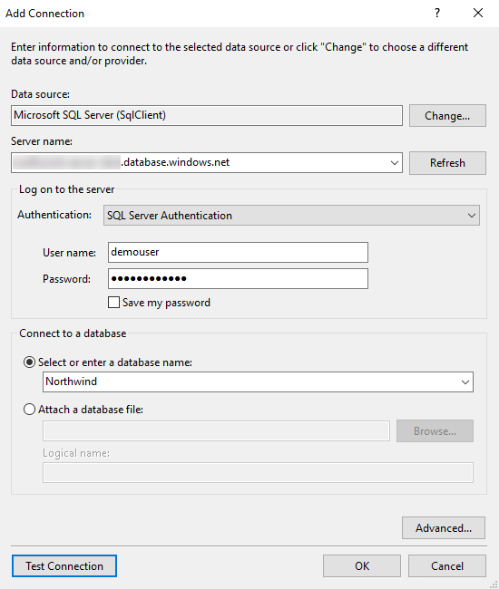

18. Select **OK**.

19. Right-click the newly added Azure SQL DB connection in the Server Explorer, and select **New Query**.

    

20. Select and copy all of the text from the `SALES_BY_YEAR_fix.sql` file (click CTRL+A, CTRL+C in the `SALES_BY_YEAR_fix.sql` file).

21. Paste (CTRL+V) the copied text into the new Query window.

22. Verify `Use [Northwind]` is the first line of the file, and that it matches the database listed in the query bar, then select the green **Execute** button.

    ![The Use [Northwind] statement is highlighted, as is the Northwind database and the Execute button in the query bar.](./media/visual-studio-sql-query-execute.png "Verify the Use [Northwind] statement")

23. You should see a message that the command completed successfully.

    

24. Run the application again by selecting the green Start button in the Visual Studio toolbar.

    

25. Verify the graph is showing correctly on the Northwind Traders dashboard.

    

26. Congratulations! You have successfully migrated the data and application from Oracle to SQL Server.

## Exercise 5: Configure SQL Server instances (Optional Homogenous Migration)

Duration: 45 minutes

In this exercise, you will configure SQL Server 2008 R2 on the SqlServer2008 VM. The database on this VM will act as the customer's existing on-premises database for this hands-on lab.

### Task 1: Connect to the SqlServer2008 VM

In this task, you will create an RDP connection to the SqlServer2008 VM.

1. In the [Azure portal](https://portal.azure.com), select **Resource groups** in the Azure services list, enter your resource group name (hands-on-lab-SUFFIX) into the filter box, and select it from the list.

   

2. In the list of resources for your resource group, select the SqlServer2008 VM.

   

3. On the SqlServer2008 blade, select Connect from the top menu.

   

4. Select **Download RDP file**, then open the downloaded RDP file.

   

5. Select **Connect** on the Remote Desktop Connection dialog.

   

6. Enter the following credentials when prompted:

   - **Username**: demouser
   - **Password**: Password.1!!

7. Select **Yes** to connect, if prompted that the identity of the remote computer cannot be verified.

   

### Task 2: Install AdventureWorks sample database

In this task, you will install the AdventureWorks database in SQL Server 2008 R2. It will act as the on-premises data warehouse database that you will migrate to Azure SQL Database.

1. On the SqlServer2008 VM, open a web browser, and navigate to the GitHub site containing the sample AdventureWorks 2008 R2 database at <https://github.com/Microsoft/sql-server-samples/releases/tag/adventureworks2008r2>.

2. Scroll down under Assets, and select `adventure-works-2008r2-dw.script.zip`.

   

3. Save the file, and unzip the downloaded file to a folder you create, called `C:\AdventureWorksSample`.

4. Open **Microsoft SQL Server Management Studio 17** (SSMS) on the SqlServer2008 VM. It can be found under Start->All Programs->Microsoft SQL Server Tools 17.

5. Connect to the **SQLSERVER2008** database, if you are not already connected. In the Connect to Server dialog, leave Authentication set to **Windows Authentication**, and select **Connect**.

   

6. In SSMS, select the **Open File** icon in SSMS menu bar.

   

7. In the Open File dialog, browse to the `C:\AdventureWorksSample\AdventureWorks 2008R2 Data Warehouse\` folder, select the file named `instawdwdb.sql`, and then select **Open**.

   

8. Next, select **Tools** in the SSMS menu, then select **Options**.

   

9.  In the Options dialog, expand **Text Editor** in the tree view on the left, then expand **Transact-SQL**, select **General**, then check the box next to **Line numbers**. This will display line numbers in the query editor window, to make finding the lines specified below easier.

   

11. Select **OK** to close the Options dialog.

12. In the SSMS query editor for `instawdwdb.sql`, uncomment the `SETVAR` lines (lines 36 and 37) by removing the double hyphen "--" from the beginning of each line.

13. Next, edit the file path for each variable so they point to the following (remember to include a trailing backslash ("\\") on each path):

    - SqlSamplesDatabasePath: `C:\AdventureWorksSample\`

    - SqlSamplesSourceDataPath: `C:\AdventureWorksSample\AdventureWorks 2008R2 Data Warehouse\`

      

14. Place SSMS into **SQLCMD mode** by selecting it from the **Query** menu.

    

15. Execute the script by selecting the **Execute** button on the toolbar in SSMS.

    

16. This will create the `AdventureWorksDW2008R2` database. When the script is done running, you will see output similar to the following in the results pane.

    

17. Expand **Databases** in Object Explorer, right-click the `AdventureWorksDW2008R2` database, and select **Rename**.

    

18. Set the name of the database to `WideWorldImporters`.

    

19. Close SSMS.

### Task 3: Update SQL Server settings using Configuration Manager

In this task, you will update the SQL Server service accounts and other settings associated with the SQL Server instance installed on the VM.

1. From the Start Menu on your SqlServer2008 VM, search for **SQL Server Config**, then select **SQL Server Configuration Manager** from the search results.

   

2. From the tree on the left of the Configuration Manager window, select **SQL Server Services**, and then double-click **SQL Server (MSSQLSERVER)** in the list of services to open its properties dialog.

   

3. In the SQL Server (MSSQLSERVER) Properties dialog, change **Log on as** to use the demouser account, by entering **demouser** into the Account Name box, then entering the password, **Password.1!!**, into the Password and Confirm password boxes.

   

4. Select **OK**.

5. Select **Yes** to restart the service in the **Confirm Account Change** dialog.

6. While still in the SQL Server Configuration Manager, expand **SQL Server Network Configuration**, select **Protocols for MSSQLSERVER**, and double-click **TCP/IP** to open the properties dialog.

   

7. On the TCP/IP Properties dialog, ensure **Enabled** is set to **Yes**, and select **OK**.

   

   > **Note**: If prompted that the changes will not take effect until the service is restarted, select **OK**. You will restart the service later.

8. Select **SQL Server Services** in the tree on the left, then right-click **SQL Server (MSSQLSERVER)** in the services pane, and select **Restart**.

   

9. Repeat the previous step for the **SQL Server Agent (MSSQLSERVER)** service, this time selecting **Start** from the menu.

   

10. Close the SQL Server Configuration Manager.

## Exercise 6: Migrate SQL Server to Azure SQL Database using DMS (Optional Homogenous Migration)

Duration: 60 minutes

Wide World Importers would like a Proof of Concept (POC) that moves their data warehouse to Azure SQL Database. They would like to know about any incompatible features that might block their eventual production move. In this exercise, you will use the [Azure Database Migration Service](https://azure.microsoft.com/services/database-migration/) (DMS) to perform an assessment on their SQL Server 2008 R2 data warehouse database, and then migrate the WideWorldImporters database from the on-premises SQL Server 2008 R2 instance to [Azure SQL Database](https://docs.microsoft.com/azure/sql-database/).

### Task 1: Assess the on-premises database

Wide World Importers would like an assessment to see what potential issues they would have to address in moving their database to Azure SQL Database.

1. On the SqlServer2008 VM, install the .NET Framework 4.8 Runtime, a requirement for Data Migration Assistant to run. Locate the downloader [here.](https://dotnet.microsoft.com/download/dotnet-framework/net48) Restart the system.

2. Download the [Data Migration Assistant v5.x](https://www.microsoft.com/download/confirmation.aspx?id=53595) and run the downloaded installer.

3. Select **Next** on each of the screens, accepting to the license terms and privacy policy in the process.

4. Select **Install** on the Privacy Policy screen to begin the installation.

5. On the final screen, check the **Launch Microsoft Data Migration Assistant** check box, and select **Finish**.

   

6. In the Data Migration Assistant window, select the New **(+)** icon in the left-hand menu.

   

7. In the New project dialog, enter the following:

   - **Project type**: Select Assessment.
   - **Project name**: Enter Assessment.
   - **Assessment type**: Select Database Engine.
   - **Source server type**: Select SQL Server.
   - **Target server type**: Select Azure SQL Database.

   

   - Select **Create**.

8. On the **Options** tab, ensure the **Check database compatibility** and **Check feature parity** report types are checked, and select **Next**.

   

9. In the **Connect to a server** dialog on the **Select sources** tab, enter `SQLSERVER2008` into the Server name box, and **uncheck Encrypt connection**, then select **Connect**.

   

10. In the **Add sources** dialog that appears, check the box next to **WideWorldImporters**, and select **Add**.

   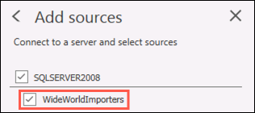

11. Select **Start Assessment**.

12. Review the Assessment results, selecting both **SQL Server feature parity** and **Compatibility issues** options and viewing the reports.

    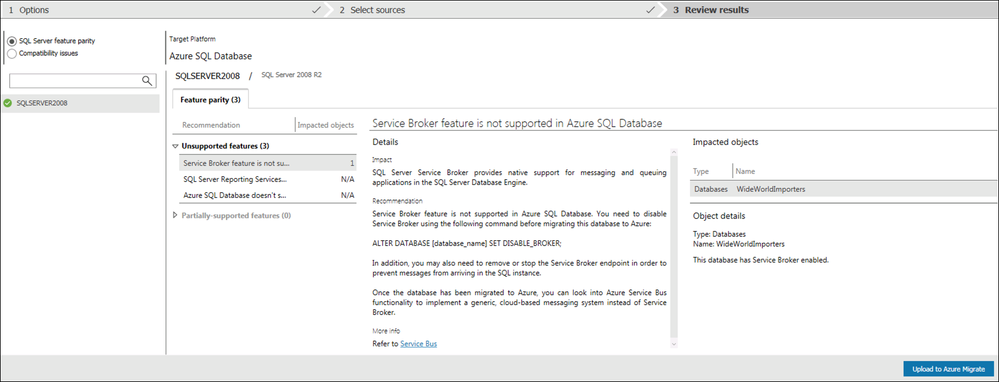

13. You now have a list of the issues WWI will need to consider in upgrading their database to Azure SQL Database. Notice the assessment includes recommendations on the potential resolutions to issues. You can select **Export Assessment** on the top toolbar to save the report as a JSON file, if desired.

### Task 2: Migrate the database schema

After you have reviewed the assessment results and you have ensured the database is a candidate for migration to Azure SQL Database, use the Data Migration Assistant to migrate the schema to Azure SQL Database.

1. On the SqlServer2008 VM, return to the Data Migration Assistant, and select the New **(+)** icon in the left-hand menu.

2. In the New project dialog, enter the following:

   - **Project type**: Select Migration.
   - **Project name**: Enter DwMigration.
   - **Source server type**: Select SQL Server.
   - **Target server type**: Select Azure SQL Database.
   - **Migration scope**: Select Schema only.

   

3. Select **Create**.

4. On the **Select source** tab, enter the following:

   - **Server name**: Enter SQLSERVER2008.
   - **Authentication type**: Leave Windows Authentication selected.
   - **Connection properties**: Check both Encrypt connection and Trust server certificate.
   - Select **Connect**.
   - Select **WideWorldImporters** from the list of databases.

   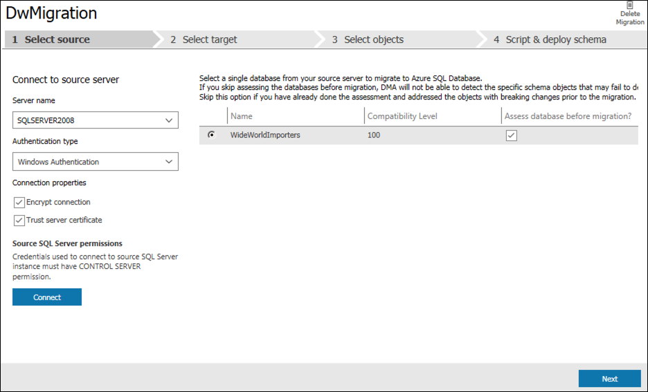

5. Select **Next**.

6. On the **Select target** tab, enter the following:

   - **Server name**: Enter the server name of the Azure SQL Database you created. If you deployed the ARM template, it will follow the format `northwind-server-[SUFFIX].database.windows.net`.
     - To find the name of your SQL Database, select the WideWorldImportersDW SQL Database from your hands-on-lab-SUFFIX resource group in the Azure portal, and then select the **Server name** in the Essentials area of the Overview blade.

   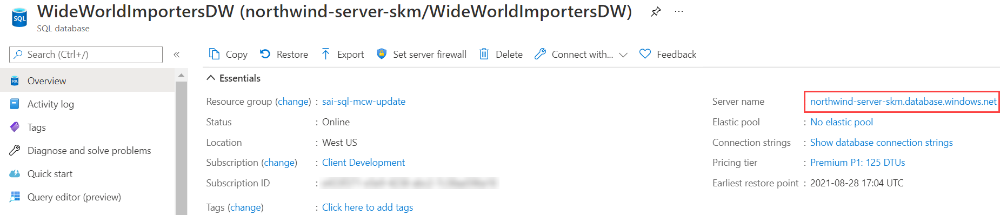

   - **Authentication type**: Select SQL Server Authentication.
   - **Username**: demouser
   - **Password**: Password.1!!
   - **Connection properties**: Check both Encrypt connection and Trust server certificate.
   - Select **Connect**.
   - Select **WideWorldImportersDW** from the list of databases.

   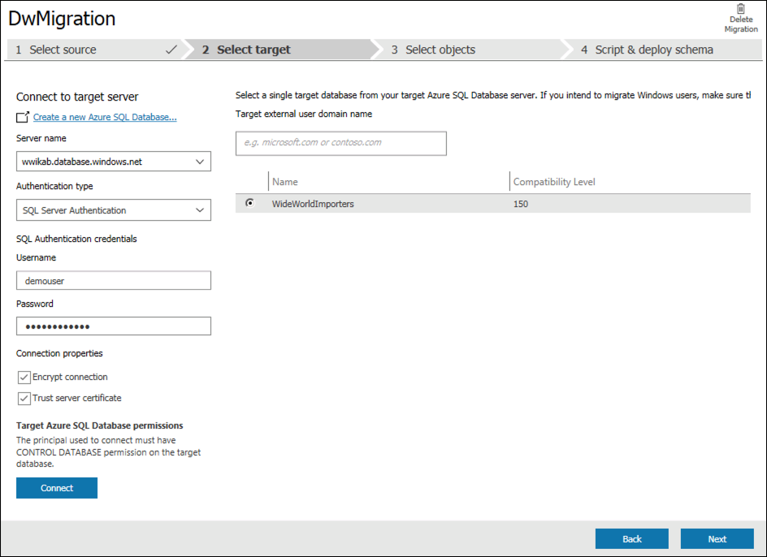

7. Select **Next**.

8. In the **Select objects** tab, leave all the objects checked, and select **Generate SQL script**.

   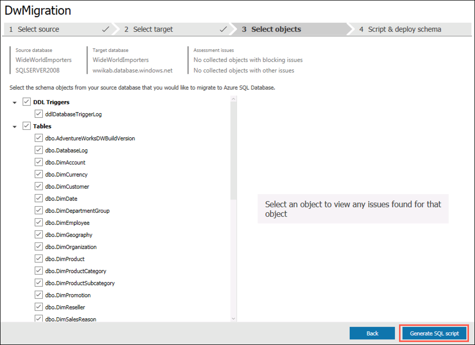

9. In the **Script & deploy schema** tab, review the script, then select **Deploy schema**.

   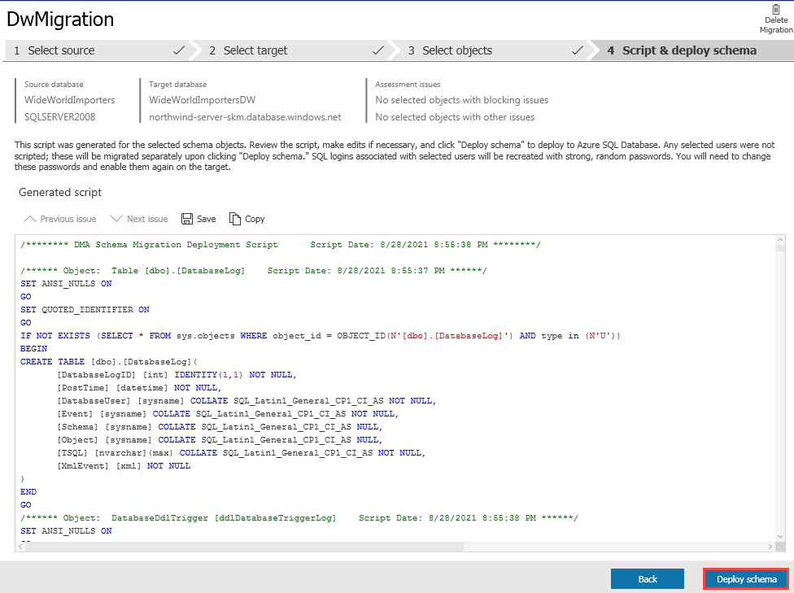

10. Select **Deploy schema**.

11. After the schema is deployed, review the deployment results, and ensure there were no errors.

    

12. Next, open SSMS on the SqlServer2008 VM, and connect to your Azure SQL Database, by selecting **Connect->Database Engine** in the Object Explorer, and then entering the server name and credentials into the Connect to Server dialog.

    

13. Once connected, expand **Databases**, and expand **WideWorldImportersDW**, then expand **Tables**, and observe the schema has been created.

    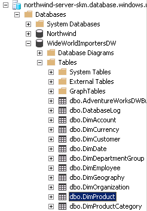

### Task 3: Create a migration project

In this task, you create a new migration project for the WideWorldImporters database.

1. Navigate to the Azure Database Migration Service in the [Azure portal](https://portal.azure.com).

2. On the Azure Database Migration Service blade, select **+New Migration Project**.

   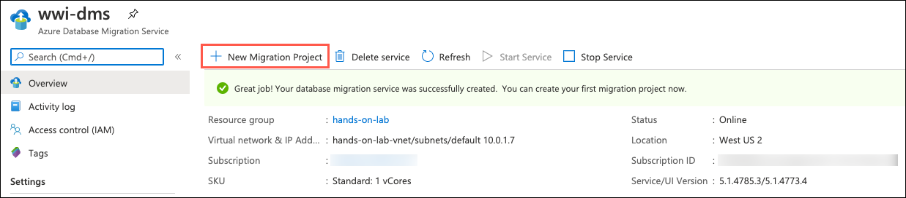

3. On the New migration project blade, enter the following:

   - **Project name**: Enter OnPremToAzureSql.

   - **Source server type**: Select SQL Server.

   - **Target server type**: Select Azure SQL Database.

   - **Choose type of activity**: Select Create project only.

     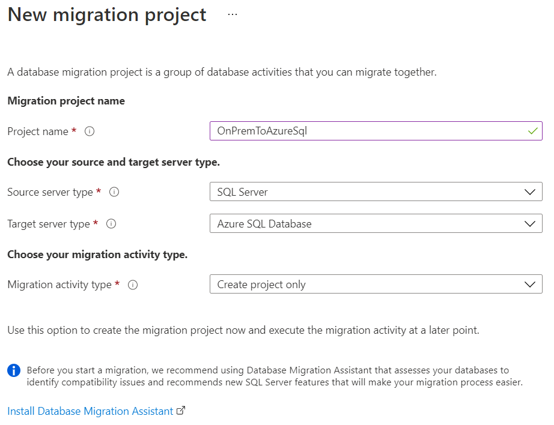

4. Select **Create**.

5. On the Migration Wizard **Select source** blade, enter the following:

   - **Source SQL Server instance name**: Enter the IP address of your SqlServer2008 VM. For example, `40.84.6.199`.

     - You can retrieve the VM IP address by navigating to the SqlServer2008 overview blade in the Azure portal and selecting the copy button next to the Public IP address value.

       

   - **Authentication type**: Select SQL Authentication.
   - **Username**: demouser
   - **Password**: Password.1!!
   - **Connection properties**: Check both Encrypt connection and Trust server certificate.

   

6. Select **Next: Select databases >>**.

7. On the Migration Wizard **Select databases** blade, select WideWorldImporters.

   

8. Select **Next: Select target >>**.

9. On the Migration Wizard **Select target** blade, enter the following:

   - Select **I know my target details**.
   - **Target server name**: Enter the server name for your Azure SQL Database.

     - To find the name of your SQL Database, select the WideWorldImportersDW SQL Database from your hands-on-lab-SUFFIX resource group in the Azure portal, and then select the **Server name** in the Essentials area of the Overview blade.

       

   - **Authentication type**: Select SQL Authentication.
   - **Username**: demouser
   - **Password**: Password.1!!
   - **Connection properties**: Check Encrypt connection.

   

10. Select **Next: Summary >>**.

11. On the Migration Wizard Summary blade, review the Project summary, then select **Save project**.

    

### Task 4: Run the migration

In this task, you will create a new activity in the Azure Database Migration Service to execute the migration from the on-premises SQL Server 2008 R2 server to Azure SQL Database.

1. On the Azure Database Migration Service blade, select **+New Activity**, and then select **Data migration**.

   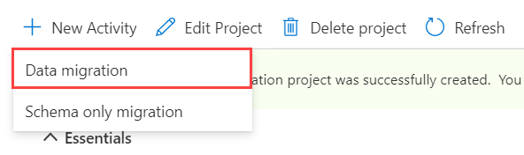

2. On the Migration Wizard **Select source** blade, re-enter the demouser password, **Password.1!!**, then select **Next: Select databases >>**.

   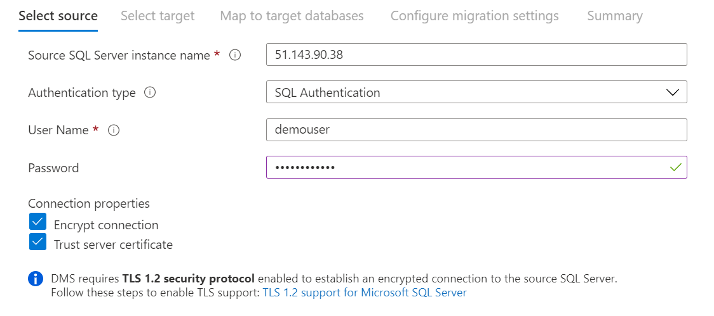

3. On the Migration Wizard **Select databases** blade, select **WideWorldImporters**. Then, select **Next: Select target >>**.

   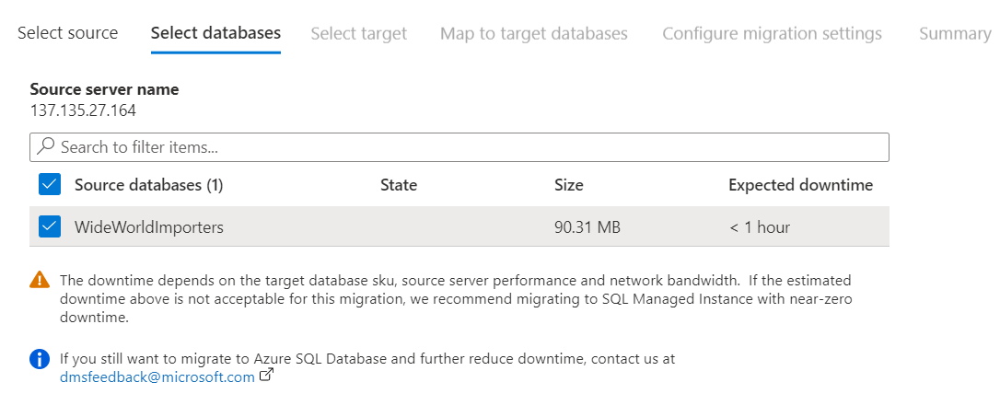

4. On the Migration Wizard **Select target** blade, re-enter the demouser password, **Password.1!!**, then select **Next: Map to target databases >>**.

   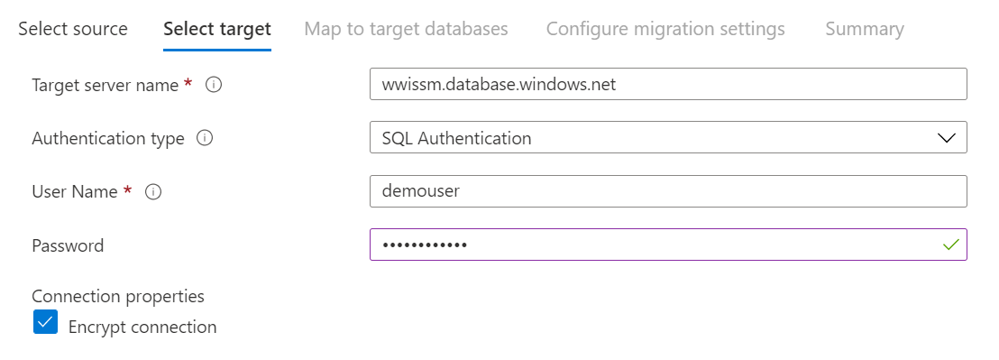

5. On the Migration Wizard **Map to target databases** blade, confirm that **WideWorldImporters** is checked as the source database, and that **WideWorldImportersDW** is selected as the target. Then select **Next: Configure migration settings >>**.

   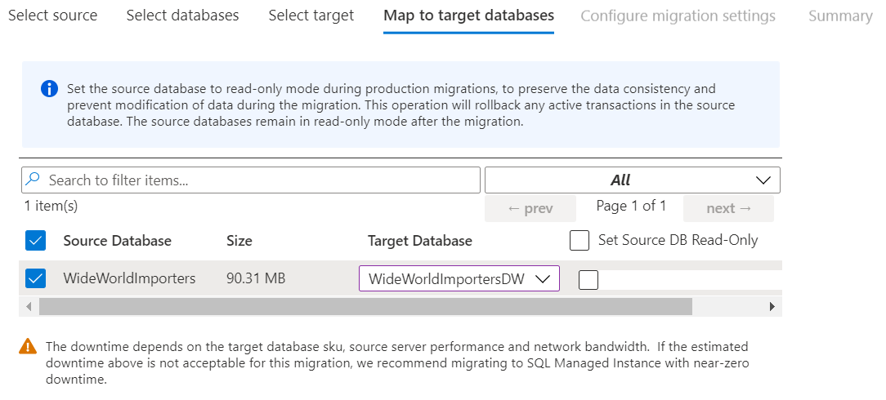

6. On the Migration Wizard **Configure migration settings** blade, expand the WideWorldImporters database, verify all the tables are selected, and select **Next: Summary >>**.

   

7. On the Migration Wizard **Summary** blade, enter the following:

   - **Activity name**: Enter a name, such as DwMigration.

   

8. Select **Start migration**.

9.  Monitor the migration on the status screen that appears. Select the refresh icon in the toolbar to retrieve the latest status.

   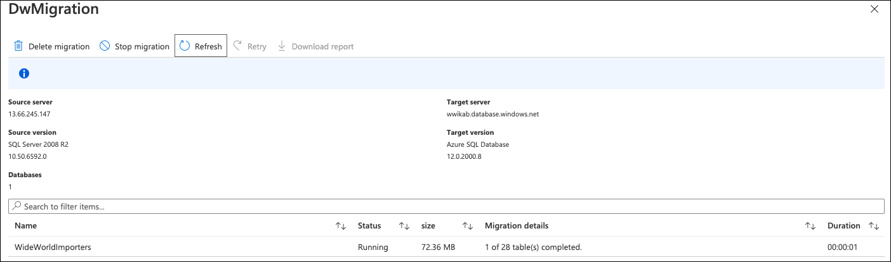

11. When the migration is complete, you will see the status as **Completed**.

   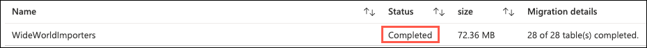

### Task 5: Verify data migration

In this task, you will use SSMS to verify the database was successfully migrated to Azure SQL Database.

1. Open SSMS on the SqlServer2008 VM, and connect to your Azure SQL Database. In the Connect to Server dialog, enter the following:

   - **Server name**: Enter the server name of your Azure SQL Database.
   - **Authentication**: Select SQL Server Authentication.
   - **Login**: demouser
   - **Password**: Password.1!!

   

2. Select **Connect**.

3. In the Object Explorer, expand Databases, WideWorldImportersDW, and Tables, then right-click `dbo.DimCustomer`, and choose **Select Top 1000 Rows**.

   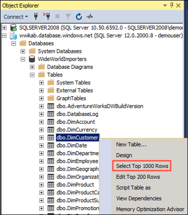

4. Observe that the query returns results, showing the data has been migrated from the on-premises SQL Server 2008 R2 database into Azure SQL Database.

5. Leave SSMS open with the connection to your Azure SQL Database for the next exercise.

## Exercise 7: Post upgrade enhancement (Optional Homogenous Migration)

Duration: 20 minutes

In this exercise, you will demonstrate value from the upgrade by enabling the Table Compression and ColumnStore Index features of Azure SQL Database.

### Task 1: Table compression

1. In SSMS on the SqlServer2008 VM, and connect to your Azure SQL Database.

2. Open a new query window by selecting **New Query** from the toolbar.

   

3. Copy the script below, and paste it into the query window:

   ```sql
   USE [WideWorldImportersDW]

   -- Get the Size of the FactInternetSales table
   SELECT
   t.Name AS TableName,
   p.rows AS RowCounts,
   CAST(ROUND((SUM(a.total_pages) / 128.00), 2) AS NUMERIC(36, 2)) AS Size_MB
   FROM sys.tables t
   INNER JOIN sys.indexes i ON t.OBJECT_ID = i.object_id
   INNER JOIN sys.partitions p ON i.object_id = p.OBJECT_ID AND i.index_id = p.index_id
   INNER JOIN sys.allocation_units a ON p.partition_id = a.container_id
   WHERE t.Name = 'FactInternetSales'
   GROUP BY t.Name, p.Rows
   GO
   ```

4. Select **Execute** on the toolbar to run the query to retrieve the size of the `FactInternetSales` table.

   

5. In the results pane, note the size of the `FactInternetSales` table.

   

6. In the Object Explorer, expand Databases, WideWorldImportersDW, and Tables.

7. Right-click the `FactInternetSales` table, select the **Storage** context menu, and then select **Manage Compression** from the fly-out menu.

   

8. On the Welcome page of the Data Compression Wizard, select **Next**.

9. On the Select Compression Type page, select **Row** from the Compression Type drop down, and select **Next**.

   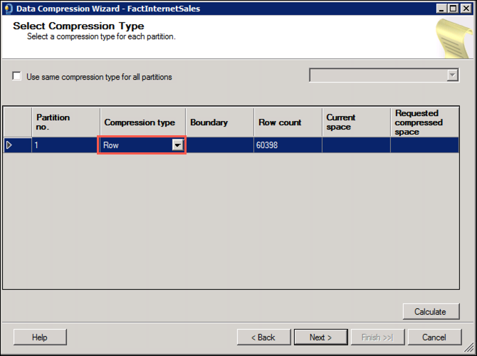

10. On the Select an Output Option page, select **Run immediately**, and then select **Finish >>|**.

    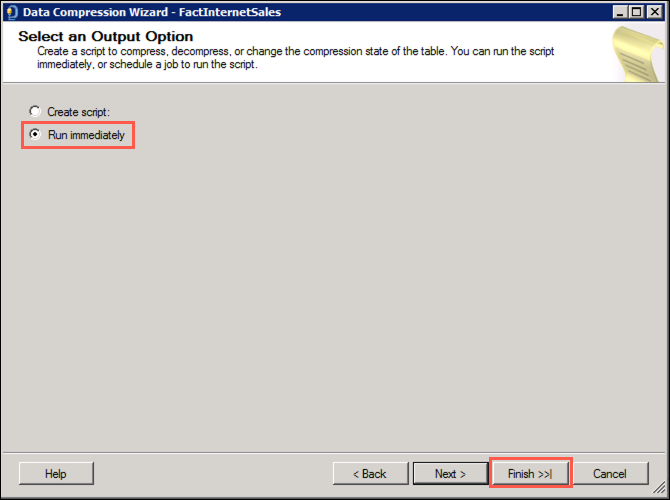

11. Select **Finish** on the Summary page and **Close** when the compression wizard is finished.

    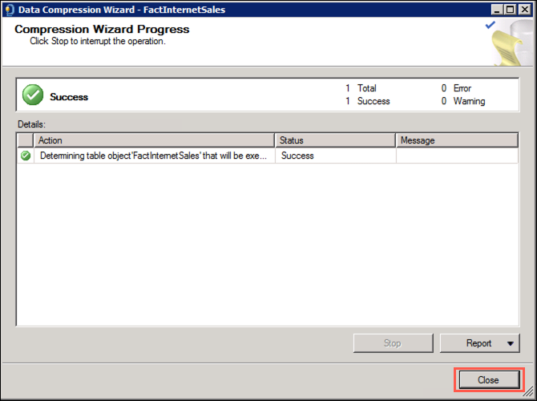

12. Rerun the query to get the size of the `FactInternetSales` table, noting the reduced size of the table.

    

13. Now, repeat steps 7 - 12 above, this time setting the Compression type to Page.

    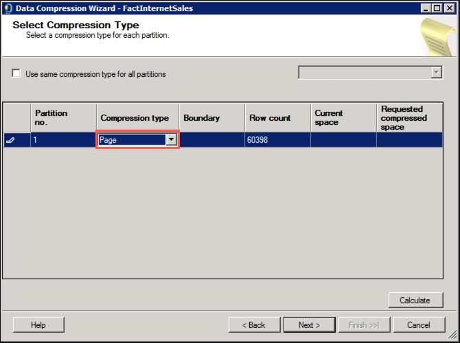

14. Once again, observe the table size in the results pane, and compare it to the values noted for the uncompressed table and with Row compression applied.

    

15. Both Row and Page compression reduce the size of the table, but Page compression provides the greatest reduction in this case. Compression decreases the load on the Disk I/O subsystem, while increasing the load on the CPU. Since most data warehouse workloads are heavily disk bound, and often have low CPU usage, compression can be a great way to improve performance.

### Task 2: Clustered ColumnStore index

In this task, you will create a new table based on the existing `FactResellerSales` table and apply a ColumnStore index.

1. In SSMS, ensure you are connected to the Azure SQL Database instance.

2. Open a new query window by selecting **New Query** from the toolbar.

   

3. Copy the script below, and paste it into the query window:

   ```sql
   USE WideWorldImportersDW

   SELECT *
   INTO ColumnStore_FactResellerSales
   FROM FactResellerSales
   GO
   ```

4. Select **Execute** on the toolbar to run the query, and create a new table named `ColumnStore_FactResellerSales`, populated with data from the `FactResellerSales` table.

   

5. Select **New Query** in the toolbar again, and paste the following query into the new query window. The query contains multiple parts; one to get the size of the `ColumnStore_FactResellerSales` table, a second to create a clustered ColumnStore index on the ColumnStore_FactResellerSales table, and then the size query is repeated to get the size after adding the clustered ColumnStore index.

   ```sql
   USE [WideWorldImportersDW]

   -- Get the Size of the ColumnStore_FactResellerSales table
   SELECT
   t.Name AS TableName,
   p.rows AS RowCounts,
   CAST(ROUND((SUM(a.total_pages) / 128.00), 2) AS NUMERIC(36, 2)) AS Size_MB
   FROM sys.tables t
   INNER JOIN sys.indexes i ON t.OBJECT_ID = i.object_id
   INNER JOIN sys.partitions p ON i.object_id = p.OBJECT_ID AND i.index_id = p.index_id
   INNER JOIN sys.allocation_units a ON p.partition_id = a.container_id
   WHERE t.Name = 'ColumnStore_FactResellerSales'
   GROUP BY t.Name, p.Rows
   GO

   -- Create a clustered columnstore index on the ColumnStore_FactResellerSales table
   CREATE CLUSTERED COLUMNSTORE INDEX [cci_FactResellerSales]
   ON [dbo].[ColumnStore_FactResellerSales]
   GO

   -- Get the Size of the ColumnStore_FactResellerSales table
   SELECT
   t.Name AS TableName,
   p.rows AS RowCounts,
   CAST(ROUND((SUM(a.total_pages) / 128.00), 2) AS NUMERIC(36, 2)) AS Size_MB
   FROM sys.tables t
   INNER JOIN sys.indexes i ON t.OBJECT_ID = i.object_id
   INNER JOIN sys.partitions p ON i.object_id = p.OBJECT_ID AND i.index_id = p.index_id
   INNER JOIN sys.allocation_units a ON p.partition_id = a.container_id
   WHERE t.Name = 'ColumnStore_FactResellerSales'
   GROUP BY t.Name, p.Rows
   GO
   ```

6. Select **Execute** on the toolbar to run the query.

   >**Note**: You will need to be in SQLCMD mode for all these queries to execute.

7. In the query results, observe the `Size_MB` value of the table before and after the creation of the clustered ColumnStore index. The first value is the size before the index was created, and the second value is the size after the ColumnStore index was created.

   

8. Create a new query window by selecting **New Query** from the toolbar, and select **Include Actual Execution Plan** by selecting its button in the toolbar.

   

9. Paste the queries below into the new query window, and select **Execute** on the toolbar:

   ```sql
   SELECT productkey, salesamount
   FROM ColumnStore_FactResellerSales

   SELECT productkey, salesamount
   FROM FactResellerSales
   ```

10. In the Results pane, select the **Execution Plan** tab. Check the (relative to the batch) percentage value of the two queries and compare them.

    

11. Run the same queries again, but this time set statistics IO on in the query by adding the following to the top of the query window:

    ```sql
    SET STATISTICS IO ON
    GO
    ```

12. Your query should look like:

    

13. Select **Execute** from the toolbar to run the query.

14. Statistics IO reports on the amount of logical pages that are read in order to return the query results. Select the **Messages** tab of the Results pane, and compare two numbers, logical reads and lob logical reads. You should see a significant drop in total number of logical reads on the column store-indexed table.

    

15. You are now done with the SqlServer2008 VM. Log off of the VM to close the RDP session.

## After the hands-on lab

Duration: 10 mins

In this exercise, you will delete any Azure resources that were created in support of the lab. You should follow all steps provided after attending the Hands-on lab to ensure your account does not continue to be charged for lab resources.

### Task 1: Delete the resource group

1. Using the [Azure portal](https://portal.azure.com), navigate to the Resource group you used throughout this hands-on lab by selecting Resource groups in the left menu.

2. Search for the name of your research group, and select it from the list.

3. Select Delete in the command bar, and confirm the deletion by re-typing the Resource group name, and selecting Delete.

You should follow all steps provided _after_ attending the Hands-on lab.
