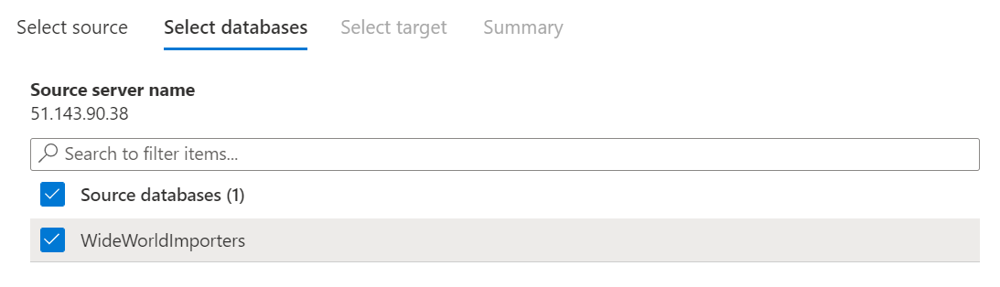
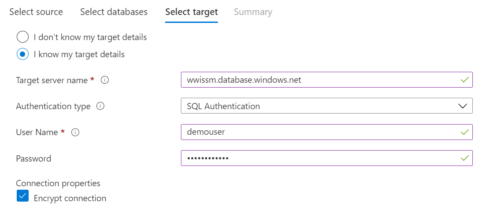
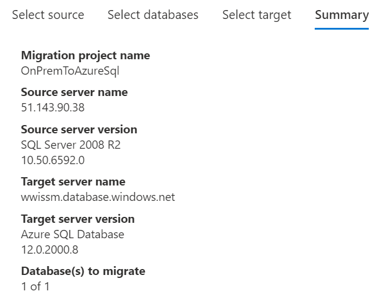
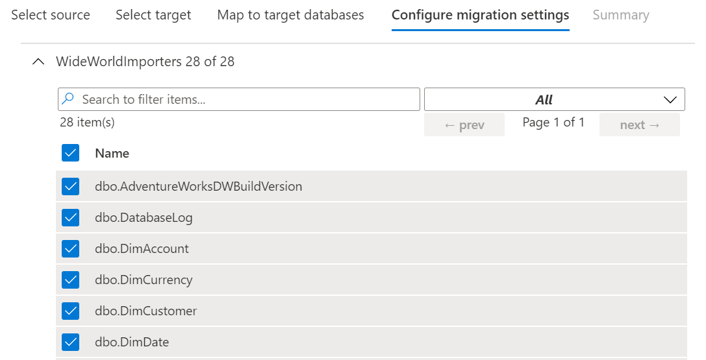
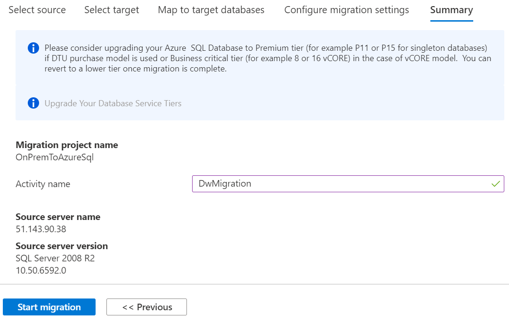
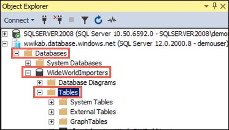
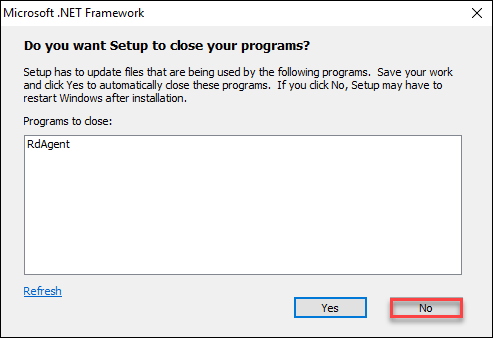
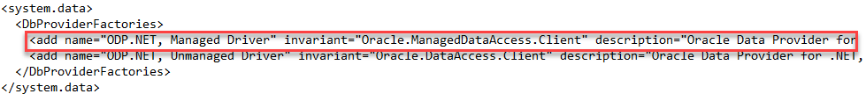
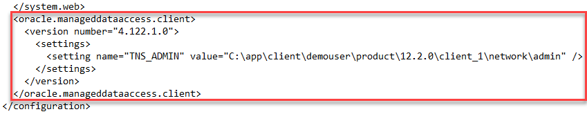
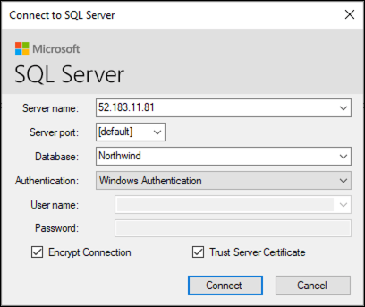

<div class="MCWHeader1">
Migrating Oracle to Azure SQL
</div>

<div class="MCWHeader2">
Hands-on lab step-by-step
</div>

<div class="MCWHeader3">
November 2020
</div>

Information in this document, including URL and other Internet Web site references, is subject to change without notice. Unless otherwise noted, the example companies, organizations, products, domain names, e-mail addresses, logos, people, places, and events depicted herein are fictitious, and no association with any real company, organization, product, domain name, e-mail address, logo, person, place or event is intended or should be inferred. Complying with all applicable copyright laws is the responsibility of the user. Without limiting the rights under copyright, no part of this document may be reproduced, stored in or introduced into a retrieval system, or transmitted in any form or by any means (electronic, mechanical, photocopying, recording, or otherwise), or for any purpose, without the express written permission of Microsoft Corporation.

Microsoft may have patents, patent applications, trademarks, copyrights, or other intellectual property rights covering subject matter in this document. Except as expressly provided in any written license agreement from Microsoft, the furnishing of this document does not give you any license to these patents, trademarks, copyrights, or other intellectual property.

The names of manufacturers, products, or URLs are provided for informational purposes only and Microsoft makes no representations and warranties, either expressed, implied, or statutory, regarding these manufacturers or the use of the products with any Microsoft technologies. The inclusion of a manufacturer or product does not imply endorsement of Microsoft of the manufacturer or product. Links may be provided to third party sites. Such sites are not under the control of Microsoft and Microsoft is not responsible for the contents of any linked site or any link contained in a linked site, or any changes or updates to such sites. Microsoft is not responsible for webcasting or any other form of transmission received from any linked site. Microsoft is providing these links to you only as a convenience, and the inclusion of any link does not imply endorsement of Microsoft of the site or the products contained therein.

© 2020 Microsoft Corporation. All rights reserved.

Microsoft and the trademarks listed at <https://www.microsoft.com/en-us/legal/intellectualproperty/Trademarks/Usage/General.aspx> are trademarks of the Microsoft group of companies. All other trademarks are property of their respective owners.

**Contents**

- [Migrating Oracle to Azure SQL hands-on lab step-by-step](#migratingoracletoazuresql-hands-on-lab-step-by-step)
  - [Abstract and learning objectives](#abstract-and-learning-objectives)
  - [Overview](#overview)
  - [Solution architecture](#solution-architecture)
  - [Requirements](#requirements)
  - [Exercise 1: Configure SQL Server instances](#exercise-1-configure-sql-server-instances)
    - [Task 1: Connect to the SqlServer2008 VM](#task-1-connect-to-the-sqlserver2008-vm)
    - [Task 2: Install AdventureWorks sample database](#task-2-install-adventureworks-sample-database)
    - [Task 3: Update SQL Server settings using Configuration Manager](#task-3-update-sql-server-settings-using-configuration-manager)
    - [Task 4: Connect to the SqlServer2017 VM](#task-4-connect-to-the-sqlserver2017-vm)
    - [Task 5: Update SQL Server settings using Configuration Manager 2017](#task-5-update-sql-server-settings-using-configuration-manager-2017)
  - [Exercise 2: Migrate SQL Server to Azure SQL Database using DMS](#exercise-2-migrate-sql-server-to-azure-sql-database-using-dms)
    - [Task 1: Assess the on-premises database](#task-1-assess-the-on-premises-database)
    - [Task 2: Migrate the database schema](#task-2-migrate-the-database-schema)
    - [Task 3: Create a migration project](#task-3-create-a-migration-project)
    - [Task 4: Run the migration](#task-4-run-the-migration)
    - [Task 5: Verify data migration](#task-5-verify-data-migration)
  - [Exercise 3: Post upgrade enhancement](#exercise-3-post-upgrade-enhancement)
    - [Task 1: Table compression](#task-1-table-compression)
    - [Task 2: Clustered ColumnStore index](#task-2-clustered-columnstore-index)
  - [Exercise 4: Setup Oracle 18c Express Edition](#exercise-4-setup-oracle-18c-express-edition)
    - [Task 1: Install Oracle XE](#task-1-install-oracle-xe)
    - [Task 2: Install Oracle Data Access components](#task-2-install-oracle-data-access-components)
    - [Task 3: Install SQL Server Migration Assistant for Oracle](#task-3-install-sql-server-migration-assistant-for-oracle)
    - [Task 4: Install SQL Developer Tool](#task-4-install-sql-developer-tool)
    - [Task 5: Create the Northwind database in Oracle 18c XE](#task-5-create-the-northwind-database-in-oracle-18c-xe)
    - [Task 6: Configure the Starter Application to use Oracle](#task-6-configure-the-starter-application-to-use-oracle)
  - [Exercise 5: Migrate the Oracle database to SQL Server 2017](#exercise-5-migrate-the-oracle-database-to-sql-server-2017)
    - [Task 1: Prepare to load SSMA](#task-1-prepare-to-load-ssma)
    - [Task 2: Migrate the Oracle database to SQL Server 2017 using SSMA](#task-2-migrate-the-oracle-database-to-sql-server-2017-using-ssma)
  - [Exercise 6: Migrate the Application](#exercise-6-migrate-the-application)
    - [Task 1: Create a new Entity Model against SQL Server](#task-1-create-a-new-entity-model-against-sql-server)
    - [Task 2: Modify Application Code](#task-2-modify-application-code)
  - [After the hands-on lab](#after-the-hands-on-lab)
    - [Task 1: Delete the resource group](#task-1-delete-the-resource-group)

# Migrating Oracle to Azure SQL hands-on lab step-by-step

## Abstract and learning objectives

In this hands-on lab, you implement a proof of concept (POC) for conducting a site analysis for a customer to compare cost, performance, and level of effort required to migrate from Oracle to SQL Server. You evaluate the dependent applications and reports that need to be updated and come up with a migration plan. Also, you help the customer take advantage of new SQL Server features to improve performance and resiliency and perform a migration from an old version of SQL Server to Azure SQL Database.

At the end of this hands-on lab, you will be better able to design and build a database migration plan and implement any required application changes associated with changing database technologies.

## Overview

Wide World Importers (WWI) has experienced significant growth in the last few years. In addition to predictable growth, they’ve had a substantial amount of growth in the data they store in their data warehouse. Their data warehouse is starting to show its age, slowing down during extract, transform, and load (ETL) operations and during critical queries. The data warehouse is running on SQL Server 2008 R2 Standard Edition.

The WWI CIO has recently read about new performance enhancements of Azure SQL Database and SQL Server 2017. She is excited about the potential performance improvements related to clustered ColumnStore indexes. She is also hoping that table compression can improve performance and backup times.

WWI is concerned about upgrading their database to Azure SQL Database or SQL Server 2017. The data warehouse has been successful for a long time. As it has grown, it has filled with data, stored procedures, views, and security. WWI wants assurance that if it moves its data store, it won’t run into any incompatibilities with the storage engine of Azure SQL Database or SQL Server 2017.

WWI’s CIO would like a POC of a data warehouse move and proof that the new technology can help ETL and query performance.

## Solution architecture

Below is a diagram of the solution architecture you build in this lab. Please study this carefully, so you understand the whole of the solution as you are working on the various components.

![This solution diagram is divided into Microsoft Azure and On-premises. Microsoft Azure includes SQL Server 2017 in a VM as an Always On Secondary, and Azure SQL Stretch Database to extend the audit table to Azure. On-premises includes the following elements: API App for vendor connections; Web App for Internet Sales Transactions; ASP.NET Core App for inventory management; SQL Server 2017 OLTP for Always On and JSON store; SSRS 2017 for Reporting of OLTP, Data Warehouse, and Cubes; SSIS 2017 for a Data Warehouse Load; Excel for reporting; SQL Server 2017 Enterprise for a Data Warehouse; and SSAS 2017 for a Data Warehouse. ](./media/preferred-solution-architecture.png "Preferred Solution diagram")

The solution begins with using the Microsoft Data Migration Assistant to assess what potentials issues might exist for upgrading the database to SQL Server 2017 or Azure SQL Database. After correcting any problems, the SQL Server 2008 database is migrated to Azure SQL Database, using the Azure Database Migration Service. Two features of Azure SQL Database, Table Compression and ColumnStore Index, will be applied to demonstrate value and performance improvements from the upgrade. For the ColumnStore Index, a new table based on the existing FactResellerSales table will be created, and a ColumnStore index applied. Next, the Oracle XE database supporting the application will be migrated to an on-premises SQL Server 2017 Enterprise instance using SQL Server Migration Assistant (SSMA) 7.x for Oracle. Once the Oracle database has been migrated, the Northwind MVC application will be updated, so it targets SQL Server 2017 instead of Oracle. The entity models are updated against SQL Server, and code updates are made to use the new Entity Framework context based on SQL Server. Corrections to stored procedures are made due to differences in how stored procedures are accessed in Oracle versus SQL Server. Azure SQL Stretch Database will be used to extend the audit log table to Azure, helping to prevent the recurrence of a system crash caused by the audit log table filling up.

## Requirements

- Microsoft Azure subscription must be pay-as-you-go or MSDN.
  - Trial subscriptions will not work.
- A virtual machine configured with Visual Studio 2019 Community edition.

## Exercise 1: Configure SQL Server instances

Duration: 45 minutes

In this exercise, you will configure SQL Server 2008 R2 on the SqlServer2008 VM. The database on this VM will act as the customer's existing on-premises database for this hands-on lab.

### Task 1: Connect to the SqlServer2008 VM

In this task, you will create an RDP connection to the SqlServer2008 VM.

1. In the [Azure portal](https://portal.azure.com), select **Resource groups** in the Azure services list, enter your resource group name (hands-on-lab-SUFFIX) into the filter box, and select it from the list.

   

2. In the list of resources for your resource group, select the SqlServer2008 VM.

   

3. On the SqlServer2008 blade, select Connect from the top menu.

   

4. Select **Download RDP file**, then open the downloaded RDP file.

   

5. Select **Connect** on the Remote Desktop Connection dialog.

   

6. Enter the following credentials when prompted:

   - **Username**: demouser
   - **Password**: Password.1!!

7. Select **Yes** to connect, if prompted that the identity of the remote computer cannot be verified.

   

### Task 2: Install AdventureWorks sample database

In this task, you will install the AdventureWorks database in SQL Server 2008 R2. It will act as the on-premises data warehouse database that you will migrate to Azure SQL Database.

1. On the SqlServer2008 VM, open a web browser, and navigate to the GitHub site containing the sample AdventureWorks 2008 R2 database at <https://github.com/Microsoft/sql-server-samples/releases/tag/adventureworks2008r2>.

2. Scroll down under Assets, and select `adventure-works-2008r2-dw.script.zip`.

   

3. Save the file, and unzip the downloaded file to a folder you create, called `C:\AdventureWorksSample`.

4. Open **Microsoft SQL Server Management Studio 17** (SSMS) on the SqlServer2008 VM. It can be found under Start->All Programs->Microsoft SQL Server Tools 17.

5. Connect to the **SQLSERVER2008** database, if you are not already connected. In the Connect to Server dialog, leave Authentication set to **Windows Authentication**, and select **Connect**.

   

6. In SSMS, select the **Open File** icon in SSMS menu bar.

   

7. In the Open File dialog, browse to the `C:\AdventureWorksSample\AdventureWorks 2008R2 Data Warehouse\` folder, select the file named `instawdwdb.sql`, and then select **Open**.

   

8. Next, select **Tools** in the SSMS menu, then select **Options**.

   

9. In the Options dialog, expand **Text Editor** in the tree view on the left, then expand **Transact-SQL**, select **General**, then check the box next to **Line numbers**. This will display line numbers in the query editor window, to make finding the lines specified below easier.

   

10. Select **OK** to close the Options dialog.

11. In the SSMS query editor for `instawdwdb.sql`, uncomment the `SETVAR` lines (lines 36 and 37) by removing the double hyphen "--" from the beginning of each line.

12. Next, edit the file path for each variable so they point to the following (remember to include a trailing backslash ("\\") on each path):

    - SqlSamplesDatabasePath: `C:\AdventureWorksSample\`

    - SqlSamplesSourceDataPath: `C:\AdventureWorksSample\AdventureWorks 2008R2 Data Warehouse\`

      

13. Place SSMS into **SQLCMD mode** by selecting it from the **Query** menu.

    

14. Execute the script by selecting the **Execute** button on the toolbar in SSMS.

    

15. This will create the `AdventureWorksDW2008R2` database. When the script is done running, you will see output similar to the following in the results pane.

    

16. Expand **Databases** in Object Explorer, right-click the `AdventureWorksDW2008R2` database, and select **Rename**.

    

17. Set the name of the database to `WideWorldImporters`.

    

18. Close SSMS.

### Task 3: Update SQL Server settings using Configuration Manager

In this task, you will update the SQL Server service accounts and other settings associated with the SQL Server instance installed on the VM.

1. From the Start Menu on your SqlServer2008 VM, search for **SQL Server Config**, then select **SQL Server Configuration Manager** from the search results.

   

2. From the tree on the left of the Configuration Manager window, select **SQL Server Services**, and then double-click **SQL Server (MSSQLSERVER)** in the list of services to open its properties dialog.

   

3. In the SQL Server (MSSQLSERVER) Properties dialog, change **Log on as** to use the demouser account, by entering **demouser** into the Account Name box, then entering the password, **Password.1!!**, into the Password and Confirm password boxes.

   

4. Select **OK**.

5. Select **Yes** to restart the service in the **Confirm Account Change** dialog.

6. While still in the SQL Server Configuration Manager, expand **SQL Server Network Configuration**, select **Protocols for MSSQLSERVER**, and double-click **TCP/IP** to open the properties dialog.

   

7. On the TCP/IP Properties dialog, ensure **Enabled** is set to **Yes**, and select **OK**.

   

   > **Note**: If prompted that the changes will not take effect until the service is restarted, select **OK**. You will restart the service later.

8. Select **SQL Server Services** in the tree on the left, then right-click **SQL Server (MSSQLSERVER)** in the services pane, and select **Restart**.

   

9. Repeat the previous step for the **SQL Server Agent (MSSQLSERVER)** service, this time selecting **Start** from the menu.

   

10. Close the SQL Server Configuration Manager.

### Task 4: Connect to the SqlServer2017 VM

In this task, you will create an RDP connection to the SqlServer2017 VM.

1. In the [Azure portal](https://portal.azure.com), select **Resource groups** in the Azure services list, enter your resource group name (hands-on-lab-SUFFIX) into the filter box, and select it from the list.

   

2. In the list of resources for your resource group, select the SqlServer2017 VM.

   

3. On the SqlServer2017 blade, select Connect from the top menu.

   

4. Select **Download RDP file**, then open the downloaded RDP file.

   

5. Select **Connect** on the Remote Desktop Connection dialog.

   

6. Enter the following credentials when prompted:

   - **Username**: demouser
   - **Password**: Password.1!!

7. Select **Yes** to connect, if prompted that the identity of the remote computer cannot be verified.

   

### Task 5: Update SQL Server settings using Configuration Manager 2017

In this task, you will update the SQL Server 2017 service accounts and other settings associated with the SQL Server 2017 instance installed on the VM.

1. From the Search Menu on your SqlServer2017 VM, search for **SQL Server 2017 Configuration Manager**, then select it from the search results.

   

2. From the tree on the left of the Configuration Manager window, select **SQL Server Services**.

   

3. In the list of services, double-click **SQL Server (MSSQLSERVER)** to open its properties dialog.

   ")

4. In the SQL Server (MSSQLSERVER) Properties dialog, change the **Log On user** to use the demouser account, by entering **demouser** into the Account Name box, then entering the password, **Password.1!!**, into the Password and Confirm password boxes.

   

5. Select **OK**.

6. Select **Yes** to restart the service in the **Confirm Account Change** dialog.

7. While still in the SQL Server 2017 Configuration Manager, expand **SQL Server Network Configuration**, select **Protocols for MSSQLSERVER**, and double-click **TCP/IP** to open the properties dialog.

   

8. On the TCP/IP Properties dialog, verify **Enabled** is set to **Yes**, and select **OK**.

   

   > **Note**: If TCP/IP was not already enabled, you will be prompted that the changes will not take effect until the service is restarted, select **OK**. Restart the service by selecting **SQL Server Services** in the tree on the left, then right-clicking **SQL Server (MSSQLSERVER)** in the services pane, and selecting **Restart**.

9. Select **SQL Server Services** in the tree on the left, right-click the **SQL Server Agent (MSSQLSERVER)** service, and then select **Start** from the menu.

   

10. Close the SQL Server 2017 Configuration Manager.

## Exercise 2: Migrate SQL Server to Azure SQL Database using DMS

Duration: 60 minutes

Wide World Importers would like a Proof of Concept (POC) that moves their data warehouse to Azure SQL Database. They would like to know about any incompatible features that might block their eventual production move. In this exercise, you will use the [Azure Database Migration Service](https://azure.microsoft.com/services/database-migration/) (DMS) to perform an assessment on their SQL Server 2008 R2 data warehouse database, and then migrate the WideWorldImporters database from the on-premises SQL Server 2008 R2 instance to [Azure SQL Database](https://docs.microsoft.com/azure/sql-database/).

### Task 1: Assess the on-premises database

Wide World Importers would like an assessment to see what potential issues they would have to address in moving their database to Azure SQL Database.

1. On the SqlServer2008 VM, install the .NET Framework 4.8 Runtime, a requirement for Data Migration Assistant to run. Locate the downloader [here.](https://dotnet.microsoft.com/download/dotnet-framework/net48) Restart the system.

2. Download the [Data Migration Assistant v5.x](https://www.microsoft.com/download/confirmation.aspx?id=53595) and run the downloaded installer.

3. Select **Next** on each of the screens, accepting to the license terms and privacy policy in the process.

4. Select **Install** on the Privacy Policy screen to begin the installation.

5. On the final screen, check the **Launch Microsoft Data Migration Assistant** check box, and select **Finish**.

   

6. In the Data Migration Assistant window, select the New **(+)** icon in the left-hand menu.

   

7. In the New project dialog, enter the following:

   - **Project type**: Select Assessment.
   - **Project name**: Enter Assessment.
   - **Assessment type**: Select Database Engine.
   - **Source server type**: Select SQL Server.
   - **Target server type**: Select Azure SQL Database.

   

   - Select **Create**.

8. On the **Options** tab, ensure the **Check database compatibility** and **Check feature parity** report types are checked, and select **Next**.

   

9. In the **Connect to a server** dialog on the **Select sources** tab, enter `SQLSERVER2008` into the Server name box, and **uncheck Encrypt connection**, then select **Connect**.

   

10. In the **Add sources** dialog that appears, check the box next to **WideWorldImporters**, and select **Add**.

   

11. Select **Start Assessment**.

12. Review the Assessment results, selecting both **SQL Server feature parity** and **Compatibility issues** options and viewing the reports.

    

13. You now have a list of the issues WWI will need to consider in upgrading their database to Azure SQL Database. Notice the assessment includes recommendations on the potential resolutions to issues. You can select **Export Assessment** on the top toolbar to save the report as a JSON file, if desired.

### Task 2: Migrate the database schema

After you have reviewed the assessment results and you have ensured the database is a candidate for migration to Azure SQL Database, use the Data Migration Assistant to migrate the schema to Azure SQL Database.

1. On the SqlServer2008 VM, return to the Data Migration Assistant, and select the New **(+)** icon in the left-hand menu.

2. In the New project dialog, enter the following:

   - **Project type**: Select Migration.
   - **Project name**: Enter DwMigration.
   - **Source server type**: Select SQL Server.
   - **Target server type**: Select Azure SQL Database.
   - **Migration scope**: Select Schema only.

   

3. Select **Create**.

4. On the **Select source** tab, enter the following:

   - **Server name**: Enter SQLSERVER2008.
   - **Authentication type**: Leave Windows Authentication selected.
   - **Connection properties**: Check both Encrypt connection and Trust server certificate.
   - Select **Connect**.
   - Select **WideWorldImporters** from the list of databases.

   

5. Select **Next**.

6. On the **Select target** tab, enter the following:

   - **Server name**: Enter the server name of the Azure SQL Database you created during the before the hands-on lab exercise.
     - To find the name of your SQL Database, select the WideWorldImporters SQL Database from your hands-on-lab-SUFFIX resource group in the Azure portal, and then select the **Server name** in the Essentials area of the Overview blade.

   

   - **Authentication type**: Select SQL Server Authentication.
   - **Username**: demouser
   - **Password**: Password.1!!
   - **Connection properties**: Check both Encrypt connection and Trust server certificate.
   - Select **Connect**.
   - Select **WideWorldImporters** from the list of databases.

   

7. Select **Next**.

8. In the **Select objects** tab, leave all the objects checked, and select **Generate SQL script**.

   

9. In the **Script & deploy schema** tab, review the script, then select **Deploy schema**.

   

10. Select **Deploy schema**.

11. After the schema is deployed, review the deployment results, and ensure there were no errors.

    

12. Next, open SSMS on the SqlServer2008 VM, and connect to your Azure SQL Database, by selecting **Connect->Database Engine** in the Object Explorer, and then entering the server name and credentials into the Connect to Server dialog.

    

13. Once connected, expand **Databases**, and expand **WideWorldImporters**, then expand **Tables**, and observe the schema has been created.

    

### Task 3: Create a migration project

In this task, you create a new migration project for the WideWorldImporters database.

1. Navigate to the Azure Database Migration Service in the [Azure portal](https://portal.azure.com).

2. On the Azure Database Migration Service blade, select **+New Migration Project**.

   

3. On the New migration project blade, enter the following:

   - **Project name**: Enter OnPremToAzureSql.

   - **Source server type**: Select SQL Server.

   - **Target server type**: Select Azure SQL Database.

   - **Choose type of activity**: Select Create project only.

     

4. Select **Create**.

5. On the Migration Wizard **Select source** blade, enter the following:

   - **Source SQL Server instance name**: Enter the IP address of your SqlServer2008 VM. For example, `40.84.6.199`.

     - You can retrieve the VM IP address by navigating to the SqlServer2008 overview blade in the Azure portal and selecting the copy button next to the Public IP address value.

       

   - **Authentication type**: Select SQL Authentication.
   - **Username**: demouser
   - **Password**: Password.1!!
   - **Connection properties**: Check both Encrypt connection and Trust server certificate.

   

6. Select **Next: Select databases >>**.

7. On the Migration Wizard **Select databases** blade, select WideWorldImporters.

   

8. Select **Next: Select target >>**.

9. On the Migration Wizard **Select target** blade, enter the following:

   - Select **I know my target details**.
   - **Target server name**: Enter the server name for your Azure SQL Database.

     - To find the name of your SQL Database, select the WideWorldImporters SQL Database from your hands-on-lab-SUFFIX resource group in the Azure portal, and then select the **Server name** in the Essentials area of the Overview blade.

       

   - **Authentication type**: Select SQL Authentication.
   - **Username**: demouser
   - **Password**: Password.1!!
   - **Connection properties**: Check Encrypt connection.

   

10. Select **Next: Summary >>**.

11. On the Migration Wizard Summary blade, review the Project summary, then select **Save project**.

    

### Task 4: Run the migration

In this task, you will create a new activity in the Azure Database Migration Service to execute the migration from the on-premises SQL Server 2008 R2 server to Azure SQL Database.

1. On the Azure Database Migration Service blade, select **+New Activity**, and then select **Offline data migration**.

   

2. On the Migration Wizard **Select source** blade, re-enter the demouser password, **Password.1!!**, then select **Next: Select target >>**.

   

3. On the Migration Wizard **Select target** blade, re-enter the demouser password, **Password.1!!**, then select **Next: Map to target databases >>**.

   

4. On the Migration Wizard **Map to target databases** blade, confirm that **WideWorldImporters** is checked as the source database, and that it is also the target database on the same line, then select **Next: Configure migration settings >>**.

   

5. On the Migration Wizard **Configure migration settings** blade, expand the WideWorldImporters database, verify all the tables are selected, and select **Next: Summary >>**.

   

6. On the Migration Wizard **Summary** blade, enter the following:

   - **Activity name**: Enter a name, such as DwMigration.

   

7. Select **Start migration**.

8. Monitor the migration on the status screen that appears. Select the refresh icon in the toolbar to retrieve the latest status.

   

9. When the migration is complete, you will see the status as **Completed**.

   

### Task 5: Verify data migration

In this task, you will use SSMS to verify the database was successfully migrated to Azure SQL Database.

1. Open SSMS on the SqlServer2008 VM, and connect to your Azure SQL Database. In the Connect to Server dialog, enter the following:

   - **Server name**: Enter the server name of your Azure SQL Database.
   - **Authentication**: Select SQL Server Authentication.
   - **Login**: demouser
   - **Password**: Password.1!!

   

2. Select **Connect**.

3. In the Object Explorer, expand Databases, WideWorldImporters, and Tables, then right-click `dbo.DimCustomer`, and choose **Select Top 1000 Rows**.

   

4. Observe that the query returns results, showing the data has been migrated from the on-premises SQL Server 2008 R2 database into Azure SQL Database.

5. Leave SSMS open with the connection to your Azure SQL Database for the next exercise.

## Exercise 3: Post upgrade enhancement

Duration: 20 minutes

In this exercise, you will demonstrate value from the upgrade by enabling the Table Compression and ColumnStore Index features of Azure SQL Database.

### Task 1: Table compression

1. In SSMS on the SqlServer2008 VM, and connect to your Azure SQL Database.

2. Open a new query window by selecting **New Query** from the toolbar.

   

3. Copy the script below, and paste it into the query window:

   ```sql
   USE [WideWorldImporters]

   -- Get the Size of the FactInternetSales table
   SELECT
   t.Name AS TableName,
   p.rows AS RowCounts,
   CAST(ROUND((SUM(a.total_pages) / 128.00), 2) AS NUMERIC(36, 2)) AS Size_MB
   FROM sys.tables t
   INNER JOIN sys.indexes i ON t.OBJECT_ID = i.object_id
   INNER JOIN sys.partitions p ON i.object_id = p.OBJECT_ID AND i.index_id = p.index_id
   INNER JOIN sys.allocation_units a ON p.partition_id = a.container_id
   WHERE t.Name = 'FactInternetSales'
   GROUP BY t.Name, p.Rows
   GO
   ```

4. Select **Execute** on the toolbar to run the query to retrieve the size of the `FactInternetSales` table.

   

5. In the results pane, note the size of the `FactInternetSales` table.

   

6. In the Object Explorer, expand Databases, WideWorldImporters, and Tables.

   

7. Right-click the `FactInternetSales` table, select the **Storage** context menu, and then select **Manage Compression** from the fly-out menu.

   

8. On the Welcome page of the Data Compression Wizard, select **Next**.

9. On the Select Compression Type page, select **Row** from the Compression Type drop down, and select **Next**.

   

10. On the Select an Output Option page, select **Run immediately**, and then select **Finish >>|**.

    

11. Select **Finish** on the Summary page and **Close** when the compression wizard is finished.

    

12. Rerun the query to get the size of the `FactInternetSales` table, noting the reduced size of the table.

    

13. Now, repeat steps 7 - 12 above, this time setting the Compression type to Page.

    

14. Once again, observe the table size in the results pane, and compare it to the values noted for the uncompressed table and with Row compression applied.

    

15. Both Row and Page compression reduce the size of the table, but Page compression provides the greatest reduction in this case. Compression decreases the load on the Disk I/O subsystem, while increasing the load on the CPU. Since most data warehouse workloads are heavily disk bound, and often have low CPU usage, compression can be a great way to improve performance.

### Task 2: Clustered ColumnStore index

In this task, you will create a new table based on the existing `FactResellerSales` table and apply a ColumnStore index.

1. In SSMS, ensure you are connected to the Azure SQL Database instance.

2. Open a new query window by selecting **New Query** from the toolbar.

   

3. Copy the script below, and paste it into the query window:

   ```sql
   USE WideWorldImporters

   SELECT *
   INTO ColumnStore_FactResellerSales
   FROM FactResellerSales
   GO
   ```

4. Select **Execute** on the toolbar to run the query, and create a new table named `ColumnStore_FactResellerSales`, populated with data from the `FactResellerSales` table.

   

5. Select **New Query** in the toolbar again, and paste the following query into the new query window. The query contains multiple parts; one to get the size of the `ColumnStore_FactResellerSales` table, a second to create a clustered ColumnStore index on the ColumnStore_FactResellerSales table, and then the size query is repeated to get the size after adding the clustered ColumnStore index.

   ```sql
   USE [WideWorldImporters]

   -- Get the Size of the ColumnStore_FactResellerSales table
   SELECT
   t.Name AS TableName,
   p.rows AS RowCounts,
   CAST(ROUND((SUM(a.total_pages) / 128.00), 2) AS NUMERIC(36, 2)) AS Size_MB
   FROM sys.tables t
   INNER JOIN sys.indexes i ON t.OBJECT_ID = i.object_id
   INNER JOIN sys.partitions p ON i.object_id = p.OBJECT_ID AND i.index_id = p.index_id
   INNER JOIN sys.allocation_units a ON p.partition_id = a.container_id
   WHERE t.Name = 'ColumnStore_FactResellerSales'
   GROUP BY t.Name, p.Rows
   GO

   -- Create a clustered columnstore index on the ColumnStore_FactResellerSales table
   CREATE CLUSTERED COLUMNSTORE INDEX [cci_FactResellerSales]
   ON [dbo].[ColumnStore_FactResellerSales]
   GO

   -- Get the Size of the ColumnStore_FactResellerSales table
   SELECT
   t.Name AS TableName,
   p.rows AS RowCounts,
   CAST(ROUND((SUM(a.total_pages) / 128.00), 2) AS NUMERIC(36, 2)) AS Size_MB
   FROM sys.tables t
   INNER JOIN sys.indexes i ON t.OBJECT_ID = i.object_id
   INNER JOIN sys.partitions p ON i.object_id = p.OBJECT_ID AND i.index_id = p.index_id
   INNER JOIN sys.allocation_units a ON p.partition_id = a.container_id
   WHERE t.Name = 'ColumnStore_FactResellerSales'
   GROUP BY t.Name, p.Rows
   GO
   ```

6. Select **Execute** on the toolbar to run the query.

   >**Note**: You will need to be in SQLCMD mode for all these queries to execute.

7. In the query results, observe the `Size_MB` value of the table before and after the creation of the clustered ColumnStore index. The first value is the size before the index was created, and the second value is the size after the ColumnStore index was created.

   

8. Create a new query window by selecting **New Query** from the toolbar, and select **Include Actual Execution Plan** by selecting its button in the toolbar.

   

9. Paste the queries below into the new query window, and select **Execute** on the toolbar:

   ```sql
   SELECT productkey, salesamount
   FROM ColumnStore_FactResellerSales

   SELECT productkey, salesamount
   FROM FactResellerSales
   ```

10. In the Results pane, select the **Execution Plan** tab. Check the (relative to the batch) percentage value of the two queries and compare them.

    

11. Run the same queries again, but this time set statistics IO on in the query by adding the following to the top of the query window:

    ```sql
    SET STATISTICS IO ON
    GO
    ```

12. Your query should look like:

    

13. Select **Execute** from the toolbar to run the query.

14. Statistics IO reports on the amount of logical pages that are read in order to return the query results. Select the **Messages** tab of the Results pane, and compare two numbers, logical reads and lob logical reads. You should see a significant drop in total number of logical reads on the columns store table.

    

15. You are now done with the SqlServer2008 VM. Log off of the VM to close the RDP session.

## Exercise 4: Setup Oracle 18c Express Edition

Duration: 45 minutes

In this exercise, you will install Oracle XE on your Lab VM, load a sample database supporting an application, and then migrate the database to the Azure SQL DB instance.

### Task 1: Install Oracle XE

1. Connect to your Lab VM, as you did in Task 5 of the [Before the Hands-on Lab](./Before%20the%20HOL%20-%20Migrating%20Oracle%20to%20Azure%20SQL%20and%20PostgreSQL.md#task-5-connect-to-the-lab-vm) exercise.

   - **Username**: demouser
   - **Password**: Password.1!!

2. In a web browser on your Lab VM, navigate to <https://www.oracle.com/database/technologies/xe-downloads.html>.

3. On the Oracle Database XE Downloads page, select **Oracle Database 18c Express Edition for Windows x64** download link.

   

4. Accept the license agreement, when prompted, and then select **Download OracleXE184_Win64.zip**. You might need to select the **Oracle License Agreement** link and scroll to the bottom of the agreement to enable the checkbox.

   

5. Sign in with your Oracle account to complete the download. If you don't already have a free Oracle account, you will need to create one.

   

6. After signing in, the file will download.

7. Unzip the file, and navigate to the `DISK1` folder.

8. Right-click `setup.exe`, and select **Run as administrator**.

   

9. Select **Next** to step through each screen of the installer, accepting the license agreement and default values, until you get to the **Specify Database Passwords** screen.

10. On the **Oracle Database Information** screen, set the password to **Password.1!!**, and select **Next**.

    

11. Select **Install**. Once the installation completes, take note of the ports assigned.

    

12. Select **Finish** on the final dialog to compete the installation.

### Task 2: Install Oracle Data Access components

1. On your Lab VM, navigate to <http://www.oracle.com/technetwork/database/windows/downloads/index-090165.html>.

2. On the 64-bit Oracle Data Access Components (ODAC) Downloads page, scroll down and locate the **64-bit ODAC 12.2c Release 1 (12.2.0.1.1) for Windows x64** section, and then select the **ODAC122011_x64.zip** link.

    Downloads screen")

3. Accept the license agreement, and then select **Download ODAC122011_x64.zip**.

   

4. When the download completes, extract the contents of the ZIP file to a local drive.

5. Navigate to the folder containing the extracted ZIP file, and right-click `setup.exe`, then select **Run as administrator** to begin the installation.

6. Select **Next** to accept the default language, English, on the first screen.

7. On the Specify Oracle Home User screen, accept the default, Use Windows Built-in Account, and select **Next**.

8. Accept the default installation locations, and select **Next**.

9. On the **Available Product Components**, uncheck **Oracle Data Access Components Documentation for Visual Studio**, and select **Next**.

   

10. On the ODP.NET screen, check the box for **Configure ODP.NET and/or Oracle Providers for ASP.NET at machine-wide level**, and select **Next**.

    

11. If the Next button is disabled on the Perform Prerequisite Checks screen, check the **Ignore All** box, and then select **Next**. This screen will be skipped by the installer if no missing prerequisites are found.

    

12. On the Summary screen, select **Install**.

13. On the Finish screen, select **Close**.

### Task 3: Install SQL Server Migration Assistant for Oracle

1. On your Lab VM, download SQL Server Migration Assistant v8.x for Oracle from <https://www.microsoft.com/en-us/download/details.aspx?id=54258>.

2. Select the Download button to download SSMA.

   

   >**Note**: Download the latest version.

3. Check the box next to **SSMAforOracle_8.x.0.msi**, and select **Next** to begin the download.

   

4. Run the downloaded installer, and select **Next** on the Welcome screen.

   

5. Accept the License Agreement, and select **Next**.

6. On the Choose Setup Type screen, select **Typical**, which will move you to the next screen.

   

7. Select **Install** on the Ready to Install screen.

   

8. Select **Finish** when the installation is complete.

### Task 4: Install SQL Developer Tool

In this task, you will install Oracle SQL Developer, a common IDE to interact with Oracle databases.

1. On your Lab VM, open a web browser and navigate to <https://www.oracle.com/tools/downloads/sqldev-downloads.html>.

2. Scroll down on the page and download **Windows 64-bit with JDK 8 included**.

   

3. Accept the license terms. Extract the files to `C:\Tools`.

4. Navigate to `C:\Tools\sqldeveloper`. Select and run the executable file. Ensure that SQL Developer loads.

   

   >**Note**: If you are prompted to import preferences from a previous installation, select **No**.

### Task 5: Create the Northwind database in Oracle 18c XE

WWI has provided you with a copy of their application, including a database script to create their Oracle database. They have asked that you use this as a starting point for migrating their database and application to Azure SQL DB. In this task, you will create a connection to the Oracle database on your Lab VM.

1. In a web browser on LabVM, download a copy of the [Migrating Oracle to  Azure SQL and PostgreSQL upgrade and migration MCW repo](https://github.com/microsoft/MCW-Migrating-Oracle-to-Azure-SQL-and-PostgreSQL/archive/master.zip).

2. Unzip the contents to **C:\handsonlab**.

3. Launch SQL Developer from the `C:\Tools\sqldeveloper` path from earlier. In the **Database Connection** window, select **Create a Connection Manually**.

   

4. Provide the following parameters to the **New / Select Database Connection** window. Select **Connect** when you are complete.

   - **Name**: Northwind
   - **Username**: system
   - **Password**: Password.1!!
   - Keep the **Details** at their defaults

   

5. Once the connection completes, select the **Open File** icon (1). Navigate to `C:\handsonlab\MCW-Migrating-Oracle-to-Azure-SQL-and-PostgreSQL-master\Hands-on lab\lab-files\starter-project\Oracle Scripts\1.northwind.oracle.schema`. Then, execute the DDL statements (2).

   

6. Right-click the **Northwind** connection and select **Properties**. Then, edit the **Username** to `NW`, and the **Password** to `oracledemo123`. Select **Connect**. Note that you may be asked to enter the password again.

7. In the Open File dialog, navigate to `C:\handsonlab\MCW-Migrating-Oracle-to-Azure-SQL-and-PostgreSQL-master\Hands-on lab\lab-files\starter-project\Oracle Scripts`, select the file `2.northwind.oracle.tables.views.sql`, and then select **Open**.

8. As you did previously, run the script. Note that SQL Developer provides an output pane to view any errors.

   

9. Repeat steps 7 - 8, replacing the file name in step 26 with each of the following:

    - `3.northwind.oracle.packages.sql`

    - `4.northwind.oracle.sps.sql`

      - During the Execute script step for this file, you will need to execute each CREATE OR REPLACE statement independently.

      - Using your mouse, select the first statement, starting with CREATE and going to END. Then, run the selection, as highligted in the image.

      

      - Repeat this for each of the remaining CREATE OR REPLACE... END; blocks in the script file (there are 7 more to execute, for 8 total).

    - `5.northwind.oracle.seed.sql`

      > **Important**: This query can take several minutes to run, so make sure you wait until you see the **Commit complete** message in the output window before executing the next file.

    - `6.northwind.oracle.constraints.sql`

### Task 6: Configure the Starter Application to use Oracle

In this task, you will add the necessary configuration to the `NorthwindMVC` solution to connect to the Oracle database you created in the previous task.

1. In Visual Studio on your LabVM, select **Build** from the menu, then select **Build Solution**.

   

2. Open the `Web.config` file in the `NorthwindMVC` project by double-clicking the file in the Solution Explorer, on the right-hand side in Visual Studio.

   

3. In the `Web.config` file, locate the `connectionStrings` section, and verify the connection string named **OracleConnectionString** matches the values you have used in this hands-on lab:

   ```xml
   DATA SOURCE=localhost:1521/XE;PASSWORD=oracledemo123;USER ID=NW
   ```

   

4. Run the solution by selecting the green **Start** button on the Visual Studio toolbar.

   

5. You should see the Northwind Traders Dashboard load in your browser.

   

   > **Note**: If you receive an error about being unable to find part of the path for `bin\roslyn\csc.exe`, stop the debugging session by selecting the Stop button on the toolbar. Next, select Tools -> NuGet Package Manager -> Package Manager Console, and at the prompt execute the following command: `Update-Package Microsoft.CodeDom.Providers.DotNetCompilerPlatform -r`. Once the command finishes, run the solution again.

6. Close the browser to stop debugging the application, and return to Visual Studio.

## Exercise 5: Migrate the Oracle database to SQL Server 2017

Duration: 30 minutes

In this exercise, you will migrate the Oracle database into the on-premises SQL Server 2017 instance using SSMA.

### Task 1: Prepare to load SSMA

1. You may need to download the latest version of .NET Framework to load the SQL Server Migration Assistance for Oracle tool. Select [this](https://dotnet.microsoft.com/download/dotnet-framework/net48) link to install .NET Framework 4.8.

   >**Note**: If you are prompted to relaunch **RdAgent**, select **No**. This will require you to restart the VM after the .NET Framework installation.

   

2. Navigate to `C:\Windows\Microsoft.NET\Framework64\v4.0.30319\Config` in File Explorer. Right-click `machine.config` and select **Open with > Notepad**.

3. Once the `machine.config` file opens in Notepad, remove the reference to `oracle.manageddataaccess.client` below the `configSections` node.

4. Below `DbProviderFactories`, remove the reference to the managed Oracle connector.

   

5. Lastly, remove the reference to the `oracle.manageddataaccess.client` node in the `configuration` root node.

   

6. Save the file. Close notepad.

### Task 2: Migrate the Oracle database to SQL Server 2017 using SSMA

1. On your LabVM, launch **Microsoft SQL Server Migration Assistant for Oracle** from the Start Menu.

2. Select **File**, then **New Project...**

   

3. In the New Project dialog, accept the default name and location, select **SQL Server 2017** for the Migration To value, and select **OK**.

   

4. Select **Connect to Oracle** in the SSMA toolbar.

   

5. In the Connect to Oracle dialog, enter the following:

   - **Provider**: Leave set to the default value, Oracle Data Provider for .NET.
   - **Mode**: Leave set to Standard mode.
   - **Server name**: localhost
   - **Server port**: Set to 1521.
   - **Oracle SID**: XE
   - **Username**: NW
   - **Password**: oracledemo123

   

6. Select **Connect**.

7. In the Filter objects dialog, uncheck everything except the **NW**, **Sys**, and **System** databases.

   

8. In the Output window, you will see a message that the connection was established successfully, similar to the following:

   

9. Under Oracle Metadata Explorer, expand the localhost node, Schemas, and confirm you can see the NW schema, which will be the source for the migration.

   

10. Next, select **Connect to SQL Server** from the toolbar, to add your SQL 2017 connection.

    

11. In the connect to SQL Server dialog, provide the following:

    - **Server name**: Enter the IP address of your SqlServer2017 VM. You can get this from the Azure portal by navigating to your VM's blade, and looking at the Essentials area.

    

    - **Server port**: Leave set to [default].
    - **Database**: Northwind
    - **Authentication**: Set to Windows Authentication.
    - **Encrypt Connection**: Check this box.
    - **Trust Server Certificate**: Check this box.

    

12. Select **Connect**.

13. You will see a success message in the output window.

    

14. In the SQL Server Metadata Explorer, expand the server node, then Databases. You should see Northwind listed.

    

15. In the Oracle Metadata Explorer, check the box next to NW, expand the NW database, and uncheck **Packages**. Next, select NW to make sure it is selected in the tree.

    

16. In the SQL Server Metadata explorer, check the box next to Northwind.

    

17. In the SSMA toolbar, select **Convert Schema**. There is a bug in SSMA which prevents this button to being properly enabled, so if the button is disabled, you can select the NW node in the Oracle Metadata Explorer, which should cause the Convert Schema button to become enabled. You can also right-click on the NW database in the Oracle Metadata Explorer, and select Convert Schema if that does not work.

    

18. After about a minute the conversion should have completed.

19. In the SQL Server Metadata Explorer, observe that new schema objects have been added. For example, under Northwind, Schemas, NW, Tables you should see the tables from the Oracle database.

    

20. In the output pane, you will notice a message that the conversion finished with 1 error, and 13 warnings.

    

21. To view the errors, select the **Error List** at the bottom of the SSMA screen.

    

22. Select **Warnings** to hide the warnings, and leave only Errors displayed.

    

23. Double-click on the error listed. This will display the Table in both Oracle and SQL Server that is causing the error, `EMPLOYEETERRITORIES`. Notice the Oracle table lists `EMPLOYEEID` with a data type of `NUMBER`, while SQL Server is expecting a data type of `float(53)`.

    

    >**Note**: If the datatype conversions are already correct, feel free to skip steps 23 to 30.

24. Look at the table definition for the table on the Oracle side.

25. To change the data type, select the **Type Mapping** tab, select the row with source type of number, and select **Edit**.

    

26. In the Edit Type Mapping dialog, set the Target type to **numeric(precision, scale)**, set the Precision to **10**, and select **OK**.

    

27. Select **Apply** on the Type mapping tab.

    

28. In the Oracle Metadata Explorer, right-click the `EMPLOYEETERRITORIES` table, and select **Convert Schema**.

    

29. When prompted that the target exists, select **Overwrite**.

    

30. Notice the error is now gone from the Error List.

31. We are going to fix another data type conversion issue now, which will otherwise appear when we attempt to migrate the data.

32. Select the `ORDER_DETAILS` table in the Oracle Metadata Explorer.

    

33. Next, you are going to convert the type associated with the `DISCOUNT` column, `FLOAT(23)` to a `numeric(10, 0)`, similar to what you did for the `EMPLOYEETERRITORIES` table.

34. Select the **Type Mapping** tab, then select `float[*..53]` from the Source Type list, and select **Edit**.

    ![The row with source type of float[*..53] is selected and highlighted on the Type Mapping tab, and Edit is highlighted on the right.](./media/ssma-type-mapping-float-edit.png "Edit float[*..53]")

35. In the Edit Type Mapping dialog, change the Target type to `numeric(precision, scale)`, and set the Precision to **10**, then select **OK**.

    

36. Select **Apply** to save the changes to the `ORDER_DETAILS` table.

37. Now, right-click on the `ORDER_DETAILS` table in the Oracle Metadata Explorer, and select **Convert Schema**.

38. When prompted that the target exists, select **Overwrite**.

39. **Optional**: Save the project. This can take a while, and is not necessary to complete the hands-on lab.

40. To apply the resultant schema to the Northwind database in SQL Server, use the SQL Server Metadata Explorer to view the Northwind database. Right-click Northwind, and select **Synchronize with Database**.

    

41. Select **OK** in the Synchronize with the Database dialog.

42. The Synchronize action will result in multiple errors in the Error List, resulting from attempting to add the SSMA assemblies to the Northwind database.

    

43. These errors are the result of improvements implemented in SQL Server 2017 SQLCLR security model. Specifically, in SQL Server 2017, Microsoft now by default requires that all types of assemblies (SAFE, EXTERNAL_ACCESS, UNSAFE) are authorized for UNSAFE access.

44. For this hands-on lab, you will be adding the assemblies causing the errors to the trusted assembly list, which will allow the assemblies. To fix these errors, complete the following:

    - Under the **Northwind** database in the SQL Server Metadata Explorer in SSMA, expand **Assemblies**.

    

    - Right-click `SSMA4OracleSQLServerCollections.NET`, and select **Save as Script**.

    

    - Save the script to the local machine.
    - Now, you will need to use SSMS on your SqlServer2017 VM.

      - Open an RDP connection to your SqlServer2017 VM, if one is not already open.
      - Open SSMS 18.
      - Connect to SqlServer2017, by entering **SqlServer2017** into the Server name field, using Windows Authentication, and selecting **Connect**.
      - Expand **Databases**, right-click on **Northwind**, and select **New Query**.
      - Paste the following query into the new query window, but don't execute it until you complete the steps below:

      ```sql
      USE master;
      GO

      DECLARE @clrName nvarchar(4000) = 'SSMA4OracleSQLServerCollections.NET'
      DECLARE @asmBin varbinary(max) = [INSERT BINARY];
      DECLARE @hash varbinary(64);

      SELECT @hash = HASHBYTES('SHA2_512', @asmBin);

      EXEC sys.sp_add_trusted_assembly @hash = @hash, @description = @clrName;
      ```

    - Now, return to your Lab VM, and open the saved `SSMA4OracleSQLServerCollections.NET.sql` file from the desktop with Notepad.exe.
    - Within the SQL file, locate the line that begins with `CREATE ASSEMBLY`, then locate the word `FROM`. Copy the binary string that appears after `FROM`. This value will span all the way down to the line containing the text `WITH PERMISSION_SET = SAFE`. Be sure not to include any whitespace at the end of the binary value.

      

    - Now, return to SSMS on your SqlServer2017 VM, and replace `INSERT BINARY` with the copied binary value. The line should end with ";" and there should be no whitespace before the ";".
    - Execute the query in SSMS.

45. Repeat step 44, this time for the assembly `SSMA4OracleSQLServerExtensions.NET`. Make sure to replace the `@clrName` variable in the script with the value "SSMA4OracleSQLServerExtensions.NET".

46. The SSMA assemblies have now been allowed in SQL Server 2017.

47. Return to SSMA on your Lab VM, and rerun the **Synchronize with Database** action on the Northwind database. This will create all the schema objects in the SQL Server Northwind database. There should now be no errors, and the Output pane should show **Synchronization operation is complete**.

48. Now you need to migrate the data.

49. In the Oracle Metadata Explorer, select **NW** and from the command bar, select **Migrate Data**.

    

50. You will be prompted to re-enter your Oracle credentials for use by the migration connection.

    - Recall the Oracle credentials are:

      - **Server name**: localhost
      - **Server port**: 1521
      - **Oracle SID**: XE
      - **Username**: NW
      - **Password**: oracledemo123

    - The SQL Server credentials are:

      - **Server name**: IP address of your SqlServer2017 VM (obtained in the essentials area of your VM's blade in Azure portal).
      - **Server port**: [default]
      - **Authentication**: Windows Authentication

51. Select **Connect**.

52. After the migration completes, you will be presented with a Data Migration Report, similar to the following:

    

53. Select **Close** on the migration report.

54. Close SSMA for Oracle.

## Exercise 6: Migrate the Application

Duration: 15 minutes

In this exercise, you will modify the `NorthwindMVC` application so it targets SQL Server 2017 instead of Oracle.

### Task 1: Create a new Entity Model against SQL Server

1. On your Lab VM, return to Visual Studio, and open `Web.config` from the Solution Explorer.

2. Modify the connection string named `SqlServerConnectionString` to match your remote SQL Server credentials.

   - Replace the value of "data source" with your SqlServer2017 VM's public IP address.
   - Verify the value of "password" is **Password.1!!**

   

3. Save the `web.config` file.

4. Build the solution, by selecting Build in the Visual Studio menu, then selecting Build Solution.

5. In the Solution Explorer, expand the Data folder, and select all the files within the folder.

   

6. Right-click, and choose **Delete**.

   

7. Select **OK** at the confirmation prompt.

8. Right-click on the Data folder, and select **Add > New Item...**

   

9. In the Add New Item dialog, expand Visual C#, select **Data**, and select **ADO.NET Entity Data Model**. Enter **DataContext** for the name, and select **Add**.

   

10. In the wizard's Choose Model Contents dialog, select **Code First from database**, and select **Next**.

    

11. In the Choose Your Data Connection dialog:

    - Select **SqlServerConnectionString (Settings)** from the data connection drop down.
    - Select **Yes, include the sensitive data in the connection string**.
    - **Uncheck Save connection settings in Web.Config**.
    - Select **Next**.

    

12. If prompted, in the Connect to SQL Server dialog, enter the Password, **Password.1!!**

    

13. On the Choose Your Database Objects and Settings screen, expand the Tables node, and check **NW** only. Ensure **Pluralize or singularize generated column names** is checked.

    

14. Select **Finish**, and the model will be generated. This may take a few minutes.

### Task 2: Modify Application Code

1. In Visual Studio, open the file `DataContext.cs` from the Solution Explorer. You may need to collapse the Data folder, and re-expand it after refreshing if you don't see the file listed.

   

2. The call to base in the DataContext constructor, at the top of the file, needs to be updated to reflect the correct connection string.

   

3. Change the line from:

   ```csharp
   : base ("name=DataContext")
   ```

4. To:

   ```csharp
   : base ("name=SqlServerConnectionString")
   ```

5. Save the file.

   

6. Next, open the file `HomeController.cs`, in the Controllers folder in the Solution Explorer.

   

7. Comment out the code under the Oracle comment. First, select the lines for the Oracle code, then select the Comment button in the toolbar.

   

8. Next, uncomment the code under the SQL Server comment. Select the commented out code, then choose the Uncomment button on the toolbar.

   > **Note**: The lines will change from green to colored text when the comment characters have been removed from the front of each line. This code change is done because of differences in how stored procedures are accessed in Oracle versus Sql Server.

   

9. Save the changes to `HomeController.cs`.

10. Open the file, `SALESBYYEAR.cs`, in the Models folder in the Solution Explorer.

    

11. Change the types of the following properties:

    - Change the `SUBTOTAL` property from double to decimal.

    - Change the `YEAR` property from string to int.

    

12. Save the file.

13. Open the `SalesByYearViewModel.cs` file from the Models folder in the Solution Explorer.

    

14. Change the type of the `YEAR` property from string to int, then save the file.

    

15. Run the solution by selecting the green Start button on the toolbar.

    

16. You will get an exception that the stored procedure call has failed. This is because of an error in migrating the stored procedure.

    

17. Select the red Stop button to end execution of the application.

    

18. To resolve the error, open the `SALES_BY_YEAR_fix.sql` file, located under Solution Items in the Solution Explorer.

19. From the Visual Studio menu, select **View**, and then **Server Explorer**.

    

20. In the Server Explorer, right-click on **Data Connections**, and select **Add Connections...**

    

21. On the Choose Data Source dialog, select **Microsoft SQL Server**, and select **Continue**.

    

22. On the Add Connection dialog, enter the following:

    - **Data source**: Leave Microsoft SQL Server (SqlClient).
    - **Server name**: Enter the IP address of your SqlServer2017 VM.
    - **Authentication**: Select SQL Server Authentication.
    - **Username**: demouser
    - **Password**: Password.1!!
    - **Connect to a database**: Choose Select or enter database name, and enter Northwind.
    - Select **Test Connection** to verify your settings are correct, and select **OK** to close the successful connection dialog.

    

23. Select **OK**.

24. Right-click the newly added SQL Server connection in the Server Explorer, and select **New Query**.

    

25. Select and copy all of the text from the `SALES_BY_YEAR_fix.sql` file (click CTRL+A, CTRL+C in the `SALES_BY_YEAR_fix.sql` file).

26. Paste (CTRL+V) the copied text into the new Query window.

27. Verify `Use [Northwind]` is the first line of the file, and that it matches the database listed in the query bar, then select the green **Execute** button.

    ![The Use [Northwind] statement is highlighted, as is the Northwind database and the Execute button in the query bar.](./media/visual-studio-sql-query-execute.png "Verify the Use [Northwind] statement")

28. You should see a message that the command completed successfully.

    

29. Run the application again by selecting the green Start button in the Visual Studio toolbar.

    

30. Verify the graph is showing correctly on the Northwind Traders dashboard.

    

31. Congratulations! You have successfully migrated the data and application from Oracle to SQL Server.

## After the hands-on lab

Duration: 10 mins

In this exercise, you will delete any Azure resources that were created in support of the lab. You should follow all steps provided after attending the Hands-on lab to ensure your account does not continue to be charged for lab resources.

### Task 1: Delete the resource group

1. Using the [Azure portal](https://portal.azure.com), navigate to the Resource group you used throughout this hands-on lab by selecting Resource groups in the left menu.

2. Search for the name of your research group, and select it from the list.

3. Select Delete in the command bar, and confirm the deletion by re-typing the Resource group name, and selecting Delete.

You should follow all steps provided _after_ attending the Hands-on lab.
