<div class="MCWHeader1">
Migrating Oracle to PostgreSQL
</div>

<div class="MCWHeader2">
Hands-on lab step-by-step
</div>

<div class="MCWHeader3">
September 2021
</div>

Information in this document, including URL and other Internet Web site references, is subject to change without notice. Unless otherwise noted, the example companies, organizations, products, domain names, e-mail addresses, logos, people, places, and events depicted herein are fictitious, and no association with any real company, organization, product, domain name, e-mail address, logo, person, place or event is intended or should be inferred. Complying with all applicable copyright laws is the responsibility of the user. Without limiting the rights under copyright, no part of this document may be reproduced, stored in or introduced into a retrieval system, or transmitted in any form or by any means (electronic, mechanical, photocopying, recording, or otherwise), or for any purpose, without the express written permission of Microsoft Corporation.

Microsoft may have patents, patent applications, trademarks, copyrights, or other intellectual property rights covering subject matter in this document. Except as expressly provided in any written license agreement from Microsoft, the furnishing of this document does not give you any license to these patents, trademarks, copyrights, or other intellectual property.

The names of manufacturers, products, or URLs are provided for informational purposes only and Microsoft makes no representations and warranties, either expressed, implied, or statutory, regarding these manufacturers or the use of the products with any Microsoft technologies. The inclusion of a manufacturer or product does not imply endorsement of Microsoft of the manufacturer or product. Links may be provided to third-party sites. Such sites are not under the control of Microsoft and Microsoft is not responsible for the contents of any linked site or any link contained in a linked site, or any changes or updates to such sites. Microsoft is not responsible for webcasting or any other form of transmission received from any linked site. Microsoft is providing these links to you only as a convenience, and the inclusion of any link does not imply endorsement of Microsoft of the site or the products contained therein.

© 2020 Microsoft Corporation. All rights reserved.

Microsoft and the trademarks listed at <https://www.microsoft.com/en-us/legal/intellectualproperty/Trademarks/Usage/General.aspx> are trademarks of the Microsoft group of companies. All other trademarks are property of their respective owners.

**Contents**

- [Migrating Oracle to PostgreSQL hands-on lab step-by-step](#migratingoracletopostgresql-hands-on-lab-step-by-step)
  - [Abstract and learning objectives](#abstract-and-learning-objectives)
  - [Overview](#overview)
  - [Solution architecture](#solution-architecture)
  - [Requirements](#requirements)
  - [Exercise 1: Setup Oracle 18c Express Edition](#exercise-1-setup-oracle-18c-express-edition)
    - [Task 1: Install Oracle XE](#task-1-install-oracle-xe)
    - [Task 2: Install Oracle Data Access components](#task-2-install-oracle-data-access-components)
    - [Task 3: Install SQL Developer Tool](#task-3-install-sql-developer-tool)
    - [Task 4: Create the Northwind database in Oracle 18c XE](#task-4-create-the-northwind-database-in-oracle-18c-xe)
  - [Exercise 2: Assess the Oracle 18c Database before Migrating to PostgreSQL](#exercise-2-assess-the-oracle-18c-database-before-migrating-to-postgresql)
    - [Task 1: Update Statistics and Identify Invalid Objects](#task-1-update-statistics-and-identify-invalid-objects)
  - [Exercise 3: Prepare to Migrate the Oracle database to PostgreSQL](#exercise-3-prepare-to-migrate-the-oracle-database-to-postgresql)
    - [Task 1: Install the ora2pg utility](#task-1-install-the-ora2pg-utility)
    - [Task 2: Prepare the PostgreSQL instance using pgAdmin](#task-2-prepare-the-postgresql-instance-using-pgadmin)
    - [Task 3: Create an ora2pg project structure](#task-3-create-an-ora2pg-project-structure)
    - [Task 4: Create a migration report](#task-4-create-a-migration-report)
  - [Exercise 4: Migrate the Database and Application](#exercise-4-migrate-the-database-and-application)
    - [Task 1: Migrate the basic database table schema using ora2pg](#task-1-migrate-the-basic-database-table-schema-using-ora2pg)
    - [Task 2: Migrate Table Data with ora2pg](#task-2-migrate-table-data-with-ora2pg)
    - [Task 3: Finishing the table schema migration](#task-3-finishing-the-table-schema-migration)
    - [Task 4: Migrate Views](#task-4-migrate-views)
    - [Task 5: Migrate the Stored Procedure](#task-5-migrate-the-stored-procedure)
    - [Task 6: Create new Entity Data Models and update the application on the Lab VM](#task-6-create-new-entity-data-models-and-update-the-application-on-the-lab-vm)
    - [Task 7: Update the Dashboard Stored Procedure Call](#task-7-update-the-dashboard-stored-procedure-call)
    - [Task 8: Deploy the application to Azure](#task-8-deploy-the-application-to-azure)
  - [After the hands-on lab](#after-the-hands-on-lab)
    - [Task 1: Delete the resource group](#task-1-delete-the-resource-group)

# Migrating Oracle to PostgreSQL hands-on lab step-by-step

## Abstract and learning objectives

In this hands-on lab, you implement a proof of concept (POC) for conducting a site analysis for a customer to compare cost, performance, and level of effort required to migrate from Oracle to Azure Database for PostgreSQL. You evaluate the dependent applications and reports that need to be updated and come up with a migration plan. Also, you help the customer take advantage of new PostgreSQL features to improve performance and resiliency.

At the end of this hands-on lab, you will be better able to design and build a database migration plan and implement any required application changes associated with changing database technologies.

## Overview

Wide World Importers (WWI) has experienced significant growth in the last few years. As the size of their data grows, they have started to experience issues with their existing Oracle OLTP database, including complex upgrade processes, complex licensing, and even a major failure caused by an overflowing audit table.

The WWI CIO has learned of the many benefits that Azure Database for PostgreSQL provides, including AD support, simple pricing, high performance, and high availability. She is also excited about the many similarities between PL/SQL and PL/pgSQL, since that will reduce the migration effort significantly.

WWI's CIO would like a POC of an OLTP database move and proof that the new technology will make her company's operations faster, cheaper, and more efficient. 

## Solution architecture

Below is a diagram of the solution architecture you build in this lab. Please study this carefully, so you understand the whole of the solution as you are working on the various components.

![This solution diagram is divided into Microsoft Azure and on-premises. Azure Database for PostgreSQL - Hyperscale (Citus) serves as the primary OLTP database cluster with support for the efficient analysis of JSON data. Citus supports high availability, which entails pairing two instances to serve as a single node. When one of the instances fails, the other instance--which is kept up to date--is substituted automatically. Logs generated by PostgreSQL's standard logging tools and pgAudit will be stored in Azure Monitor, a tool which allows the analysis of logging data. As for on-premises components, the API app for vendor connections, the Web App for Internet Sales Transactions, and the ASP.NET Core App for inventory management reside locally. BI developers will continue to use Excel and Power BI for reporting.](./media/preferred-solution-architecture-oracle-to-postgres.PNG "Preferred Solution diagram")

The solution begins by installing and using ora2pg to assess the task of migrating the Oracle XE database supporting the application to Azure Database for PostgreSQL. Then, the tool will be used to migrate the table schema without indexes or constraints to the target. Azure Database Migration Service will be used to migrate data from Oracle to PostgreSQL. Remaining objects, including stored procedures and views, will be modified and exported to PostgreSQL through ora2pg. At this point, we will need to modify the MVC application. The first step is to create new entity models and update controllers to reference the new models. Then, code will be added to call the home page stored procedure. We will deploy the application to an Azure App Service instance using a publish profile. Azure Monitor will be used to facilitate the storage and analysis of audit logs generated by the cloud PostgreSQL instance. 

## Requirements

- Microsoft Azure subscription must be pay-as-you-go or MSDN.
  - Trial subscriptions will not work.
- A virtual machine configured with Visual Studio 2019 Community edition.

    >**Note**: If you find that your Visual Studio 2019 VM image comes with Visual Studio 2017, and not 2019, you will need to manually install 2019 Community from [here](https://visualstudio.microsoft.com/downloads/). Ensure that the **ASP.NET and web development** and **Azure development** Workloads are enabled for your installation.

## Exercise 1: Setup Oracle 18c Express Edition

Duration: 45 minutes

In this exercise, you will install Oracle XE on your Lab VM, load a sample database supporting an application, and then migrate the database to the Azure SQL DB instance.

### Task 1: Install Oracle XE

1. Connect to your Lab VM, as you did in Task 5 of the [Before the Hands-on Lab](./Before%20the%20HOL%20-%20Migrating%20Oracle%20to%20Azure%20SQL%20and%20PostgreSQL.md#task-5-connect-to-the-lab-vm) exercise.

   - **Username**: demouser
   - **Password**: Password.1!!

2. In a web browser on your Lab VM, navigate to <https://www.oracle.com/database/technologies/xe-downloads.html>.

3. On the Oracle Database XE Downloads page, select **Oracle Database 18c Express Edition for Windows x64** download link.

   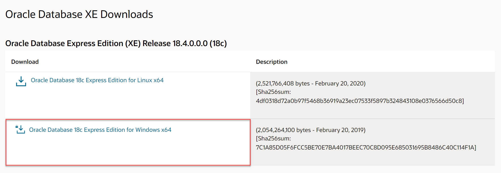

4. Accept the license agreement, when prompted, and then select **Download OracleXE184_Win64.zip**. You might need to select the **Oracle License Agreement** link and scroll to the bottom of the agreement to enable the checkbox.

   

5. Sign in with your Oracle account to complete the download. If you don't already have a free Oracle account, you will need to create one.

   

6. After signing in, the file will download.

7. Unzip the file, and navigate to the `DISK1` folder.

8. Right-click `setup.exe`, and select **Run as administrator**.

   

9. Select **Next** to step through each screen of the installer, accepting the license agreement and default values, until you get to the **Specify Database Passwords** screen.

10. On the **Oracle Database Information** screen, set the password to **Password.1!!**, and select **Next**.

    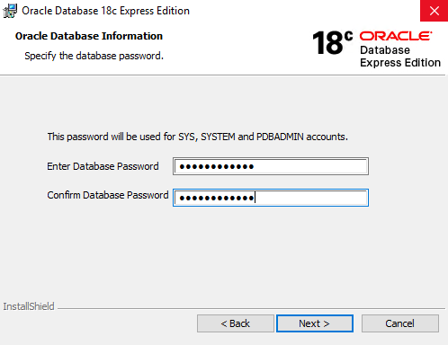

11. Select **Install**. Once the installation completes, take note of the ports assigned.

    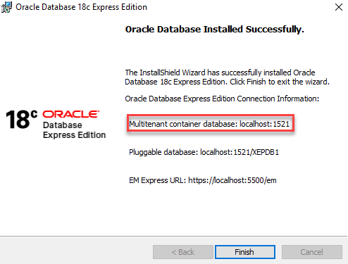

12. Select **Finish** on the final dialog to compete the installation.

13. Open a command prompt. Enter `lsnrctl status`. The Oracle listener handles incoming connection requests and provides them to the database instance. Observe an output similar to the following:

    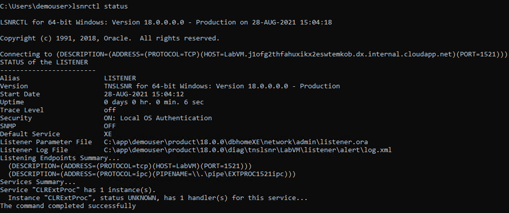

    If you shut down or restart the Virtual Machine during the lab, validate that the Oracle listener is running before following the steps. Use the following command to start it.

    ```cmd
    lsnrctl start
    ```

### Task 2: Install Oracle Data Access components

1. On your Lab VM, navigate to <http://www.oracle.com/technetwork/database/windows/downloads/index-090165.html>.

2. On the 64-bit Oracle Data Access Components (ODAC) Downloads page, scroll down and locate the **64-bit ODAC 12.2c Release 1 (12.2.0.1.1) for Windows x64** section, and then select the **ODAC122011_x64.zip** link.

    Downloads screen")

3. Accept the license agreement, and then select **Download ODAC122011_x64.zip**.

   

4. When the download completes, extract the contents of the ZIP file to a local drive.

5. Navigate to the folder containing the extracted ZIP file, and right-click `setup.exe`, then select **Run as administrator** to begin the installation.

6. Select **Next** to accept the default language, English, on the first screen.

7. On the Specify Oracle Home User screen, accept the default, Use Windows Built-in Account, and select **Next**.

8. Accept the default installation locations, and select **Next**.

9. On the **Available Product Components**, uncheck **Oracle Data Access Components Documentation for Visual Studio**, and select **Next**.

   

10. On the ODP.NET screen, check the box for **Configure ODP.NET and/or Oracle Providers for ASP.NET at machine-wide level**, and select **Next**.

    

11. If the Next button is disabled on the Perform Prerequisite Checks screen, check the **Ignore All** box, and then select **Next**. This screen will be skipped by the installer if no missing prerequisites are found.

    

12. On the Summary screen, select **Install**.

13. On the Finish screen, select **Close**.

### Task 3: Install SQL Developer Tool

In this task, you will install Oracle SQL Developer, a common IDE to interact with Oracle databases.

1. On your Lab VM, open a web browser and navigate to <https://www.oracle.com/tools/downloads/sqldev-downloads.html>.

2. Scroll down on the page and download **Windows 64-bit with JDK 8 included**.

   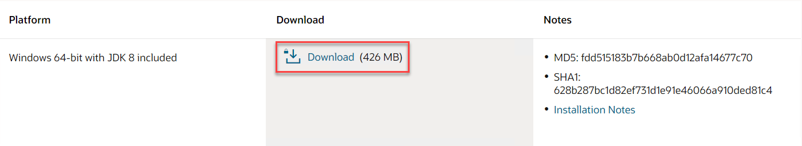

3. Accept the license terms. Extract the files to `C:\Tools`.

4. Navigate to `C:\Tools\sqldeveloper`. Select and run the executable file. Ensure that SQL Developer loads.

   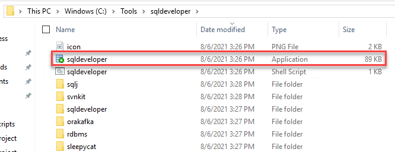

   >**Note**: If you are prompted to import preferences from a previous installation, select **No**.

### Task 4: Create the Northwind database in Oracle 18c XE

WWI has provided you with a copy of their application, including a database script to create their Oracle database. They have asked that you use this as a starting point for migrating their database and application to Azure SQL DB. In this task, you will create a connection to the Oracle database on your Lab VM.

1. In a web browser on LabVM, download a copy of the [Migrating Oracle to  Azure SQL and PostgreSQL upgrade and migration MCW repo](https://github.com/microsoft/MCW-Migrating-Oracle-to-Azure-SQL-and-PostgreSQL/archive/master.zip).

2. Unzip the contents to **C:\handsonlab**.

3. Launch SQL Developer from the `C:\Tools\sqldeveloper` path from earlier. In the **Database Connection** window, select **Create a Connection Manually**.

   

4. Provide the following parameters to the **New / Select Database Connection** window. Select **Connect** when you are complete.

   - **Name**: Northwind
   - **Username**: system
   - **Password**: Password.1!!
   - Keep the **Details** at their defaults

   

5. Once the connection completes, select the **Open File** icon (1). Navigate to `C:\handsonlab\MCW-Migrating-Oracle-to-Azure-SQL-and-PostgreSQL-master\Hands-on lab\lab-files\starter-project\Oracle Scripts\1.northwind.oracle.schema`. Then, execute the DDL statements (2).

   

6. Right-click the **Northwind** connection and select **Properties**. Then, edit the **Username** to `NW`, and the **Password** to `oracledemo123`. Select **Connect**. Note that you may be asked to enter the password again.

7. In the Open File dialog, navigate to `C:\handsonlab\MCW-Migrating-Oracle-to-Azure-SQL-and-PostgreSQL-master\Hands-on lab\lab-files\starter-project\Oracle Scripts`, select the file `2.northwind.oracle.tables.views.sql`, and then select **Open**.

8. As you did previously, run the script. Note that SQL Developer provides an output pane to view any errors.

   

9. Repeat steps 7 - 8, replacing the file name in step 26 with each of the following:

    - `3.northwind.oracle.packages.sql`

    - `4.northwind.oracle.sps.sql`

    - `5.northwind.oracle.seed.sql`

## Exercise 2: Assess the Oracle 18c Database before Migrating to PostgreSQL

Duration: 15 mins

In this exercise, you will prepare the existing Oracle database for its migration to PostgreSQL. Preparation involves two main steps. The first step is to update the database statistics. Statistics about the database become outdated as data volumes and activity change over time. Second, you will need to identify invalid objects in the Oracle database. The migration utility will not migrate invalid objects.

### Task 1: Update Statistics and Identify Invalid Objects

1. Run the following statements in SQL Developer.

    ```sql
    -- 18c script
    EXECUTE DBMS_STATS.GATHER_SCHEMA_STATS(ownname => 'NW');
    EXECUTE DBMS_STATS.GATHER_DATABASE_STATS;
    EXECUTE DBMS_STATS.GATHER_DICTIONARY_STATS;
    ```

    >**Note**: This script can take over one minute to run. Ensure that you receive confirmation that that the script has executed successfully.

2. Now, we will utilize a query that lists database objects that are invalid and unsupported by the ora2pg utility. It is recommended to fix any errors and compile the objects before starting the migration process.

    ```sql
    SELECT owner, object_type, object_name
    FROM all_objects
    WHERE status = 'INVALID';
    ```

    >**Note**: You should not see any invalid objects. If you have invalid objects, right-click on the correct folder and compile.

    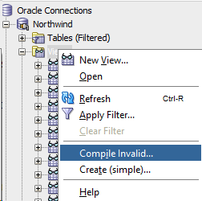

## Exercise 3: Prepare to Migrate the Oracle database to PostgreSQL

Duration: 60 minutes

In this exercise, you will configure Azure Database for PostgreSQL and Azure App Service, install and configure ora2pg and pgAdmin, and create an assessment report that outlines the difficulty of the migration process.

### Task 1: Install the ora2pg utility

**Ora2pg** is the tool we will use to migrate database objects and data. Microsoft's Data Migration Team has greatly simplified the process of obtaining this tool by providing the **installora2pg.ps1** script. You can download using the link below:

 **Download**: <https://raw.githubusercontent.com/microsoft/DataMigrationTeam/master/IP%20and%20Scripts/PostgreSQL%20Migration%20and%20Assessment%20Tools/installora2pg.ps1>.

1. Copy Microsoft's script content to the `C:\handsonlab\MCW-Migrating-Oracle-to-Azure-SQL-and-PostgreSQL\Hands-on lab\lab-files\starter-project\Postgre Scripts` location.

    - Press Ctrl+S to save the file from the webpage.
    - In the File Explorer dialog, quote the file name and ensure that the **Save as type** field is set to **All Files**.

        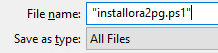

    >**Note**: Failing to put quotes around file name on save will cause the file to be saved as a text file. It will NOT execute as a PowerShell file.

2. Navigate to the location mentioned above and right-click `installora2pg.ps1`. Then, select **Run with PowerShell**.

    

    >**Note:** If you are warned about a PS extension policy changes, accept ALL of the policy changes.

    You should see the script executing.

    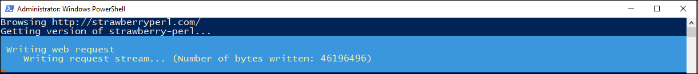

3. Install the ora2pg utility dependencies.

   - Install Perl. It will take five minutes.
   - Install the Oracle client library and SDK. To do this, you will first need to navigate to [Oracle Downloads](https://www.oracle.com/database/technologies/instant-client/winx64-64-downloads.html). Then, scroll to **Version 12.2.X**. Select the installer for the **Basic Package**.
   - Download the zip file.

    

4. On the same Oracle link as above under the **version** section, locate the **SDK Package** installer under the **Development and Runtime - optional packages** section. Keep the zipped file in the Downloads directory.

    

5. Navigate to the directory where the zipped instant client packages reside.

    - For the basic package, right-click it, and select **Extract All...**.
    - When prompted to choose the destination directory, navigate to the `C:\` location.
    - Select **Extract**.
    - Repeat this process for the zipped SDK.

    

    Your folder path should show:

    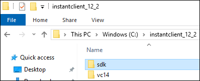

6. Install the Git client and ora2pg utility.  
    - Return to the PowerShell script.
    - Press any key to terminate the script's execution, if the PS window is still visible.
    - Open Explorer and rename the  `C:\instantclient_12_2` folder to `C:\instantclient`.
    - Launch the script one more time for install path validation purposes.
    - If the previous steps were successful, the script should be able to locate **oci.dll** under `C:\instantclient\oci.dll`.

        >**Note**: If the script still cannot find `oci.dll`, rename the Instant Client extract folder name to `C:\instantclient` exactly.

    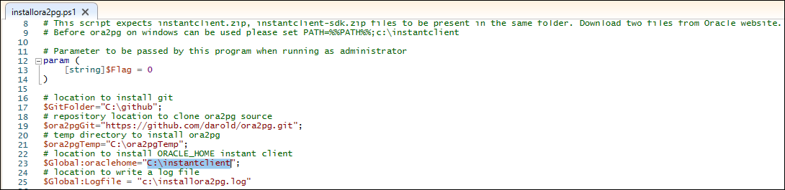

    If the path is correct, you should see the script downloading the Git installer.

    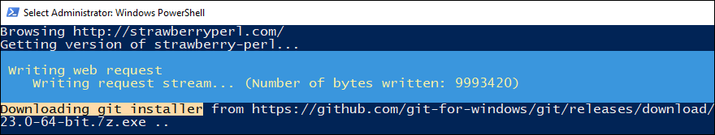

    >**Note**: The script may throw errors of not being able to find a Git executable at a certain location. This should not impact the installation.

    A successful installation should have a PowerShell screen that resembles this:

    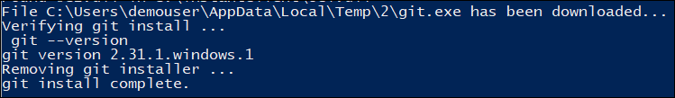

7. Once ora2pg installs, you will need to configure PATH variables.

    - Search for **View advanced system settings** in Windows.
    - Select the result, and the **System Properties** dialog box should open.
    - By default, the **Advanced** tab should be showing, but if not, navigate to it.
    - Then, select **Environment Variables...**.

    

8. Under **System variables**, select **Path**. Select **Edit...**.

    

9.  The **Edit environment variable** box should be dispdlaying.

    - Select **New**.
    - Enter **C:\instantclient**.
    - Repeat this process, but enter **%%PATH%%** instead.

    

### Task 2: Prepare the PostgreSQL instance using pgAdmin

In this task, we will create the new application user and create the NW database.

1. Launch **pgAdmin** and enter your master password.

2. Under the **Quick Links** section of the Dashboard, there is the option to **Add New Server**. When selected, the **Create - Server** dialog box will open.

3. Under the **General** tab, enter a name for your connection.

    

4. Navigate to the **Connection** tab.

    - You can pull your instance's hostname from the Azure portal (it is available in the resource's overview).
    - For **Username**, enter the admin username available on the instance's overview.
    - For **Password**, enter the admin user password you provided during deployment.
    - Select **Save** when you are ready to connect.

    

5. If the connection is successful, it should appear under the **Servers** browser dropdown.

    

6. Create a new role, which the application will reference.

    - Under your connection, right-click **Login/Group Roles**.
    - Select **Create > Login/Group Role...**.
    - Name the role **NW**.

7. Under **Definition**, provide a secure password.  

8. Under **Privileges**, change the **Can log in?** slider to the **Yes** position.

    

9.  Finally, navigate to **Membership**.

    - Add the **azure_pg_admin** role.
    - Do not select the checkbox next to the role name (this user will not be granting the azure_pg_admin role to others).
    - Select **Save**.

    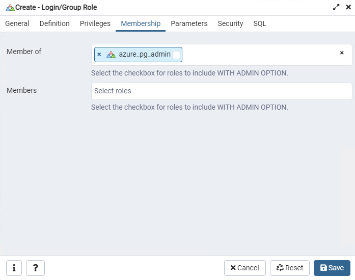

Our configuration in pgAdmin is now complete.

### Task 3: Create an ora2pg project structure

**Ora2pg** allows database objects to be exported in multiple files so that is simple to organize and review changes. In this task, you will create the project structure that will make it easy to do this.  

1. Open a command prompt window and navigate to the directory `C:\ora2pg`, where we will create the project structure.

    ```text
    cd C:\ora2pg
    rename ora2pg_conf.dist ora2pg.conf.dist
    ```

2. To create a project, we will use the ora2pg command with the --init_project flag. In the example below, our migration project is titled nw_migration.

    ```cmd
    ora2pg --init_project nw_migration
    ```

    >**Note**: In some cases, ora2pg may fail to find its configuration file. In scenarios such as these, you may need to provide the -c flag with the name of the actual configuration file in your ora2pg directory. For instance, `ora2pg.conf.dist` did not exist in my directory, but the file `ora2pg_conf.dist` was available.

    >**Note**: You may receive an error that ora2pg cannot find Perl. If this is the case, just ensure that `C:\Strawberry\perl\bin` has been added to the PATH variable.

    ```cmd
    ora2pg -c ora2pg_dist.conf --init_project nw_migration
    ```

3. Verify that the command succeeded. There should be a folder with the same name as your migration project in the C:\ora2pg directory.

    

4. Navigate to the project directory.

    - Locate **config\ora2pg.conf**.
    - Select the file to open it. If you are asked to select an application to open the file, select **Notepad**. We will need to collect multiple parameters of the local Oracle database to enter into the configuration file. These parameters are available by entering **lsnrctl status** into the command prompt.

    


5. In the **config\ora2pg.conf** file, replace the old values in the file with the correct information.

    ```text
    # Set the Oracle home directory
    ORACLE_HOME	C:\app\demouser\product\18.0.0\dbhomeXE

    # Set Oracle database connection (datasource, user, password)
    ORACLE_DSN	dbi:Oracle:host=LabVM;sid=XE;port=1521
    ORACLE_USER	NW
    ORACLE_PWD	oracledemo123
    ```

    Moreover, you need to populate the schema name correctly.

    ```text
    # Oracle schema/owner to use
    SCHEMA	NW
    ```

6. Confirm that all information entered is correct. The command below should display the version of your local Oracle database.

    ```cmd
    cd nw_migration
    ora2pg -t SHOW_VERSION -c config\ora2pg.conf
    ```

7. We will also need to populate connection information for our Postgre instance. We will use the role we created in the previous task.

    

### Task 4: Create a migration report

The migration report tells us the "man-hours" required to fully migrate to our application and components. The report will provide the user with a relative complexity value. In this task, we will retrieve the migration report for our migration.

1. Navigate to the `C:\ora2pg\nw_migration` directory in command prompt.

2. Ora2pg provides a reporting functionality that displays information about the objects in the existing schema and the estimated effort required to ensure compatibility with PostgreSQL. The command below creates a report titled **6-23-report.html** in the reports folder (when executed within the `C:\ora2pg\nw_migration` directory).

    ```cmd
    ora2pg -c config\ora2pg.conf -t SHOW_REPORT --estimate_cost --dump_as_html > reports\6-23-report.html
    ```

    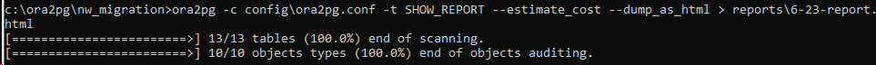

    >**Note**: The report displays information for the provided schema--in our case, we placed schema information in `config\ora2pg.conf` before executing the command.

    

    >**Note:** The invalid objects count was zero. Also, if the utility assessed database objects, they were listed in the report details.

    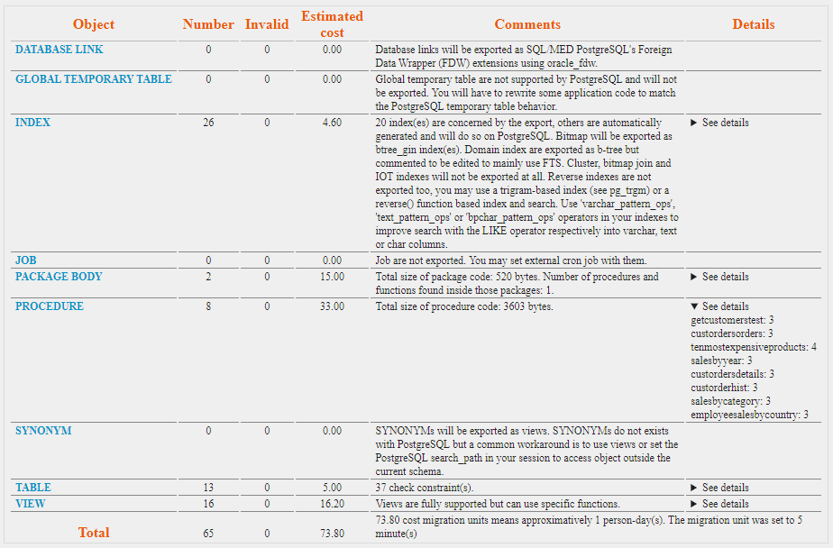

    Of particular interest is the migration level. In our case, it is B-5, which implicates code rewriting, since there are multiple stored procedures which must be altered.

    

## Exercise 4: Migrate the Database and Application

Duration: 90 minutes

In this exercise, we will begin the migration of the database and the application. This includes migrating database objects, the data, application code, and finally, deploying to Azure App Service.

### Task 1: Migrate the basic database table schema using ora2pg

In this task, we will migrate the database table schema, using ora2pg and psql, which is a command-line utility that makes it easy to run SQL files against the database.

Exercise 3 covered planning and assessment steps.  To start the database migration, DDL statements must be created for all valid Oracle objects.

1. In almost all migration scenarios, it is advised that table, index, and constraint schemas are kept in separate files. For data migration performance reasons, constraints should be applied to the target database only after tables are created and data copied. To enable this feature, open **config\ora2pg.conf** file. Set **FILE_PER_CONSTRAINT**, **FILE_PER_INDEX**, **FILE_PER_FKEYS**, and **FILE_PER_TABLE** to 1.

    

2. Call the following command in the `C:\ora2pg\nw_migration` directory to obtain object schemas (table schemas will be created in a file called **NW-psql.sql**).

    ```cmd
    ora2pg -c config\ora2pg.conf -o NW-psql.sql -t TABLE -b schema\tables\
    ```

    In our scenario, 13 tables are exported. If you see an unreasonably large number, verify that you provided a schema in the configuration file (see step 8 of the previous task). If all was successful, you will see four files in the **schema\tables** directory.

    

    >**Note**: Open the **schema\tables\NW-psql.sql** file. Notice that all table names are lowercase--using uppercase names for tables and/or columns will require quotations whenever referenced. Furthermore, ora2pg converts data types fairly well. If you have strong knowledge of the stored data, you can modify types to improve performance. You can export individual table schemas in separate files to facilitate the review.

3. Execute the PostgreSQL commands against the PostgreSQL database. You can use any PostgreSQL database client. One way to execute a SQL file against a PostgreSQL database is through the **psql** utility located at the `C:\Program Files\pgAdmin 4\v5\runtime` directory. Just as we did in task 4, append this location to the system PATH variable. Note that you will need to restart your command prompt windows for the change to take effect.

    

4. Reopen the command prompt in the `C:\ora2pg\nw_migration` directory.

    - Enter the following command to run the **NW-psql.sql** file to create tables in the **NW** database.
    - Enter your database's DNS name as the value passed to the -h flag.
    - If the connection is successful, you will be asked to enter your password.
    - Then, the command prompt should show a sequence of **CREATE TABLE** statements.

    ```cmd
    psql -U NW@[Server Name] -h [Server Name].postgres.database.azure.com -d NW < schema\tables\NW-psql.sql
    ```

    >**Note**: If you receive an error like "could not find a 'psql' to execute", use the entire path to the executable in the command (`"C:\Program Files\pgAdmin 4\v5\runtime\psql"`)

### Task 2: Migrate Table Data with ora2pg

In this Task, we will use the ora2pg utility to migrate table data to the PostgreSQL instance, now that we have created the table schema on the landing zone.

1. Navigate to `C:\ora2pg\nw_migration\data` in command prompt and enter the following command.

    ```cmd
    ora2pg -t COPY -o data.sql -c ..\config\ora2pg.conf
    ```

    You should see the following once the command completes. Notice how all 3,308 rows are accounted for.

    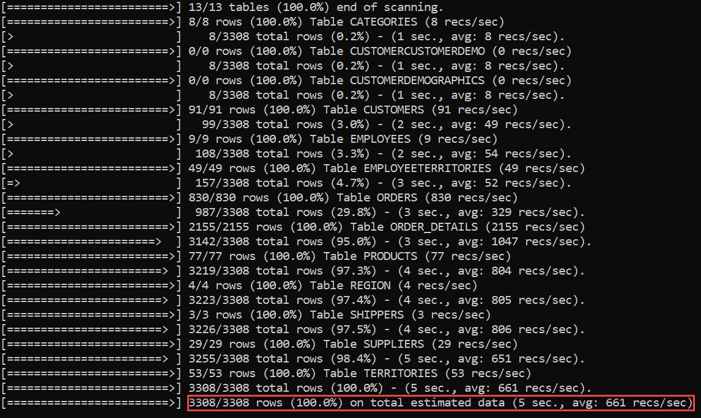

2. In the `data` subdirectory, notice how there are SQL files for all tables and one primary SQL file, titled `data.sql`. Use the following command in command prompt to export data to the PostgreSQL instance.

    ```cmd
    psql -U NW@[SERVER NAME] -h [SERVER NAME].postgres.database.azure.com -d NW < data.sql
    ```

### Task 3: Finishing the table schema migration

We migrated the data before the constraints to reduce the time required to copy data into the tables. In addition, if foreign keys were present on the target tables, data migration would fail. So, in this task, we will add constraints, foreign keys, and indexes to the target tables. This task assumes that you are in the `C:\ora2pg\nw_migration` directory in command prompt.

1. First, layer on constraints (not foreign keys):

    ```cmd
    psql -U NW@[Server Name] -h [Server Name].postgres.database.azure.com -d NW < schema\tables\CONSTRAINTS_NW-psql.sql
    ```

2. Now, Add foreign keys:

    ```cmd
    psql -U NW@[Server Name] -h [Server Name].postgres.database.azure.com -d NW < schema\tables\FKEYS_NW-psql.sql
    ```

3. Next, layer on the indexes:

    ```cmd
    psql -U NW@[Server Name] -h [Server Name].postgres.database.azure.com -d NW < schema\tables\INDEXES_NW-psql.sql
    ```

4. Before migrating views in the next task, let's verify that table data has been properly migrated. Open **pgAdmin** and connect to the database as the NW user. To use **Query Tool**, select **Query Tool** under the **Tools** dropdown.

    

    >**Note**: You will need to select the **NW** database before accessing the Query Tool.

5. Enter the following query into the editor:

    ```sql
    SELECT CONCAT(firstname, ' ', lastname) as name,
       territorydescription
    FROM employees e
     JOIN employeeterritories et ON e.employeeid = et.employeeid
     JOIN territories t ON et.territoryid = t.territoryid;
    ```

6. Now, execute the query by selecting the **execution** button on the toolbar.

    

7. If you were successful, you should see an output similar to the following. The result set should have 49 rows. It is available under the **Data Output** tab.

    

Next, let's take a look at migrating views.

### Task 4: Migrate Views

Views are not referenced by the sample application, but we are including this task here to show you how to do it manually. When we migrate stored procedures, we will show you how to enable an extension that greatly simplifies the migration of objects which reference Oracle-specific functions.  

1. Navigate to the  `C:\ora2pg\nw_migration\schema\views` directory, where we will run ora2pg and psql.

    ```cmd
    cd schema\views
    ora2pg -c ..\..\config\ora2pg.conf -t VIEW -o NW-views.sql
    ```

    >**Note**: Views are exported into individual files. The file specified in the command (NW-views.sql) references the individual files.

2. Before we invoke NW-views.sql, we will need to make changes to four files. This is because our application uses a to_date() function that is not supported in PostgreSQL. We will need to replace the command in the code with the equivalent DATE() function in PostgreSQL. First, in **SALES_TOTALS_BY_AMOUNT_NW-views.sql**, replace the existing last line:

    

    with this:

    

3. In **QUARTERLY_ORDERS_NW-views.sql**, replace the existing last line:

    

    with this:

    

    >**Note**: The other two applications of the `to_date()` function in that file are acceptable, as seen below.

     sample")

4. In **PRODUCT_SALES_FOR_1997_NW-views.sql**, replace the line before the last:

    

    with this:

    

5. Finally, in **SALES_BY_CATEGORY_NW-views.sql**, replace the line before the last:

    

    with this:

    

6. Now that all modifications are complete, run the NW-views.sql file in psql:

    ```cmd
    psql -U NW@[DB Name] -h [DB Name].postgres.database.azure.com -d NW < NW-views.sql
    ```

7. With that, we have migrated views.

    - Navigate to the **Query Editor** and test these migrated views.
    - Utilize the query below, which will show data where **productsales** is greater than 5000. You can envision how this would be useful in an organization to identify successful items in a given year (1997).

    ```sql
    SELECT *
    FROM product_sales_for_1997
    WHERE productsales > 5000;
    ```

8. When the query is executed, you should see the following result set, with 42 rows. This shows that we have successfully migrated the views.

    

Let's migrate stored procedures next.

### Task 5: Migrate the Stored Procedure

Our application utilizes a single stored procedure, so we must be able to migrate it. To do this, we will be using the **orafce** extension utility, which provides functions that are compatible with Oracle code. We will then call the procedure and view its results using a refcursor.

1. Open `C:\ora2pg\nw_migration\config\ora2pg.conf`. There is a directive titled `PLSQL_PGSQL`. Uncomment it. This is necessary for the stored procedure migration.

    ```txt
    # Enable PLSQL to PLPSQL conversion. This is a work in progress, feel
    # free modify/add you own code and send me patches. The code is under
    # function plsql_toplpgsql in Ora2PG/PLSQL.pm. Default enabled.
    PLSQL_PGSQL	1
    ```

2. Only one stored procedure, **NW.SALESBYYEAR**, is in use by the application. So, we will export this stored procedure from the Oracle database for analysis. Run the command below in `C:\ora2pg\nw_migration\schema\procedures`.

    ```cmd
    ora2pg -c ..\..\config\ora2pg.conf -t PROCEDURE -a SALESBYYEAR -o NW-proc.sql
    ```

3. Open `SALESBYYEAR_NW-proc.sql`. Notice that ora2pg exported the Oracle procedure as a PostgreSQL procedure. In some cases, ora2pg exports procedures as functions. Whether that is acceptable depends on if the object needs to return a value and if transactions must be defined within the object. Note that the exported stored procedure is defined as **SECURITY DEFINER**, removing support for transaction control.

    

    A second detail to keep in mind is NULLs vs. empty strings. In PostgreSQL, they are handled differently. This is a small distinction in Oracle that can be overlooked, leading to incomplete query results.

4. We will need to edit the procedure's parameter list, and we can do this by using a refcursor. Replace the existing last parameter of the procedure:

    

    with this:

    

5. A useful PostgreSQL extension that facilitates greater compatibility with Oracle database objects is **orafce**, which is provided with Azure Database for PostgreSQL. To enable it, navigate to pgAdmin, enter your master password, and connect to your PostgreSQL instance. Then, enter the following command into the query editor and execute it:

    ```sql
    CREATE EXTENSION orafce;
    ```

6. Now, you will need to execute the **NW-proc.sql** file against the PostgreSQL instance.

    ```cmd
    psql -U NW@[Server Name] -h [Server Name].postgres.database.azure.com -d NW < NW-proc.sql
    ```

7. Execute the following statements. Note that pgAdmin requires that each statement is executed independently.

    ```sql
    BEGIN;
    CALL salesbyyear('1996-01-01'::timestamp, '1999-01-01'::timestamp, 'cur_out');
    FETCH ALL FROM cur_out;
    COMMIT;
    ```

8. If all is successful, 809 rows should be returned. The following is an excerpt from the result set, which can be retrieved by executing the FETCH statement.

    

### Task 6: Create new Entity Data Models and update the application on the Lab VM

In this task, we will be recreating the ADO.NET data models to accurately represent our PostgreSQL database objects.  

1. On your Lab VM, return to Visual Studio, and open `appsettings.json` from the Solution Explorer.

2. Add a connection string called `PostgreSqlConnectionString`. Ensure that it correctly references the remote Azure Database for PostgreSQL credentials.

   - Replace the value of `Server` with your Azure Database for PostgreSQL DNS name
   - Substitute the `Server Name`
   - Verify the value of `Password` is set

   ```json
   "ConnectionStrings": {
      "OracleConnectionString": "DATA SOURCE=localhost:1521/XE;PASSWORD=oracledemo123;USER ID=NW",
      "PostgreSqlConnectionString": "Server={Server};Database=NW;Port=5432;User Id=NW@{Server Name};Password={Password};Ssl Mode=Require;"
   }
   ```

3. Save the `appsettings.json` file.

    >**Note**: In production scenarios, it is not recommended to store connection strings in files that are checked into version control. Consider using Azure Key Vault references in production and [user secrets](https://docs.microsoft.com/aspnet/core/security/app-secrets) in development.

4. Open the Package Manager console by selecting **Tools** (1), **NuGet Package Manager** (2), and **Package Manager Console** (3).

    

5. Enter the following command in the Package Manager console. It will install the open-source Npgsql Entity Framework Core provider.

    ```powershell
    Install-Package Npgsql.EntityFrameworkCore.PostgreSQL
    ```

6. Enter the following command in the Package Manager console to produce the models. The `-Force` flag eliminates the need to manually clear the `Data` directory.

    ```powershell
    Scaffold-DbContext Name=ConnectionStrings:PostgreSqlConnectionString Npgsql.EntityFrameworkCore.PostgreSQL -OutputDir Data -Context DataContext -Schemas public -Force
    ```

    >**Note**: This command will reverse-engineer more tables than are actually needed. The `-Tables` flag, referencing schema-qualified table names, provides a more accurate approach.

7. Attempt to build the solution to identify errors.

    

8. Expand the **Views** folder. Delete the following folders, each of which contain five views:

   - **Customers**
   - **Employees**
   - **Products**
   - **Shippers**
   - **Suppliers**

9. Expand the **Controllers** folder. Delete all controllers, except **HomeController.cs**.

10. Open **DataContext.cs**. Add the following line to the top of the file, below the other `using` directives.

   ```csharp
   using NorthwindMVC.Models;
   ```

   Add the following below the other property definitions.

   ```csharp
   public virtual DbSet<SalesByYear> SalesByYearDbSet { get; set; }
   ```

   Lastly, add the following statement to the `OnModelCreating()` method, after setting the collation information. 

   ```csharp
   modelBuilder.Entity<SalesByYear>(entity =>
   {
         entity.HasNoKey();
   });
   ```

11. Build the solution. Ensure that no errors appear. We added `SalesByYearDbSet` to **DataContext** because **HomeController.cs** references it. We deleted the controllers and their associated views because we will scaffold them again from the models.

12. Right-click the **Controllers** folder and select **Add** (1). Select **New Scaffolded Item...** (2).

   

13. Select **MVC Controller with views, using Entity Framework**. Then, select **Add**.

   

14. In the **ADD MVC Controller with views, using Entity Framework** dialog box, provide the following details. Then, select **Add**. Visual Studio will build the project.

    - **Model class**: Select `Customer`
    - **Data context class**: Select `DataContext`
    - Select all three checkboxes below **Views**
    - **Controller name**: Keep it set to `CustomersController`

   

15. Repeat steps 12-14, according to the following details:

    - **EmployeesController.cs**
      - Based on the **Employee** model class
    - **ProductsController.cs**
      - Based on the **Product** model class
    - **ShippersController.cs**
      - Based on the **Shipper** model class
    - **SuppliersController.cs**
      - Based on the **Supplier** model class

16. Navigate to **Startup.cs**. Ensure that PostgreSQL is configured as the correct provider and the appropriate connection string is referenced.

   ```csharp
   services.AddDbContext<DataContext>(options => options.UseNpgsql(Configuration.GetConnectionString("PostgreSqlConnectionString")));
   ```

### Task 7: Update the Dashboard Stored Procedure Call

With PostgreSQL, stored procedures cannot return output values without a cursor. This Task details how to write a function to replicate the same logic. Functions can return result sets directly, without a cursor.

1. Open PostgreSQL pgAdmin. Connect to the **NW** database as the **NW** user. Launch the query tool.

2. Into the query tool, copy the following statement and execute it.

    ```sql
    CREATE OR REPLACE FUNCTION SALESBYYEAR_func (p_begin_date TIMESTAMP, p_end_date TIMESTAMP)
	RETURNS TABLE (
		ShippedDate TIMESTAMP,
		OrderID bigint,
		Subtotal double precision,
		Year text
    )
    AS $$
    BEGIN
        RETURN QUERY 
        SELECT Orders.ShippedDate, 
                Orders.OrderID, 
                Order_Subtotals.Subtotal, 
                TO_CHAR(Orders.ShippedDate, 'YY') AS Year
        FROM Orders INNER JOIN Order_Subtotals ON Orders.OrderID = Order_Subtotals.OrderID
        WHERE Orders.ShippedDate Between p_begin_date And p_end_date;
    END;
    $$ 
    LANGUAGE 'plpgsql';
    ```

    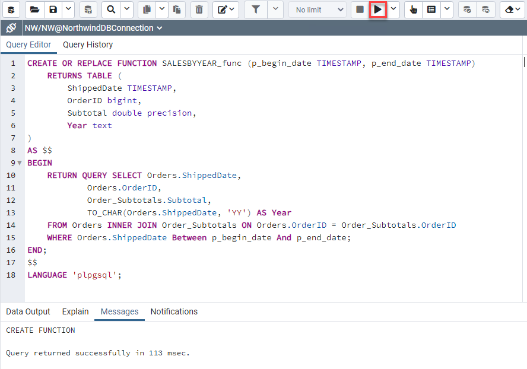

3. Comment out the code under the Oracle comment. First, select the lines for the Oracle code, then select the Comment button in the toolbar.

   

4. Below the commented Oracle code and before the LINQ query, add the following:

    ```csharp
    var beginDate = new NpgsqlParameter { ParameterName = "beginDate", NpgsqlDbType = NpgsqlDbType.Timestamp, Direction = ParameterDirection.Input, Value = new NpgsqlDateTime(DateTime.Parse("Jan 1, 1996")) };
    var endDate = new NpgsqlParameter { ParameterName = "endDate", NpgsqlDbType = NpgsqlDbType.Timestamp, Direction = ParameterDirection.Input, Value = new NpgsqlDateTime(DateTime.Parse("Jan 1, 1999")) };

    var salesByYear = await _context.SalesByYearDbSet.FromSqlRaw("SELECT * FROM SALESBYYEAR_func(@beginDate, @endDate);", beginDate, endDate).ToListAsync();
    ```

5. In `SalesByYear.cs`, update the type of the `OrderID` property to `long`.

    ```csharp
    public long OrderID { get; set; }
    ```

6. Run the application again by selecting the green Start button in the Visual Studio toolbar.

    

7. Verify the graph is showing correctly on the Northwind Traders dashboard.

    

### Task 8: Deploy the application to Azure

As part of the PoC, the finished app will be hosted on Azure App Service. In this task, you will add a connection string to the App Service resource and use Visual Studio 2019 to complete the deployment.

1. In the Azure portal, navigate to your App Service instance. Navigate to **Configuration** below **Settings**.

2. Below **Connection strings**, select **+ New connection string**. In the **Add/Edit connection string** window, provide the following:

    - **Name**: Use `PostgreSqlConnectionString`
    - **Value**: Use the connection string from the `appsettings.json` file
    - **Type**: Select `Custom` (with ASP.NET Core, it is not possible to use the `PostgreSQL` connection string type)

    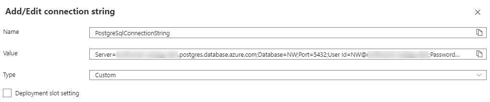

3. Select **OK** and then select **Save**.
   
4. In Visual Studio's Solution Explorer, right-click the **NorthwindMVC** project (not the solution) and select **Publish...**.

5. The **Publish** window should open. Select **Azure**. Select **Next**.

    

6. Select **Azure App Service (Linux)**. Select **Next**.

7. In the **Publish** window, select your **Subscription name**. Expand the correct resource group and select the App Service resource. Select **Next**.

    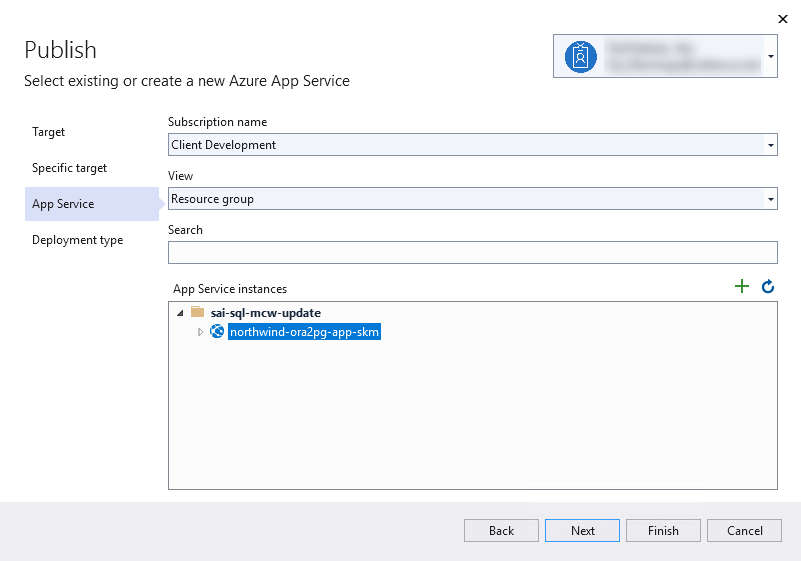

8. Select **Publish (generates pubxml file)** for the **Deployment type** tab. Select **Finish**.

    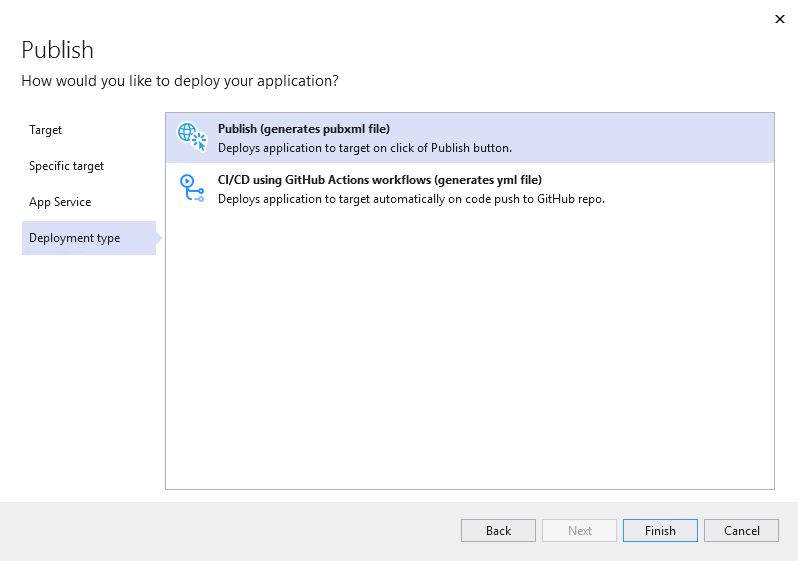

9. Select **Publish** next to the new publish profile.

10. First, your application will build. Then, all relevant files will be copied into a ZIP archive for deployment.

11. Once the build completes, navigate to your app's link. Test the web application.

    

    >**Note**: If you still see the default page display, try publishing again.

    >**Note**: Feel free to remove the connection string from the `appsettings.json` file, as it is securely provided to the application through Azure App Service. This is usually done to avoid committing connection strings into version control.

## After the hands-on lab

Duration: 10 mins

In this exercise, you will delete any Azure resources that were created in support of the lab. You should follow all steps provided after attending the Hands-on lab to ensure your account does not continue to be charged for lab resources.

### Task 1: Delete the resource group

1. Using the [Azure portal](https://portal.azure.com), navigate to the Resource group you used throughout this hands-on lab by selecting Resource groups in the left menu.

2. Search for the name of your research group, and select it from the list.

3. Select Delete in the command bar, and confirm the deletion by re-typing the Resource group name, and selecting Delete.

You should follow all steps provided *after* attending the Hands-on lab.
