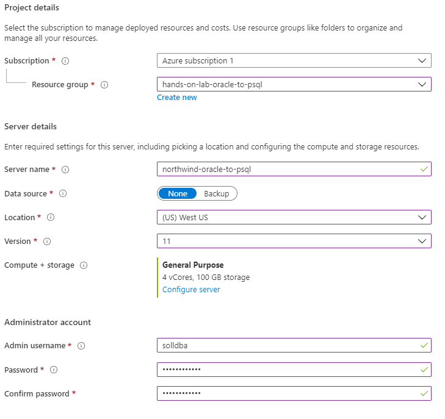
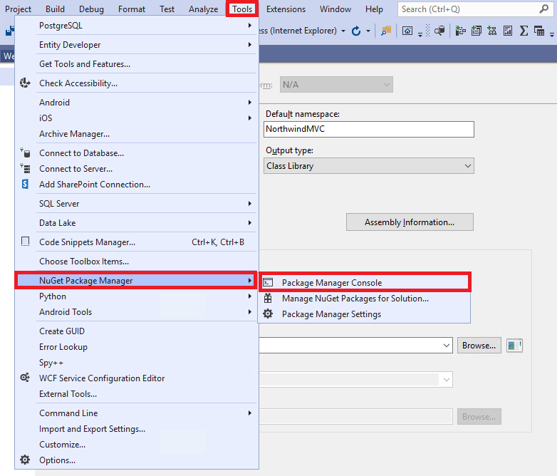

**Contents** 

- [Exercise 1: Setup Oracle 11g Express Edition](#exercise-1-setup-oracle-11g-express-edition)
    - [Task 1: Install Oracle XE](#task-1-install-oracle-xe)
    - [Task 2: Install Oracle Data Access components](#task-2-install-oracle-data-access-components)
    - [Task 3: Install dbForge Fusion tool](#task-3-install-dbforge-fusion-tool)
    - [Task 4: Create the Northwind database in Oracle 11g XE](#task-4-create-the-northwind-database-in-oracle-11g-xe)
    - [Task 5: Configure the Starter Application to use Oracle](#task-5-configure-the-starter-application-to-use-oracle)

- [Exercise 2: Assess the Oracle 11g Database before Migrating to PostgreSQL](#exercise-2-assess-the-oracle-11g-database-before-migrating-to-postgresql)
    - [Task 1: Update Statistics and Identify Invalid Objects](#task-1-update-statistics-and-identify-invalid-objects)

- [Exercise 3: Migrate the Oracle database to PostgreSQL](#exercise-3-migrate-the-oracle-database-to-postgresql)
    - [Task 1: Create Azure resources and configure the Key Vault](#task-1-create-azure-resources-and-configure-the-key-vault)
    - [Task 2: Configure the PostgreSQL server instance](#task-2-configure-the-postgresql-server-instance)
    - [Task 3: Create a VM migration server](#task-3-create-a-vm-migration-server)
    - [Task 4: Install pgAdmin utilities on the migration server](#task-4-install-pgadmin-utilities-on-the-migration-server)
    - [Task 5: Install ora2pg](#task-5-install-ora2pg)
    - [Task 6: Prepare the Postgre instance using pgAdmin and create an ora2pg project structure](#task-6-prepare-the-postgre-instance-using-pgadmin-and-create-an-ora2pg-project-structure)
    - [Task 7: Create a migration report](#task-7-create-a-migration-report)

- [Exercise 4: Migrate the Application](#exercise-4-migrate-the-application)
    - [Task 1: Migrate the database table schema using ora2pg and psql and copy data into the database](#task-1-migrate-the-database-table-schema-using-ora2pg-and-psql-and-copy-data-into-the-database)
    - [Task 2: Migrate views](#task-2-migrate-views)
    - [Task 3: Migrate stored procedures and package bodies](#task-3-migrate-stored-procedures-and-package-bodies)
    - [Task 4: Create new Entity Data Models and update the application on the Lab VM](#task-4-create-new-entity-data-models-and-update-the-application-on-the-lab-vm)
    - [Task 5: Deploy the application to Azure](#task-5-deploy-the-application-to-azure)

- [After the hands-on lab](#after-the-hands-on-lab)
    - [Task 1: Delete the resource group](#task-1-delete-the-resource-group)


### Exercise 1: Setup Oracle 11g Express Edition
Duration: 45 minutes

In this exercise, you will install Oracle XE on your Lab VM, load a sample database supporting an application. 

### Task 1: Install Oracle XE

1. Connect to your Lab VM, as you did in Task 5 of the [Before the Hands-on Lab](./Before%20the%20HOL%20-%20Data%20Platform%20upgrade%20and%20migration.md#task-5-connect-to-the-lab-vm) exercise.

    - **Username**: demouser
    - **Password**: Password.1!!

2. In a web browser on your Lab VM, navigate to <https://www.oracle.com/technetwork/database/database-technologies/express-edition/downloads/xe-prior-releases-5172097.html>.

3. On the Oracle Database XE Prior Release Archive page, select **Oracle Database 11gR2 Express Edition for Windows x64** download link.

    

4. Accept the license agreement, when prompted, and then select **Download OracleXE112_Win64.zip**.

    

5. Sign in with your Oracle account to complete the download. If you don't already have a free Oracle account, you will need to create one.

    

6. After signing in, the file will download.

7. Unzip the file, and navigate to the `DISK1` folder.

8. Right-select `setup.exe`, and select **Run as administrator**.

    

9. Select **Next** to step through each screen of the installer, accepting the license agreement and default values, until you get to the **Specify Database Passwords** screen.

10. On the **Specify Database Passwords** screen, set the password to **Password.1!!**, and select **Next**.

    

11. On the Summary screen, take note of the ports being assigned, and select **Install**.

    

12. Select **Finish** on the final dialog to compete the installation.

### Task 2: Install Oracle Data Access components

In this task, you will download and configure Oracle Data Access components so that you can connect and access to the Northwind database. 

1. On your Lab VM, navigate to <http://www.oracle.com/technetwork/database/windows/downloads/index-090165.html>.

2. On the 64-bit Oracle Data Access Components (ODAC) Downloads page, scroll down and locate the **64-bit ODAC 12.2c Release 1 (12.2.0.1.1) for Windows x64** section, and then select the **ODAC122011_x64.zip** link.

     Downloads screen")

3. Accept the license agreement, and then select **Download ODAC122011_x64.zip**.

    

4. When the download completes, extract the contents of the ZIP file to a local drive.

5. Navigate to the folder containing the extracted ZIP file, and right-select `setup.exe`, then select **Run as administrator** to begin the installation.

6. Select **Next** to accept the default language, English, on the first screen.

7. On the Specify Oracle Home User screen, accept the default, Use Windows Built-in Account, and select **Next**.

8. Accept the default installation locations, and select **Next**.

9. On the **Available Product Components**, uncheck **Oracle Data Access Components Documentation for Visual Studio**, and select **Next**.

    

10. On the ODP.NET screen, check the box for **Configure ODP.NET and/or Oracle Providers for ASP.NET at machine-wide level**, and select **Next**.

    

11. On the DB Connection Configuration screen, enter the following:

    - **Connection Alias**: Northwind
    - **Port Number**: 1521
    - **Database Host Name**: localhost
    - **Database Service Name**: XE

        

    - Select **Next**.

12. If the Next button is disabled on the Perform Prerequisite Checks screen, check the **Ignore All** box, and then select **Next**. This screen will be skipped by the installer if no missing requisites are found.

    

13. On the Summary screen, select **Install**.

14. On the Finish screen, select **Close**.

### Task 3: Install dbForge Fusion tool

In this task, you will install a third-party extension to Visual Studio to enable interaction with, and script execution for, Oracle databases in Visual Studio 2019 Community Edition.

> This step is required because the Oracle Developer Tools extension does not currently work with the Community edition of Visual Studio.

1. On your Lab VM, open a web browser and navigate to <https://www.devart.com/dbforge/oracle/fusion/download.html>.

2. Scroll down on the page, and download a Trial of the current version by selecting the blue download link.

    

3. Run the installer.

    >**Note**: Close Visual Studio if it is open to complete the installation.

4. Select **Next** on the Welcome screen.

    

5. Select **Next** on each screen, accepting the license agreement and default settings, until reaching the Ready to Install screen.

6. Select **Install** on the Ready to Install screen.

    

7. Select **Finish** when the installation is complete.

### Task 4: Create the Northwind database in Oracle 11g XE

WWI has provided you with a copy of their application, including a database script to create their Oracle database. They have asked that you use this as a starting point for migrating their database and application to PostGre SQL. In this task, you will create a connection to the Oracle database on your Lab VM, and create a database called Northwind.

1. Navigate to the Lab VM and download the starter project by downloading a .zip copy of the Data Platform upgrade and migration project from the GitHub repo.

6. In a web browser, navigate to the [Data Platform upgrade and migration MCW repo](https://github.com/Microsoft/MCW-Data-Platform-upgrade-and-migration)

7. On the repo page, select **Clone or download**, then select **Download ZIP**.

    

8. Unzip the contents to **C:\handsonlab**.

9. Within the **handsonlab** folder, navigate to the folder `MCW-Data-Platform-upgrade-and-migration-master\Hands-on lab\lab-files\starter-project`, and double-select `NorthwindMVC.sln` to open the project in Visual Studio 2019.

10. If prompted for how you want to open the file, select **Visual Studio 2019**, and select **OK**.

11. Sign into Visual Studio (or create an account if you don't have one), when prompted.

12. At the Security Warning screen, uncheck **Ask me for every project in this solution**, and select **OK**.

    

13. Once then solution is open in Visual Studio, select the **Extensions -> Fusion** menu, and then select **New Connection**.

    

14. In the Database Connection properties dialog, set the following values:

    - **Host**: localhost
    - **Port**: Leave 1521 selected.
    - Select **SID**, and enter **XE**.
    - **User**: system
    - **Password**: Password.1!!
    - Check **Allow saving password**.
    - **Connect as**: Normal
    - **Connection Name**: Northwind

    

15. Select **Test Connection** to verify the settings are correct, and select **OK** to close the popup.

16. Select **OK** to create the Database Connection.

17. You will now see the Northwind connection in the Database Explorer window.

    

18. In Visual Studio, select **File** in the menu, then select **Open File**, and navigate to `C:\handsonlab\MCW-Data-Platform-upgrade-and-migration-master\Hands-on lab\lab-files\starter-project\Oracle Scripts\`, select the file `1.northwind.oracle.schema.sql`, and then select **Open**.

    

    > **Note**: You may receive a notification that your Fusion trial has expired when you do this. This can be ignored for this hands-on lab. Close that dialog, and continue to the query window that opens in Visual Studio.

19. Select the **Execute** Fusion script button on the Visual Studio toolbar to run the SQL script.

    

20. The results of execution can be viewed in the Output window, found at the bottom left of the Visual Studio window.

    

21. In the Database Explorer window, right-select on the **Northwind** connection, and select **Modify Connection** (If the Database Explorer is not already open, you can open it by selecting Fusion in the menu, then selecting Database Explorer).

    

22. In the Modify Connection dialog, change the username and password as follows:

    - **Username**: NW
    - **Password**: oracledemo123

23. Select **Test Connection** to verify the new credentials work.

    

24. Select **OK** to close the Database Connection properties dialog.

25. Select the **Open File** icon on the Visual Studio toolbar.

    

26. In the Open File dialog, navigate to `C:\handsonlab\MCW-Data-Platform-upgrade-and-migration-master\Hands-on lab\lab-files\starter-project\Oracle Scripts`, select the file `2.northwind.oracle.tables.views.sql`, and then select **Open**.

27. As you did previously, select the **Execute** Fusion script button on the toolbar, and view the results of execute in the Output pane.

    

28. Repeat steps 26 - 27, replacing the file name in step 26 with each of the following:

    - `3.northwind.oracle.packages.sql`

    - `4.northwind.oracle.sps.sql`

        - During the Execute script step for this file, you will need to execute each CREATE OR REPLACE statement independently.

        - Using your mouse, select the first statement, starting with CREATE and going to END;

        

        - Next, select **Execute Selection** in the Visual Studio toolbar.

        

        - Repeat this for each of the remaining CREATE OR REPLACE... END; blocks in the script file (there are 7 more to execute, for 8 total).

    - `5.northwind.oracle.seed.sql`

        > **Important**: This query can take several minutes to run, so make sure you wait until you see **Execute succeeded** message, followed by **Done: 5.northwind.oracle.seed.sql**, in the output window before executing the next file, like the following:

        

    - `6.northwind.oracle.constraints.sql
    
### Exercise 2: Assess the Oracle 11g Database before Migrating to PostgreSQL
Duration: 15 mins

In this exercise, you will prepare the existing Oracle database for its migration to PostgreSQL. This will be done through updating statistics and identifying invalid objects. You will update statistics about the database as they become outdated as data volumes tend to change over time, as well as column charateristics. You will also identify invalid objects in the Oracle database that will not be exported over by ora2pg, the migration utility used. 

### Task 1: Update Statistics and Identify Invalid Objects

1. In Visual Studio, access the NW Schema in the Database Explorer. To create a new SQL file, where we will house the updated statements, navigate to **Create New SQL** button near the top right corner of Visual Studio.

    

2. Now, you will populate the new file with the following statements:
```sql
-- 11g script
EXECUTE DBMS_STATS.GATHER_SCHEMA_STATS(ownname => 'NW');
EXECUTE DBMS_STATS.GATHER_DATABASE_STATS;
EXECUTE DBMS_STATS.GATHER_DICTIONARY_STATS;
```
3. Save the file as `update-llg-stats.sql` in the `C:\handsonlab\MCW-Data-Platform-upgrade-and-migration\Hands-on lab\lab-files\starter-project` directory. Run the file as you did when you created database objects.

    

4. Now, we will utilize a query that lists database objects that are invalid, and hence unsupported by ora2pg meaning that ora2pg will not be converted and exported. It is recommended to fix any errors and compile the objects before starting the migration process. Create a new file, titled `show-invalid-objects.sql`, in the `C:\handsonlab\MCW-Data-Platform-upgrade-and-migration\Hands-on lab\lab-files\starter-project` directory. This simple query returns all invalid objects in the current schema.

```sql
SELECT owner, object_type, object_name
FROM all_objects
WHERE status = 'INVALID';
```

### Exercise 3: Migrate the Oracle database to PostgreSQL
Duration: 2 hours

In this exercise, you will configure Azure Database for PostgreSQL in the lab VM, migrate to it from the Oracle database, and then update the application with the new data source.

### Task 1: Create Azure Resources

We need to create a PostgreSQL instance and an App Service to host our application.

1. As shown in **Before the HOL**, you will need to navigate to the **New** page accessed by selecting **+ Create a resource**. Then, navigate to **Databases** under the **Azure Marketplace** section. Select **Azure Database for PostgreSQL**.

    

2. There are two deployment options: **Single Server** and **Hyperscale (Citus)**. Single Server is best suited for traditional transactional workloads whereas Hyperscale is best suited for ultra high-performance, multi-tenant applications. For our simple application, we will be utilizing a single server for our database. 

    

3. Configure your instance to reside in the hands-on-lab-SUFFIX resource group. Enter a unique server name. Make sure to choose PostgreSQL version 11, not 10. As for the administrator credentials, we will be using **solldba** as the admin username, and **Password.1!!** as the admin password. Select **Review + create** once you are ready.

    

4. Select **Create** to start the deployment. Once the deployment completes, we will move on to creating an Azure Web App.

5. At the **New** page, navigate to **Web** under **Azure Marketplace**. Select **Web App**.

    

6. Create the new app in your hands-on-lab-SUFFIX resource group. Configure a unique app name (the name you choose will form part of your app's URL). Choose **ASP.NET V4.7** as your runtime stack. Select a region that supports the necessary resources. Keep all other settings at their default values. Select **Review + create** when you are ready.

    

7. Select **Create** after reviewing parameters. Once the deployment finishes, navigate to the **App Service** resource you created. Select **Get publish profile** under the resource's **Overview** page.

    

8. Save the file and move it to `C:\handsonlab\MCW-Data-Platform-upgrade-and-migration\Hands-on lab\lab-files\starter-project`. Later, we will need this file to import into Visual Studio for deployment. 

9. We need to ensure that Azure supports the version of .NET used in the solution. We will do this by changing the target framework on the solution to **.NET Framework 4.7.2**. Open the NorthwindMVC solution in Visual Studio. Right-select the NorthwindMVC project (not the solution) and select **Properties**. Find the **Target framework:** dropdown menu and select **.NET Framework 4.7.2**.

    

### Task 2: Configure the PostgreSQL server instance


1. Storage auto-growth is a feature in which Azure will add more storage automatically when you run out of it. We do not need it for our purposes so we will need to disable it. To do this, locate the PostgreSQL instance you created. Then, under the **Settings** tab, select **Pricing tier**.

    

2. Find the **Storage Auto-growth** switch, and disable the feature. Select **OK** at the bottom of the page to save your change. 

    

3. Now, we need to implement firewall rules for the PostgreSQL database so we can access it. Locate the **Connection security** selector under the **Settings** tab.

    

4. We will add an access rule. Since we are storing insecure test data, we can open the 0.0.0.0 to 255.255.255.255 range (all IPv4 addresses). Azure makes this option available. Press the **Save** button at the top of the page once you are ready.

    

### Task 3: Install pgAdmin on the LabVM

1. You will need to navigate to <https://www.pgadmin.org/download/pgadmin-4-windows/> to obtain the latest version of pgAdmin 4, which, at the time of writing, is **v4.22**. Select the link to the installer, as shown below.

    

2. Download the **pgadmin4-4.22-x86.exe** file--not the one with the **.asc** extension.

    

3. Once the installer launches, accept all defaults. Complete the installation.

4. By default, pgAdmin opens automatically. If it does not, however, you can search for it using the Windows key. When launched, pgAdmin should open in Internet Explorer.

5. pgAdmin will prompt you to set a password to govern access to database credentials. I will use **Password.1!!** as my entry. Confirm your choice. For now, our configuration of pgAdmin is complete.

### Task 4: Install ora2pg

ora2pg is the tool we will use to migrate database objects and data. Luckily, Microsoft's Data Migration Team has greatly simplified the process of obtaining this tool by providing the **installora2pg.ps1** script, available here <https://github.com/microsoft/DataMigrationTeam/blob/master/IP%20and%20Scripts/PostgreSQL%20Migration%20and%20Assessment%20Tools/installora2pg.ps1>. We have made this script available to you at `C:\handsonlab\MCW-Data-Platform-upgrade-and-migration\Hands-on lab\lab-files\starter-project\Postgre Scripts\installora2pg.ps1`.

1. Navigate to the location mentioned above and right-select `installora2pg.ps1`. Then, select **Run with PowerShell**. 

    

2. After Perl is installed (about 5 minutes after starting the script), you will need to install the Oracle client library and SDK. To do this, you will first need to navigate to https://www.oracle.com/database/technologies/instant-client/winx64-64-downloads.html. Then, scroll to **Version 12.2.0.1.0**. Select the installer for the **Basic Package**. Feel free to download the zipped folder to your Downloads directory, since we will need to unzip it to a certain location. 

    

3. On the same Oracle page as above, again under the Version 12.2.0.1.0 section, locate the **SDK Package** installer under the **Development and Runtime - optional packages** section. Once more, feel free to keep the zipped file in the Downloads directory.

    

4. Navigate to the directory where the zipped instant client packages reside. First, for the basic package, right-select it, and select **Extract All...**. When prompted to choose the destination directory, navigate to the `C:\` location. Finally, select **Extract**. Repeat this process for the zipped SDK.

    

5. Return to the PowerShell script. Press any key to terminate the script's execution. Launch the script once more. If the previous steps were successful, the script should be able to locate **oci.dll** under `C:\instantclient_12_2\oci.dll`.

6. Once ora2pg installs, you will need to configure PATH variables. Search for **View advanced system settings** in Windows. Select the result, and the **System Properties** dialog box should open. By default, the **Advanced** tab should be showing, but if not, navigate to it. Then, select **Environment Variables...**. 
    
    

7. Under **System variables**, select **Path**. Select **Edit...**.

    

8. The **Edit environment variable** box should be displaying. Select **New**. Enter **C:\instantclient_12_2**. Repeat this process, but enter **%%PATH%%** instead.

    

### Task 5: Prepare the Postgre instance using pgAdmin

1. Launch pgAdmin and enter your master password.

2. Under the **Quick Links** section of the Dashboard, there is the option to **Add New Server**. When selected, the **Create - Server** dialog box will open.

3. Under the **General** tab, enter a name for your connection.

    

4. Navigate to the **Connection** tab. You can pull your instance's host name from the Azure portal (it is available in the resource's overview). As for the **Username**, enter the admin username available on the instance's overview. The **Password** is simply the admin user password you provided during deployment. Press **Save** when you are ready to connect. 

    

5. If the connection succeeded, it should appear under the **Servers** browser dropdown.

    

6. To create a new database, right-select **Databases** under the connection you just created, and select **Create > Database...**. Name your database **NW** and save. 

7. Now, we will create a new role. The application will reference this role. Under your connection, right-select **Login/Group Roles**. Select **Create > Login/Group Role...**. Name the role **NW**. 

8. Under **Definition**, provide a password. We will use **oracledemo123**. 

9. Under **Privileges**, change the **Can login?** slider to the **Yes** position. 

    

10. Finally, under **Membership**, select the **Roles** box and add the **azure_pg_admin** role. Do not select the checkbox next to the role name (this user will not be granting the azure_pg_admin role to others). Select **Save**.

Our configuration in pgAdmin is now complete. 


### Task 6: Create an ora2pg project structure

ora2pg allows database objects to be exported in multiple files, meaning that it is simple to organize and review changes. In this task, we will show you how to create this project structure.  

1. Open a command prompt window and navigate to `C:\ora2pg`.
```
cd C:\ora2pg
```

2. To create a project, we will use the ora2pg command with the --init_project flag. In the example below, our migration project is titled nw_migration.
```
ora2pg --init_project nw_migration
```

In some cases, ora2pg may fail to find its configuration file. In scenarios such as these, you may need to provide the -c flag with the name of the actual configuration file in your ora2pg directory. For instance, **ora2pg.conf.dist** did not exist in my directory, but the file ora2pg_dist.conf was available.

```
ora2pg -c ora2pg_dist.conf --init_project nw_migration
```

3. Verify that the command succeded. There should be a folder with the same name as your migration project in the C:\ora2pg directory.

    

4. Enter the project directory. Then, locate **config\ora2pg.conf**. Select the file to open it. If you are asked to select an application to open the file, select Notepad. We will need to collect multiple parameters of the local Oracle database to enter into the configuration file. These parameters are available by entering **lsnrctl status** into the command prompt, as seen in the following.

    

5. In the **config\ora2pg.conf** file, replace the old values in the file with the correct information. 

    

6. Confirm that all information entered is correct. The command below should display the version of your local Oracle database. 
```
cd nw_migration
ora2pg -t SHOW_VERSION -c config\ora2pg.conf
```

7. We will also need to populate connection information for our Postgre instance. We will use the role we created in the previous task.

    

8. We need to set the schema that we wish to migrate. In this scenario, we are migrating the NW schema.

    

### Task 7: Create a migration report

Migration reports tell us the "man-hours" required to fully migrate our application and components. This can be used as a planning tool to tell us how much effort we will need to migrate. Let's take a closer look. 

1. Navigate to the `C:\ora2pg\nw_migration` directory in command prompt.

2. ora2pg provides a reporting functionality which displays information about the objects in the existing schema and the estimated effort required to ensure compatibility with PostgreSQL. The command below creates a report titled **6-23-report.html** in the reports folder (when executed within the `C:\ora2pg\nw_migration` directory). 

```
ora2pg -c config\ora2pg.conf -t SHOW_REPORT --estimate_cost --dump_as_html > reports\6-23-report.html
```
Note that the report displays information for the provided schema--in our case, we placed schema information in `config\ora2pg.conf` before executing the command. 


Of particular interest is the migration level. In our case, it is B-5, which implicates code rewriting, since there are multiple stored procedures which must be altered.


This concludes creating a migration report and preparing the database for migration. Read on to complete the migration to Azure. 

### Exercise 4: Migrate the Application 
Duration: 3.5 hours

We will perform database and application migration.

### Task 1: Migrate the database table schema using ora2pg and psql and copy data into the database

1. Now that we know what our migration entails, we must start the process by producing the DDL statements for objects. In almost all migration scenarios, it is advised that table, index, and constraint schemas are kept in separate files, since constraints should be applied to the target database only after tables are created and data copied. To enable this feature, open **config\ora2pg.conf**. Set **FILE_PER_CONSTRAINT**, **FILE_PER_INDEX**, **FILE_PER_FKEYS**, and **FILE_PER_TABLE** to 1.

    

2. Call the following command in the `C:\ora2pg\nw_migration` directory to obtain object schemas (table schemas will be created in a file called **NW-psql.sql**).
```
ora2pg -c config\ora2pg.conf -o NW-psql.sql -t TABLE -b schema\tables\
```

In our scenario, 13 tables are exported. If you see an unreasonably large number, verify that you provided a schema in the configuration file (see step 8 of the previous task). If all was successful, you will see four files in the **schema\tables** directory.


> Note: Open the **schema\tables\NW-psql.sql** file. Notice that all table names are lowercase--using uppercase names for tables and/or columns will require quotations whenever referenced. Furthermore, ora2pg converts datatypes fairly well, but if you have strong knowledge of the stored data, you can modify types to improve performance. You can export individual table schemas in separate files to facilitate review.

3. One way to execute a SQL file against a PostgreSQL database is through the **psql** utility. Luckily, it is available at the `C:\Program Files (x86)\pgAdmin 4\v4\runtime` directory. Just as we did in task 4, we recommend appending this location to the system PATH variable. Note that you will need to restart your command prompt windows for the change to take effect.

    

4. Reopen the command prompt in the `C:\ora2pg\nw_migration` directory. Then, enter the following command to run the **NW-psql.sql** file to create tables in the **NW** database. Enter your database's DNS name as the value passed to the -h flag. If the connection is successful, you will be asked to enter your password. Then, the command prompt should show a sequence of **CREATE TABLE** statements. 
```
psql -U NW@northwind-oracle-to-psql -h northwind-oracle-to-psql.postgres.database.azure.com -d NW < schema\tables\NW-psql.sql
```

5. Now, we will copy data into the created tables. We can use ora2pg for this purpose.
```
ora2pg -c config\ora2pg.conf -t COPY
```

6. We will layer on constraints (not foreign keys).
```
psql -U NW@northwind-oracle-to-psql -h northwind-oracle-to-psql.postgres.database.azure.com -d NW < schema\tables\CONSTRAINTS_NW-psql.sql
```

7. Add foreign keys.
```
psql -U NW@northwind-oracle-to-psql -h northwind-oracle-to-psql.postgres.database.azure.com -d NW < schema\tables\FKEYS_NW-psql.sql
```

8. Layer on indexes.
```
psql -U NW@northwind-oracle-to-psql -h northwind-oracle-to-psql.postgres.database.azure.com -d NW < schema\tables\INDEXES_NW-psql.sql
```

In the next task, we will migrate packages, procedures, and views.

### Task 2: Migrate views

>Note: Views are not referenced by the sample application, but we are including this task here to show you how to do it. 

1. We will start by migrating views. First, navigate to the  `C:\ora2pg\nw_migration\schema\views` directory, where we ran ora2pg and psql from. 
```
cd schema\views
ora2pg -c ..\..\config\ora2pg.conf -t VIEW -o NW-views.sql
```

>Note that views are exported into individual files. The file specified in the command (NW-views.sql) references the individual files. 

2. Before we invoke NW-views.sql, we will need to make changes to four files. First, in **SALES_TOTALS_BY_AMOUNT_NW-views.sql**, replace the existing last line

    

    with this

    

3. In **QUARTERLY_ORDERS_NW-views.sql**, replace the existing last line

    

    with this

    

4. In **PRODUCT_SALES_FOR_1997_NW-views.sql**, replace the line before the last

    

    with this

    

5. Finally, in **SALES_BY_CATEGORY_NW-views.sql**, replace the line before the last

    

    with this

    

6. Now that all modifications are complete, run the NW-views.sql file in psql. 
```
psql -U NW@northwind-oracle-to-psql -h northwind-oracle-to-psql.postgres.database.azure.com -d NW < NW-views.sql
```

With that, we have migrated views. If you have done it correctly, you should see the following. We will now focus on migrating stored procedures and package bodies. 

**Add in screenshot**

### Task 3: Migrate the stored procedure

In this task, we will migrate the stored procedures. To do this, we will be using a few utilities: **orafce** and **devart**. 

1. Note that simply one stored procedure (NW.SALESBYYEAR) is in use by the application. So, we will export this stored procedure from the Oracle database for analysis. Run the command below in `C:\ora2pg\nw_migration`.
```
ora2pg -c config\ora2pg.conf -t PROCEDURE -a SALESBYYEAR -o NW-proc.sql -b schema\procedures\
```

2. Open `schema\procedures\NW-proc.sql`. Notice that ora2pg exported the Oracle procedure as a Postgre procedure. In some cases, ora2pg exports procedures as functions. Whether that is acceptable depends on if the object needs to return a value and if transactions must be defined within the object. Note that the exported stored procedure is defined as **SECURITY DEFINER**, removing support for transaction control.

    

A second detail to keep in mind is NULLs vs. empty strings. In PostGreSQL, they are handled differently. This is a small distinction, but can go unnoticed, which can lead to incomplete query results. 

3. We will need to edit the procedure's parameter list. Replace the existing last parameter of the procedure

    

    with this

    

4. A useful PostgreSQL extension that facilitates greater compatibility with Oracle database objects is **orafce**, which is provided with Azure Database for PostgreSQL. We need to enable it. So, navigate to pgAdmin, enter your master password, and connect to your PostgreSQL instance as the NW user. Then, select **Query Tool** under the **Tools** dropdown.

    

5. To enable orafce, enter the following command into the query editor.
```
CREATE EXTENSION orafce;
```

6. Run the command.

    

7. Now, you will need to execute the NW-proc.sql file against the PostgreSQL instance.
```
psql -U NW@northwind-oracle-to-psql -h northwind-oracle-to-psql.postgres.database.azure.com -d NW < schema\procedures\NW-proc.sql
```
**Add screenshot here**

### Task 4: Create new Entity Data Models and update the application on the Lab VM

In this task, we will be migrating the entity data models. 

1. First, install Entity Framework. To do so, navigate to the package manager console and enter the following command.
```
Install-Package EntityFramework
```



**why do we have devart??**

2. Navigate to <https://www.devart.com/dotconnect/postgresql/download.html>. Locate **dotConnect for PostgreSQL 7.17 Professional Trial**, and select **Get Trial**.

    

3. Unless you have a Devart account, **Sign Up**. 

    

4. Enter your information and select **Sign Up**.

    

5. Now, you will be redirected to the downloads page. Select **Download** again. Run the executable (no need to save).

6. Accept all defaults until **Select Components**. Unselect **SQL Server Business Intelligence Solutions** and **Samples**. 

    

7. Continue to the **Ready to Install** screen. Select **Install**. Select **Finish** once setup has completed.

8. Reopen the Visual Studio solution. We will now modify the web.config file to use the Devart PostgreSQL driver. Under the `<providers>` node below the `<entityFramework>` node, add the following statement. Note that you will need to change the assembly version if you use updated DLLs. 
```xml
<provider invariantName="Devart.Data.PostgreSql" type="Devart.Data.PostgreSql.Entity.PgSqlEntityProviderServices, Devart.Data.PostgreSql.Entity.EF6, Version=7.17.1666.0, Culture=neutral, PublicKeyToken=09af7300eec23701" />
``` 

This is how the `<entityFramework>` section of the file should appear.


9. We will need to make another change to Web.config. Under the `<DbProviderFactories>` node below the `<system.data>` node, add the following statements (the second statement should be added as a single line). Again, enter your version of the DLL.

```xml
<remove invariant="Devart.Data.PostgreSql" />
<add name="dotConnect for PostgreSQL" invariant="Devart.Data.PostgreSql" description="Devart dotConnect for PostgreSQL" type="Devart.Data.PostgreSql.PgSqlProviderFactory, Devart.Data.PostgreSql, Version=7.17.1666.0, Culture=neutral, PublicKeyToken=09af7300eec23701" />
```

10. We will now need to add references to multiple assemblies. Under the **Solution Explorer**, right-click **References**. Then select **Add Reference...**.  Locate **Browse** on the left-hand side of the Reference Manager dialog box. Select **Browse** at the bottom right corner of the box. 


11. The first assembly we will need is **Devart.Data.dll**. Navigate to `C:\Windows\assembly\GAC_MSIL\Devart.Data\[DATA DLL ASSEMBLY VERSION]` and select the DLL. Select **Add**.

    

12. Now, we need **Devart.Data.PostgreSql.dll**. Navigate to `C:\Windows\assembly\GAC_MSIL\Devart.Data.PostgreSql\[PostgreSQL DLL ASSEMBLY VERSION]` and select the object. Select **Add**.

13. Finally, we need **Devart.Data.PostgreSql.Entity.EF6.dll**. This time, you will need to navigate to `C:\Program Files (x86)\Devart\dotConnect\PostgreSQL\Entity\EF6`. Select the correct DLL.

14. Now, you will need to rebuild the solution. Under **Build**, select **Rebuild Solution**. 

    

15. After the solution rebuilds, delete the existing contents of the **Data** folder. Select all items, right-click, and select **Delete**. 

16. Then, right-click the **Data** directory in the **Solution Explorer** and select **Add** and **New Item...**. Then, select **ADO.NET Entity Data Model**. Name it **DataContext**. Then, select **Add**. 

    

17. On the **Choose Model Contents** page, select **Code First from database**. 

    

18. On the **Choose Your Data Connection** page, select **New Connection...**. 

19. Under the **Connection Properties** window, you will need to change your Data Source to **PostgreSQL Server (dotConnect for PostgreSQL)**. To perform this, select **Change**. Choose **PostgreSQL Server** as the **Data source**, and **dotConnect for PostgreSQL** as the **Data provider**. Then, select **OK**. 

    

20. The **Connection Properties** box should open. Enter the DNS name of your Azure PostgreSQL database as the **Host**. Enter **NW@[DATABASE NAME]** as the **User Id**. Provide the user's **Password**. Then, select **Advanced...** at the bottom right corner of the box.

    

21. Navigate to **SSL**. Change **SSLMode** to **Prefer**. Also, under **Source**, change **Database** to **NW** and **Initial Schema** to **public**. Select **OK**.

    

22. Click **Test Connection**, and if the connection fails, verify that you entered all parameters correctly. If the connection succeeds, select **OK**. 

23. Back at the **Choose Your Data Connection** page, select **Yes, include the sensitive data in the connection string**. Select **Next >**. 

    

24. You will now be presented with the option to choose your desired database objects. Select **Tables**. This should select all tables in the public schema. Select **Finish**. 

    

25. If all was successful, the new models should be located under the **Data** directory.

    

26. Since we recommend using lowercase table names in PostgreSQL, the resulting model classes are also in lowercase. This poses an issue because the views and the controllers in our app reference uppercase class names and properties. We will demonstrate how to accomodate for this in the **category** model, and expect you to follow the same steps for the other models. **This action can be avoided if you use Devart's Entity Developer.**

27. First, right-click the model file, and select **Properties**. Change **File Name** from **category.cs** to **CATEGORY.cs**. When asked to rename all references, select **Yes**. This action will rename the class and its constructor. 

28. Now, we must capitalize property names while respecting the underlying database column names. Observe the inclusion of the data annotation and the uppercase propety name. To capitalize a name, highlight it, and locate **Edit [in the top ribbon] > Advanced > Make Uppercase**. If a data annotation is already present, provide the name of the underlying column as the first argument.

    

>Note that ICollections do not need to be modified in any way. 

29. Finally, navigate to **DataContext.cs**. Capitalize the property names (e.g. convert categories to CATEGORIES). There are multiple other changes you will need to make, mentioned below in the **Additional Notes** section. 

**Additional Notes**\
    - In EMPLOYEE.cs, capitalize the employee1 property, but do not provide a column attribute\
    - In ORDER.cs, do not capitalize or provide an attribute for any properties following SHIPCOUNTRY\
    - In ORDER_DETAILS.cs, do not capitalize and do not provide column attributes for the order and product properties\
    - In PRODUCT.cs, capitalize the category and supplier properties, but do not provide attributes. Also, do not use CATEGORY as the property name--instead, write CATEGORy\
    - In TERRITORY.cs, do not capitalize or provide an attribute for any properties following REGIONID\
    - When in doubt if a column exists in the database, check the table schema created by ora2pg. Any columns in the database will require an attribute\
    - **DataContext.cs changes:**\
        - Modify e.employee1 to e.EMPLOYEE1 (line 36)\
        - Modify e.reportsto to e.REPORTSTO (line 37)\
        - Replace e.unitprice with e.UNITPRICE (line 45)\
        - Replace e.freight with e.FREIGHT (line 49)\
        - Replace e.shipvia with e.SHIPVIA (line 74)

30. We are nearly at the end - woohoo! Navigate to **HomeController.cs**. Replace the existing contents of the file with the following.

```csharp
using System.Data;
using System.Data.SqlClient;
using System.Linq;
using System.Web.Mvc;
using NorthwindMVC.Data;
using NorthwindMVC.Models;
using Oracle.ManagedDataAccess.Client;
using Oracle.ManagedDataAccess.Types;
using Devart.Data.PostgreSql;
using System;
using System.Collections.Generic;

namespace NorthwindMVC.Controllers
{
    public class HomeController : Controller
    {
        private DataContext db = new DataContext();

        public ActionResult Index()
        {
            // Oracle
            //var salesByYear = this.db.Database.SqlQuery<SALESBYYEAR>(
            //    "BEGIN NW.SALESBYYEAR(:P_BEGIN_DATE, :P_END_DATE, :CUR_OUT); END;",
            //    new OracleParameter("P_BEGIN_DATE", OracleDbType.TimeStamp, new OracleTimeStamp(1996, 1, 1), ParameterDirection.Input),
            //    new OracleParameter("P_END_DATE", OracleDbType.TimeStamp, new OracleTimeStamp(1999, 12, 31), ParameterDirection.Input),
            //    new OracleParameter("CUR_OUT", OracleDbType.RefCursor, ParameterDirection.Output)).ToList();

            // SQL Server
            //var salesByYear = this.db.Database.SqlQuery<SALESBYYEAR>(
            //    "exec [NW].[SALESBYYEAR] @p_begin_date, @p_end_date ",
            //    new SqlParameter("p_begin_date", "1996-1-1"),
            //    new SqlParameter("p_end_date", "1999-1-1")).ToList();

            // Create the command on the existing connection
            PgSqlConnection connection = (PgSqlConnection)this.db.Database.Connection;
            PgSqlCommand spCommand = connection.CreateCommand();
            PgSqlParameter p_begin_date, p_end_date, cur_OUT;

            spCommand.CommandText = "salesbyyear";
            spCommand.CommandType = CommandType.StoredProcedure;

            p_begin_date = spCommand.Parameters.Add("p_begin_date", PgSqlType.TimeStamp);
            p_end_date = spCommand.Parameters.Add("p_end_date", PgSqlType.TimeStamp);
            // cur_OUT will be cast to a PgSqlCursor later on 
            cur_OUT = spCommand.Parameters.Add("cur_OUT", PgSqlType.VarChar);

            p_begin_date.Direction = ParameterDirection.Input;
            p_end_date.Direction = ParameterDirection.Input;
            // There are no OUT parameters in PostgreSQL -- just INOUT
            cur_OUT.Direction = ParameterDirection.InputOutput;

            connection.Open();

            spCommand.Prepare();

            p_begin_date.Value = new PgSqlTimeStamp(DateTime.Parse("Jan 1, 1996"));
            p_end_date.Value = new PgSqlTimeStamp(DateTime.Parse("Jan 1, 1999"));

            // The cursor is only accessible within the transaction in which its stored procedure is executed
            PgSqlTransaction t = connection.BeginTransaction();

            spCommand.ExecuteNonQuery();

            PgSqlCursor cursor = cur_OUT.PgSqlValue as PgSqlCursor;
            PgSqlDataReader dataReader = cursor.GetDataReader();

            List<SALESBYYEAR> salesByYear = new List<SALESBYYEAR>();

            while (dataReader.Read())
            {
                SALESBYYEAR yearlySales = new SALESBYYEAR();
                yearlySales.ShippedDate = (DateTime)dataReader.GetValue(0);
                yearlySales.ORDERID = Convert.ToDecimal(dataReader.GetValue(1));
                yearlySales.SUBTOTAL = Convert.ToDecimal(dataReader.GetValue(2));
                yearlySales.YEAR = Convert.ToInt32(dataReader.GetValue(3));

                salesByYear.Add(yearlySales);
            }

            var model = from r in salesByYear
                        orderby r.YEAR
                        group r by r.YEAR into grp
                        select new SalesByYearViewModel { Year = grp.Key, Count = grp.Count() };

            // Evaluates the LINQ query -- we want to pass data to our view
            List<SalesByYearViewModel> data = model.ToList<SalesByYearViewModel>();

            dataReader.Close();

            t.Commit();

            connection.Close();

            return this.View(data);
        }
    }
}
```

31. We will unpack the contents of this controller. First, we attach to the existing database connection and prepare to call the stored procedure by defining parameters. Since the stored procedure does not return data directly, we reference a refcursor (cur_OUT in the script), which allows us to extract data row by row (hence the while loop). We then define and execute a LINQ query, which encapsulates its results in objects of type SalesByYearViewModel. After this, we close the datareader (which allows us to pull data from the refcursor), commit the transaction, close the connection, and display the `Home\Index.cshtml` view. 

32. Open the file, `SALESBYYEAR.cs`, in the Models folder in the Solution Explorer.

    

33. Change the types of the following properties:

    - Change the `SUBTOTAL` property from double to decimal.

    - Change the `YEAR` property from string to int.

    

34. Save the file.

35. Open the `SalesByYearViewModel.cs` file from the Models folder in the Solution Explorer.

    

36. Change the type of the `YEAR` property from string to int, then save the file.

    

37. Run the solution by selecting the green Start button on the toolbar.

    

38. The application should launch in Internet Explorer.

    

### Task 5: Deploy the application to Azure

1. Devart's dotConnect has licensing agreements that must be met prior to deployment. Luckily, there is a tool to accomplish this. Select **License Information...** under **Tools > PostgreSQL**. The following wizard should open. Select **Fix**.

    

2. Select **Next >** until you reach **Execute**. A licenses.licx file will be created, which contains information about Devart.Data.PostgreSql.PgSqlConnection.dll and Devart.Data.PostgreSql.dll.

    

3. You will be asked if you wish to recompile the build. Select the option and then select **Finish**.

    

4. If you relaunch the wizard, a new issue will appear, since dotConnect must know which applications and libraries reference its DLLs. Again, select **Fix**.

    

5. At the **Specify which executables are allowed to use the class library** page, **Add** *NorthwindMVC.dll* and *w3wp.exe*, the IIS worker process which serves requests. A new file titled licenses.config will be created with these details. Select **Next >**.

    

6. Again, select **Execute** and rebuild the service.

7. In Visual Studio's Solution Explorer, right-click the **NorthwindMVC** project (not the solution) and select **Publish...**. 

8. The **Publish** window should open. Select **Import Profile**. Select **Next**. 
 
    

9. Select **Browse** to locate the **Publish settings file**. Earlier, we saved our publish profile in `C:\handsonlab\MCW-Data-Platform-upgrade-and-migration\Hands-on lab\lab-files\starter-project` as `northwindapporacletopsql.PublishSettings`. Select **Finish**.

    

10. Verify that your app is published using the **Web Deploy** method. If so, accept the remaining settings and select **Publish**.

    

11. First, your application will build. Then, all relevant files will be copied and organized on the host such that all relevant assets are served to the client.

12. Once the build completes, navigate to your app's link. All operations will work as expected. 

**Screenshot**