<div class="MCWHeader1">
Data Platform upgrade and migration for Oracle to PostgreSQL 
</div>

<div class="MCWHeader2">
Hands-on lab step-by-step
</div>

<div class="MCWHeader3">
June 2020
</div>

Information in this document, including URL and other Internet Web site references, is subject to change without notice. Unless otherwise noted, the example companies, organizations, products, domain names, e-mail addresses, logos, people, places, and events depicted herein are fictitious, and no association with any real company, organization, product, domain name, e-mail address, logo, person, place or event is intended or should be inferred. Complying with all applicable copyright laws is the responsibility of the user. Without limiting the rights under copyright, no part of this document may be reproduced, stored in or introduced into a retrieval system, or transmitted in any form or by any means (electronic, mechanical, photocopying, recording, or otherwise), or for any purpose, without the express written permission of Microsoft Corporation.

Microsoft may have patents, patent applications, trademarks, copyrights, or other intellectual property rights covering subject matter in this document. Except as expressly provided in any written license agreement from Microsoft, the furnishing of this document does not give you any license to these patents, trademarks, copyrights, or other intellectual property.

The names of manufacturers, products, or URLs are provided for informational purposes only and Microsoft makes no representations and warranties, either expressed, implied, or statutory, regarding these manufacturers or the use of the products with any Microsoft technologies. The inclusion of a manufacturer or product does not imply endorsement of Microsoft of the manufacturer or product. Links may be provided to third-party sites. Such sites are not under the control of Microsoft and Microsoft is not responsible for the contents of any linked site or any link contained in a linked site, or any changes or updates to such sites. Microsoft is not responsible for webcasting or any other form of transmission received from any linked site. Microsoft is providing these links to you only as a convenience, and the inclusion of any link does not imply endorsement of Microsoft of the site or the products contained therein.

© 2020 Microsoft Corporation. All rights reserved.

Microsoft and the trademarks listed at <https://www.microsoft.com/en-us/legal/intellectualproperty/Trademarks/Usage/General.aspx> are trademarks of the Microsoft group of companies. All other trademarks are property of their respective owners.

**Contents**

- [Exercise 1: Setup Oracle 11g Express Edition](#exercise-1-setup-oracle-11g-express-edition)
    - [Task 1: Install Oracle XE](#task-1-install-oracle-xe)
    - [Task 2: Install Oracle Data Access components](#task-2-install-oracle-data-access-components)
    - [Task 3: Install dbForge Fusion tool](#task-3-install-dbforge-fusion-tool)
    - [Task 4: Create the Northwind database in Oracle 11g XE](#task-4-create-the-northwind-database-in-oracle-11g-xe)
    - [Task 5: Configure the Starter Application to use Oracle](#task-5-configure-the-starter-application-to-use-oracle)

- [Exercise 2: Assess the Oracle 11g Database before Migrating to PostgreSQL](#exercise-2-assess-the-oracle-11g-database-before-migrating-to-postgresql)
  - [Task 1: Update Statistics and Identify Invalid Objects](#task-1-update-statistics-and-identify-invalid-objects)
- [Exercise 3: Prepare to Migrate the Oracle database to PostgreSQL](#exercise-3-prepare-to-migrate-the-oracle-database-to-postgresql)
  - [Task 1: Create Azure Resources](#task-1-create-azure-resources)
  - [Task 2: Configure the PostgreSQL server instance](#task-2-configure-the-postgresql-server-instance)
  - [Task 3: Install pgAdmin on the LabVM](#task-3-install-pgadmin-on-the-labvm)
  - [Task 4: Install ora2pg](#task-4-install-ora2pg)
  - [Task 5: Prepare the PostgreSQL instance using pgAdmin](#task-5-prepare-the-postgresql-instance-using-pgadmin)
  - [Task 6: Create an ora2pg project structure](#task-6-create-an-ora2pg-project-structure)
  - [Task 7: Create a migration report](#task-7-create-a-migration-report)
- [Exercise 4: Migrate the Database and Application](#exercise-4-migrate-the-database-and-application)
  - [Task 1: Migrate the basic database table schema using ora2pg](#task-1-migrate-the-basic-database-table-schema-using-ora2pg)
  - [Task 2: Use Azure Database Migration Service to migrate table data](#task-2-use-azure-database-migration-service-to-migrate-table-data)
- [Task 3: Finishing the table schema migration](#task-3-finishing-the-table-schema-migration)
  - [Task 4: Migrate Views](#task-4-migrate-views)
  - [Task 5: Migrate the Stored Procedure](#task-5-migrate-the-stored-procedure)
  - [Task 6: Create new Entity Data Models and update the application on the Lab VM](#task-6-create-new-entity-data-models-and-update-the-application-on-the-lab-vm)
  - [Task 7: Deploy the application to Azure](#task-7-deploy-the-application-to-azure)
- [After the hands-on lab](#after-the-hands-on-lab)
  - [Task 1: Delete the resource group](#task-1-delete-the-resource-group)

- [Exercise 2: Assess the Oracle 11g Database before Migrating to PostgreSQL](#exercise-2-assess-the-oracle-11g-database-before-migrating-to-postgresql)
  - [Task 1: Update Statistics and Identify Invalid Objects](#task-1-update-statistics-and-identify-invalid-objects)
- [Exercise 3: Prepare to Migrate the Oracle database to PostgreSQL](#exercise-3-prepare-to-migrate-the-oracle-database-to-postgresql)
  - [Task 1: Create Azure Resources](#task-1-create-azure-resources)
  - [Task 2: Configure the PostgreSQL server instance](#task-2-configure-the-postgresql-server-instance)
  - [Task 3: Install pgAdmin on the LabVM](#task-3-install-pgadmin-on-the-labvm)
  - [Task 4: Install ora2pg](#task-4-install-ora2pg)
  - [Task 5: Prepare the PostgreSQL instance using pgAdmin](#task-5-prepare-the-postgresql-instance-using-pgadmin)
  - [Task 6: Create an ora2pg project structure](#task-6-create-an-ora2pg-project-structure)
  - [Task 7: Create a migration report](#task-7-create-a-migration-report)
- [Exercise 4: Migrate the Database and Application](#exercise-4-migrate-the-database-and-application)
  - [Task 1: Migrate the basic database table schema using ora2pg](#task-1-migrate-the-basic-database-table-schema-using-ora2pg)
  - [Task 2: Use Azure Database Migration Service to migrate table data](#task-2-use-azure-database-migration-service-to-migrate-table-data)
- [Task 3: Finishing the table schema migration](#task-3-finishing-the-table-schema-migration)
  - [Task 4: Migrate Views](#task-4-migrate-views)
  - [Task 5: Migrate the Stored Procedure](#task-5-migrate-the-stored-procedure)
  - [Task 6: Create new Entity Data Models and update the application on the Lab VM](#task-6-create-new-entity-data-models-and-update-the-application-on-the-lab-vm)
  - [Task 7: Deploy the application to Azure](#task-7-deploy-the-application-to-azure)
- [After the hands-on lab](#after-the-hands-on-lab)
  - [Task 1: Delete the resource group](#task-1-delete-the-resource-group)

- [Exercise 2: Assess the Oracle 11g Database before Migrating to PostgreSQL](#exercise-2-assess-the-oracle-11g-database-before-migrating-to-postgresql)
  - [Task 1: Update Statistics and Identify Invalid Objects](#task-1-update-statistics-and-identify-invalid-objects)
- [Exercise 3: Prepare to Migrate the Oracle database to PostgreSQL](#exercise-3-prepare-to-migrate-the-oracle-database-to-postgresql)
  - [Task 1: Create Azure Resources](#task-1-create-azure-resources)
  - [Task 2: Configure the PostgreSQL server instance](#task-2-configure-the-postgresql-server-instance)
  - [Task 3: Install pgAdmin on the LabVM](#task-3-install-pgadmin-on-the-labvm)
  - [Task 4: Install ora2pg](#task-4-install-ora2pg)
  - [Task 5: Prepare the PostgreSQL instance using pgAdmin](#task-5-prepare-the-postgresql-instance-using-pgadmin)
  - [Task 6: Create an ora2pg project structure](#task-6-create-an-ora2pg-project-structure)
  - [Task 7: Create a migration report](#task-7-create-a-migration-report)
- [Exercise 4: Migrate the Database and Application](#exercise-4-migrate-the-database-and-application)
  - [Task 1: Migrate the basic database table schema using ora2pg](#task-1-migrate-the-basic-database-table-schema-using-ora2pg)
  - [Task 2: Use Azure Database Migration Service to migrate table data](#task-2-use-azure-database-migration-service-to-migrate-table-data)
- [Task 3: Finishing the table schema migration](#task-3-finishing-the-table-schema-migration)
  - [Task 4: Migrate Views](#task-4-migrate-views)
  - [Task 5: Migrate the Stored Procedure](#task-5-migrate-the-stored-procedure)
  - [Task 6: Create new Entity Data Models and update the application on the Lab VM](#task-6-create-new-entity-data-models-and-update-the-application-on-the-lab-vm)
  - [Task 7: Deploy the application to Azure](#task-7-deploy-the-application-to-azure)
- [After the hands-on lab](#after-the-hands-on-lab)
  - [Task 1: Delete the resource group](#task-1-delete-the-resource-group)

- [After the hands-on lab](#after-the-hands-on-lab)
    - [Task 1: Delete the resource group](#task-1-delete-the-resource-group)

### Exercise 1: Setup Oracle 11g Express Edition
Duration: 45 minutes

In this exercise, you will install Oracle XE on your Lab VM, load a sample database supporting an application. 

### Task 1: Install Oracle XE

1. Connect to your Lab VM, as you did in Task 5 of the [Before the Hands-on Lab](./Before%20the%20HOL%20-%20Data%20Platform%20upgrade%20and%20migration.md#task-5-connect-to-the-lab-vm) exercise.

    - **Username**: demouser
    - **Password**: Password.1!!

2. In a web browser on your Lab VM, navigate to <https://www.oracle.com/technetwork/database/database-technologies/express-edition/downloads/xe-prior-releases-5172097.html>.

3. On the Oracle Database XE Prior Release Archive page, select **Oracle Database 11gR2 Express Edition for Windows x64** download link.

    

4. Accept the license agreement, when prompted, and then select **Download OracleXE112_Win64.zip**.

    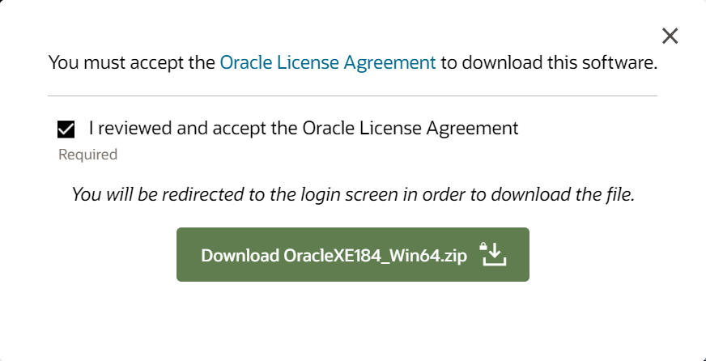

5. Sign in with your Oracle account to complete the download. If you don't already have a free Oracle account, you will need to create one.

    

6. After signing in, the file will download.

7. Unzip the file, and navigate to the `DISK1` folder.

8. Right-click `setup.exe`, and select **Run as administrator**.

    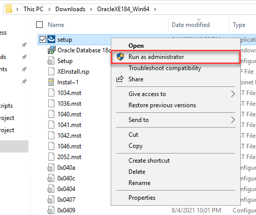

9. Select **Next** to step through each screen of the installer, accepting the license agreement and default values, until you get to the **Specify Database Passwords** screen.

10. On the **Specify Database Passwords** screen, set the password to **Password.1!!**, and select **Next**.

    

11. On the Summary screen, take note of the ports being assigned, and select **Install**.

    

12. Select **Finish** on the final dialog to complete the installation.

### Task 2: Install Oracle Data Access components

In this task, you will download and configure Oracle Data Access components so that you can connect and access to the Northwind database. 

1. On your Lab VM, navigate to <http://www.oracle.com/technetwork/database/windows/downloads/index-090165.html>.

2. On the 64-bit Oracle Data Access Components (ODAC) Downloads page, scroll down and locate the **64-bit ODAC 12.2c Release 1 (12.2.0.1.1) for Windows x64** section, and then select the **ODAC122011_x64.zip** link.

     Downloads screen")

3. Accept the license agreement, and then select **Download ODAC122011_x64.zip**.

    

4. When the download completes, extract the contents of the ZIP file to a local drive.

5. Navigate to the folder containing the extracted ZIP file, and right-click `setup.exe`, then select **Run as administrator** to begin the installation.

6. Select **Next** to accept the default language, English, on the first screen.

7. On the Specify Oracle Home User screen, accept the default, Use Windows Built-in Account, and select **Next**.

8. Accept the default installation locations, and select **Next**.

9. On the **Available Product Components**, uncheck **Oracle Data Access Components Documentation for Visual Studio**, and select **Next**.

    

10. On the ODP.NET screen, check the box for **Configure ODP.NET and/or Oracle Providers for ASP.NET at machine-wide level**, and select **Next**.

    

11. On the DB Connection Configuration screen, enter the following:

    - **Connection Alias**: Northwind
    - **Port Number**: 1521
    - **Database Host Name**: localhost
    - **Database Service Name**: XE

        

    - Select **Next**.

12. If the Next button is disabled on the Perform Prerequisite Checks screen, check the **Ignore All** box, and then select **Next**. This screen will be skipped by the installer if no missing requisites are found.

    

13. On the Summary screen, select **Install**.

14. On the Finish screen, select **Close**.

### Task 3: Install dbForge Fusion tool

In this task, you will install a third-party extension to Visual Studio to enable interaction with, and script execution for, Oracle databases in Visual Studio 2019 Community Edition.

> This step is required because the Oracle Developer Tools extension does not currently work with the Community edition of Visual Studio.

1. On your Lab VM, open a web browser and navigate to <https://www.devart.com/dbforge/oracle/fusion/download.html>.

2. Scroll down on the page, and download a trial of the current version by selecting the blue download link.

    

3. Run the installer.

    >**NOTE**: Close Visual Studio if it is open to complete the installation.

4. Select **Next** on the Welcome screen.

    

5. Select **Next** on each screen, accepting the license agreement and default settings, until reaching the Ready to Install screen.

6. Select **Install** on the Ready to Install screen.

    

7. Select **Finish** when the installation is complete.

### Task 4: Create the Northwind database in Oracle 11g XE

WWI has provided you with a copy of their application, including a database script to create their Oracle database. They have asked that you use this as a starting point for migrating their database and application to Azure Database for PostgreSQL. In this task, you will create a connection to the Oracle database on your Lab VM, and create a database called Northwind.

1. Navigate to the Lab VM and download the starter project by downloading a .zip copy of the Data Platform upgrade and migration project from the GitHub repo.

2. . In a web browser, navigate to the [Data Platform upgrade and migration MCW repo](https://github.com/Microsoft/MCW-Data-Platform-upgrade-and-migration)

3. On the repo page, select **Clone or download**, then select **Download ZIP**.

    

4. Unzip the contents to **C:\handsonlab**.

5. Within the **handsonlab** folder, navigate to the folder `MCW-Data-Platform-upgrade-and-migration-master\Hands-on lab\lab-files\starter-project`, and double-select `NorthwindMVC.sln` to open the project in Visual Studio 2019.

6. If prompted for how you want to open the file, select **Visual Studio 2019**, and select **OK**.

7. Sign in to Visual Studio (or create an account if you don't have one), when prompted.

8. At the Security Warning screen, uncheck **Ask me for every project in this solution**, and select **OK**.

    

9. Once then the solution is open in Visual Studio, select the **Extensions -> Fusion** menu, and then select **New Connection**.

    

10. In the Database Connection properties dialog, set the following values:

    - **Host**: localhost
    - **Port**: Leave 1521 selected.
    - Select **SID**, and enter **XE**.
    - **User**: system
    - **Password**: Password.1!!
    - Check **Allow saving password**.
    - **Connect as**: Normal
    - **Connection Name**: Northwind

    

11. Select **Test Connection** to verify the settings are correct, and select **OK** to close the popup.

12. Select **OK** to create the Database Connection.

13. You will now see the Northwind connection in the Database Explorer window.

    

14. In Visual Studio, select **File** in the menu, then select **Open File**, and navigate to `C:\handsonlab\MCW-Data-Platform-upgrade-and-migration-master\Hands-on lab\lab-files\starter-project\Oracle Scripts\`, select the file `1.northwind.oracle.schema.sql`, and then select **Open**.

    

    > **NOTE**: You may receive a notification that your Fusion trial has expired when you do this. This can be ignored for this hands-on lab. Close that dialog, and continue to the query window that opens in Visual Studio.

15. Select the **Execute** Fusion script button on the Visual Studio toolbar to run the SQL script.

    

16. The results of execution can be viewed in the Output window, found at the bottom left of the Visual Studio window.

    

17. In the Database Explorer window, right-click on the **Northwind** connection, and select **Modify Connection** (If the Database Explorer is not already open, you can open it by selecting Fusion in the menu, then selecting Database Explorer).

    

18. In the **Modify Connection dialog**, change the username and password as follows:

    - **Username**: NW
    - **Password**: oracledemo123

19. Select **Test Connection** to verify the new credentials work.

    

20. Select **OK** to close the Database Connection Properties dialog.

21. Select the **Open File** icon on the Visual Studio toolbar.

    

22. In the Open File dialog, navigate to `C:\handsonlab\MCW-Data-Platform-upgrade-and-migration-master\Hands-on lab\lab-files\starter-project\Oracle Scripts`, select the file `2.northwind.oracle.tables.views.sql`, and then select **Open**.

23. As you did previously, select the **Execute** Fusion script button on the toolbar, and view the results of the execution in the Output pane.

    

24. Repeat steps 26 - 27, replacing the file name in step 26 with each of the following:

    - `3.northwind.oracle.packages.sql`

    - `4.northwind.oracle.sps.sql`

        - During the Execute script step for this file, you will need to execute each CREATE OR REPLACE statement independently.

        - Using your mouse, select the first statement, starting with CREATE and going to END;

        

        - Next, select **Execute Selection** in the Visual Studio toolbar.

        

        - Repeat this for each of the remaining CREATE OR REPLACE... END; blocks in the script file (there are 7 more to execute, for 8 total).

    - `5.northwind.oracle.seed.sql`

        > **Important**: This query can take several minutes to run, so make sure you wait until you see **Execute succeeded** message, followed by **Done: 5.northwind.oracle.seed.sql**, in the output window before executing the next file, like the following:

        

    - `6.northwind.oracle.constraints.sql

## Exercise 2: Assess the Oracle 11g Database before Migrating to PostgreSQL

Duration: 15 mins

In this exercise, you will prepare the existing Oracle database for its migration to PostgreSQL. Preparation involves two main steps. The first step is to update the database statistics. Statistics about the database become outdated as data volumes and activity change over time. Second, you will need to identify invalid objects in the Oracle database. The migration utility will not migrate invalid objects.

### Task 1: Update Statistics and Identify Invalid Objects

1. Create a new folder titled `Postgre Scripts` at the `C:\handsonlab\MCW-Data-Platform-upgrade-and-migration\Hands-on lab\lab-files\starter-project` location.

2. In Visual Studio, access the NW Schema in the Database Explorer. To create a new SQL file, where we will house the updated statements, navigate to the **Create New SQL** button near the top right corner of Visual Studio.

    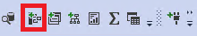

3. Now, you will populate the new file with the following statements:

    ```sql
    -- 11g script
    EXECUTE DBMS_STATS.GATHER_SCHEMA_STATS(ownname => 'NW');
    EXECUTE DBMS_STATS.GATHER_DATABASE_STATS;
    EXECUTE DBMS_STATS.GATHER_DICTIONARY_STATS;
    ```

4. Save the file as `update-llg-stats.sql` in the `C:\handsonlab\MCW-Data-Platform-upgrade-and-migration\Hands-on lab\lab-files\starter-project\Postgre Scripts` directory. Run the file as you did when you created database objects.

    

5. Now, we will utilize a query that lists database objects that are invalid and unsupported by the ora2pg utility. It is recommended to fix any errors and compile the objects before starting the migration process. Create a new file named `show-invalid-objects.sql` and save it in the same directory. Run this query to find all of the invalid objects.

    ```sql
    SELECT owner, object_type, object_name
    FROM all_objects
    WHERE status = 'INVALID';
    ```

6. As you can see, we do not have any invalid objects.

    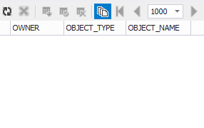

## Exercise 3: Prepare to Migrate the Oracle database to PostgreSQL

Duration: 60 minutes

In this exercise, you will configure Azure Database for PostgreSQL and Azure App Service, install and configure ora2pg and pgAdmin, and create an assessment report that outlines the difficulty of the migration process.

### Task 1: Create Azure Resources

We need to create a PostgreSQL instance and an App Service to host our application. Visual Studio integrates well with Microsoft Azure, simplifying application deployment.

1. Just as you configured resources in **Before the HOL**, you will need to navigate to the **New** page accessed by selecting **+ Create a resource**. Then, navigate to **Databases** under the **Azure Marketplace** section. Select **Azure Database for PostgreSQL**.

    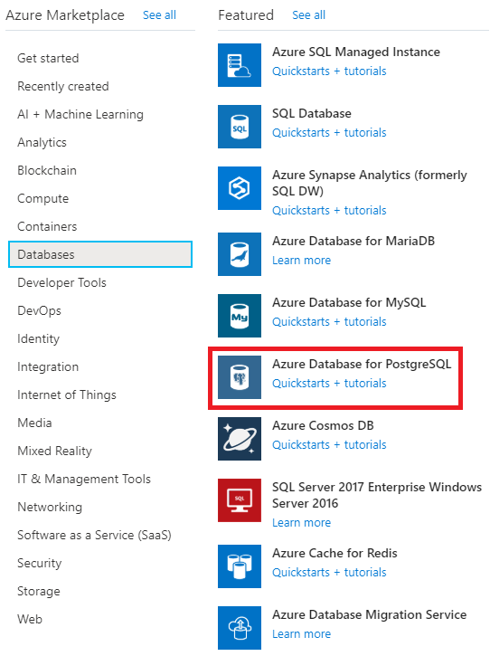

2. There are two deployment options: **Single Server** and **Hyperscale (Citus)**. Single Server is best suited for traditional transactional workloads whereas Hyperscale is best suited for ultra-high-performance, multi-tenant applications. For our simple application, we will be utilizing a single server for our database.

    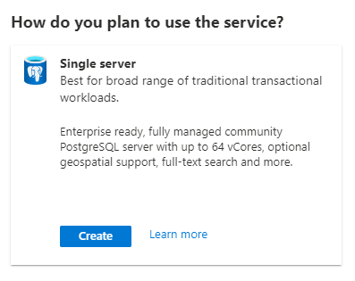

3. Create a new Azure Database for PostgreSQL resource. Use the following configuration values:

   - **Resource group**: (same as Lab VM)
   - **Server name**: Enter a unique server name.
   - **Version**: 11.
   - **Administrator username**: solldba.
   - **Password**: (secure password)

    Select **Review + create** button once you are ready.

    

4. Select **Create** to start the deployment. Once the deployment completes, we will move on to creating an Azure Web App.

5. At the **New** page, navigate to **Web** under **Azure Marketplace**. Select **Web App**.

    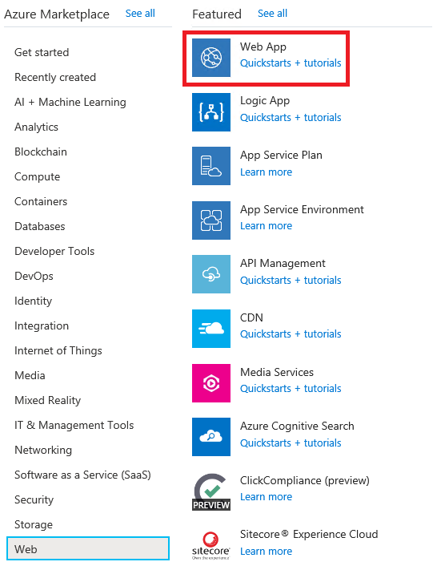

6. Create a new app in your hands-on-lab-SUFFIX resource group. Configure it with the following parameters. Keep all other settings at their default values. Select **Review + create** when you are ready.

    - **Name**: Configure a unique app name (the name you choose will form part of your app's URL).
    - **Runtime stack**: ASP.NET V4.7.
    - **Region**: Must support all necessary resources.

    

7. Select **Create** after reviewing parameters. Once the deployment finishes, navigate to the **App Service** resource you created. Select **Get publish profile** under the resource's **Overview** page.

    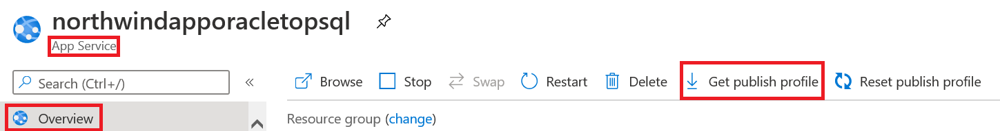

8. Save the file and move it to `C:\handsonlab\MCW-Data-Platform-upgrade-and-migration\Hands-on lab\lab-files\starter-project`. Later, we will need this file to import into Visual Studio for deployment.

9. We need to ensure that Azure supports the version of .NET used in the solution. We will do this by changing the target framework on the solution to **.NET Framework 4.7.2**. Open the NorthwindMVC solution in Visual Studio. Right-click the NorthwindMVC project (not the solution) and select **Properties**. Find the **Target framework:** dropdown menu and select **.NET Framework 4.7.2**.

    

### Task 2: Configure the PostgreSQL server instance

In this task, we will be modifying the PostgreSQL instance to fit our needs.

1. Storage Auto-growth is a feature in which Azure will add more storage automatically when you run out of it. We do not need it for our purposes so we will need to disable it. To do this, locate the PostgreSQL instance you created. Then, under the **Settings** tab, select **Pricing tier**.

    

2. Find the **Storage Auto-growth** switch, and disable the feature. Select **OK** at the bottom of the page to save your change. 

    

3. Now, we need to implement firewall rules for the PostgreSQL database so we can access it. Locate the **Connection security** selector under the **Settings** tab.

    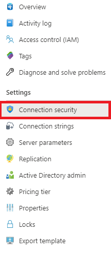

4. We will add an access rule. Since we are storing insecure test data, we can open the 0.0.0.0 to 255.255.255.255 range (all IPv4 addresses). Azure makes this option available. Press the **Save** button at the top of the page once you are ready.

    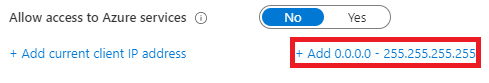

    >**NOTE**: Do not use this type of rule for databases with sensitive data. You are allowing access from any IP address.

### Task 3: Install pgAdmin on the LabVM

pgAdmin greatly simplifies database administration and configuration tasks by providing an intuitive GUI. Hence, we will be using it to create a new application user and test the migration.

1. You will need to navigate to <https://www.pgadmin.org/download/pgadmin-4-windows/> to obtain the latest version of pgAdmin 4, which, at the time of writing, is **v4.22**. Select the link to the installer, as shown below.

    

2. Download the **pgadmin4-4.22-x86.exe** file--not the one with the **.asc** extension.

    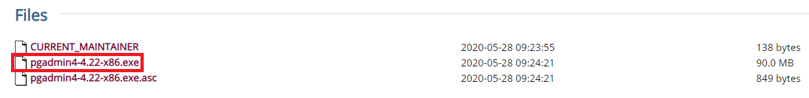

3. Once the installer launches, accept all defaults. Complete the installation steps.

4. The pgAdmin utility will open automatically in the browser.  To open manually, use the Windows Search utility.  Type `pgAdmin`.

   

5. pgAdmin will prompt you to set a password to govern access to database credentials. Enter a password. Confirm your choice. For now, our configuration of pgAdmin is complete.

### Task 4: Install ora2pg

**Ora2pg** is the tool we will use to migrate database objects and data. Microsoft's Data Migration Team has greatly simplified the process of obtaining this tool by providing the **installora2pg.ps1** script. You can download using the link below:

 **Download**: <https://github.com/microsoft/DataMigrationTeam/blob/master/IP%20and%20Scripts/PostgreSQL%20Migration%20and%20Assessment%20Tools/installora2pg.ps1>.

1. Copy Microsoft's script to the `C:\handsonlab\MCW-Data-Platform-upgrade-and-migration\Hands-on lab\lab-files\starter-project\Postgre Scripts` location.

2. Navigate to the location mentioned above and right-click `installora2pg.ps1`. Then, select **Run with PowerShell**.

    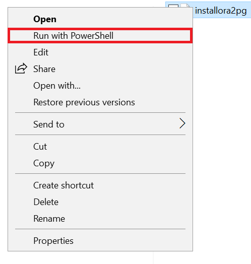

3. Install the ora2pg utility dependencies.
   - Install Perl. It will take five minutes.
   - Install the Oracle client library and SDK. To do this, you will first need to navigate to [Oracle Downloads](https://www.oracle.com/database/technologies/instant-client/winx64-64-downloads.html). Then, scroll to **Version 12.2.X**. Select the installer for the **Basic Package**.
   - Download the zip file.

    

4. On the same Oracle link as above under the **version** section, locate the **SDK Package** installer under the **Development and Runtime - optional packages** section. Keep the zipped file in the Downloads directory.

    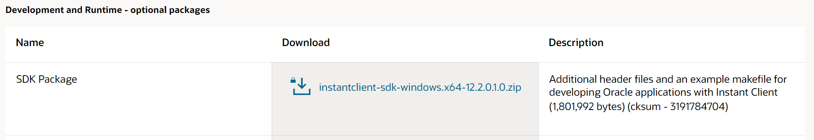

5. Navigate to the directory where the zipped instant client packages reside.
    - For the basic package, right-click it, and select **Extract All...**.
    - When prompted to choose the destination directory, navigate to the `C:\` location.
    - Select **Extract**.
    - Repeat this process for the zipped SDK.

    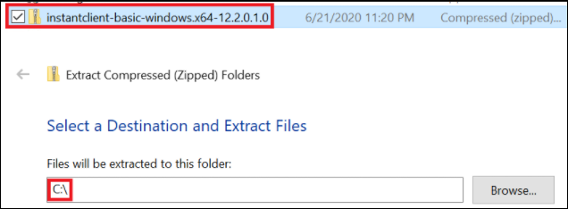

6. Return to the PowerShell script.
    - Press any key to terminate the script's execution.
    - Launch the script once more.
    - If the previous steps were successful, the script should be able to locate **oci.dll** under `C:\instantclient_12_2\oci.dll`.

7. Once ora2pg installs, you will need to configure PATH variables.
    - Search for **View advanced system settings** in Windows.
    - Select the result, and the **System Properties** dialog box should open.
    - By default, the **Advanced** tab should be showing, but if not, navigate to it.
    - Then, select **Environment Variables...**.

    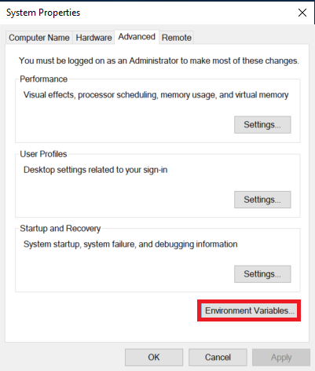

8. Under **System variables**, select **Path**. Select **Edit...**.

    

9. The **Edit environment variable** box should be displaying. 
    - Select **New**.
    - Enter **C:\instantclient_12_2**.
    - Repeat this process, but enter **%%PATH%%** instead.

    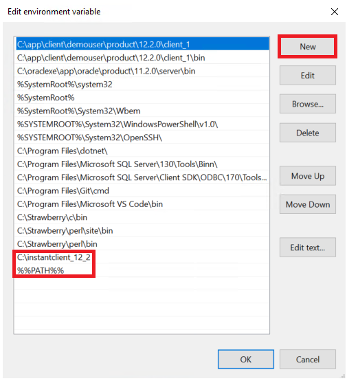

### Task 5: Prepare the PostgreSQL instance using pgAdmin

In this task, we will create the new application user and create the NW database.

1. Launch **pgAdmin** and enter your master password.

2. Under the **Quick Links** section of the Dashboard, there is the option to **Add New Server**. When selected, the **Create - Server** dialog box will open.

3. Under the **General** tab, enter a name for your connection.

    

4. Navigate to the **Connection** tab.
    - You can pull your instance's hostname from the Azure portal (it is available in the resource's overview).
    - For **Username**, enter the admin username available on the instance's overview.
    - For **Password**, enter the admin user password you provided during deployment.
    - Select **Save** when you are ready to connect.

    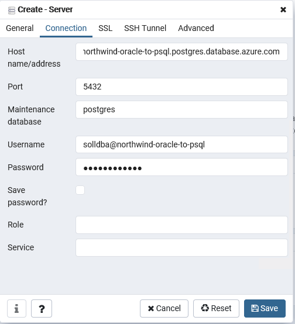

5. If the connection is successful, it should appear under the **Servers** browser dropdown.

    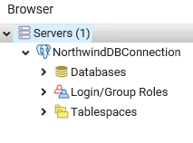

6. Create a new database.
    - Right-click **Databases** under the connection you just created.
    - Select **Create > Database...**.
    - Name your database **NW** and select **Save**.

7. Create a new role, which the application will reference.
    - Under your connection, right-click **Login/Group Roles**.
    - Select **Create > Login/Group Role...**.
    - Name the role **NW**.

8. Under **Definition**, provide a secure password.  

9. Under **Privileges**, change the **Can log in?** slider to the **Yes** position.

    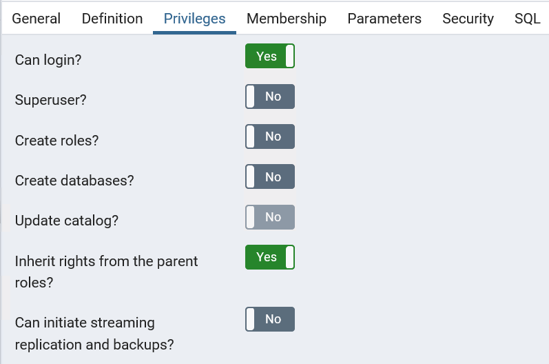

10. Finally, navigate to **Membership**.
    - Select the **Roles** box.
    - Add the **azure_pg_admin** role.
    - Do not select the checkbox next to the role name (this user will not be granting the azure_pg_admin role to others).
    - Select **Save**.

Our configuration in pgAdmin is now complete.

### Task 6: Create an ora2pg project structure

**ora2pg** allows database objects to be exported in multiple files so that is simple to organize and review changes. In this task, you will create the project structure that will make it easy to do this.  

1. Open a command prompt window and navigate to the directory `C:\ora2pg`, where we will create the project structure.

    ```text
    cd C:\ora2pg
    ```

2. To create a project, we will use the ora2pg command with the --init_project flag. In the example below, our migration project is titled nw_migration.

    ```cmd
    ora2pg --init_project nw_migration
    ```

    >**NOTE**: In some cases, ora2pg may fail to find its configuration file. In scenarios such as these, you may need to provide the -c flag with the name of the actual configuration file in your ora2pg directory. For instance, **ora2pg.conf.dist** did not exist in my directory, but the file ora2pg_dist.conf was available.

    ```cmd
    ora2pg -c ora2pg_dist.conf --init_project nw_migration
    ```

3. Verify that the command succeeded. There should be a folder with the same name as your migration project in the C:\ora2pg directory.

    

4. Navigate to the project directory.
    - Locate **config\ora2pg.conf**.
    - Select the file to open it. If you are asked to select an application to open the file, select **Notepad**. We will need to collect multiple parameters of the local Oracle database to enter into the configuration file. These parameters are available by entering **lsnrctl status** into the command prompt.

    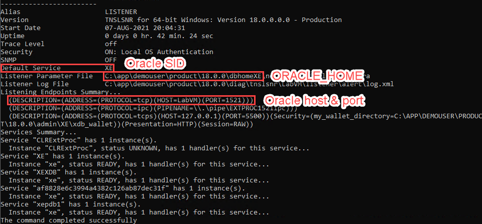

5. In the **config\ora2pg.conf** file, replace the old values in the file with the correct information.

    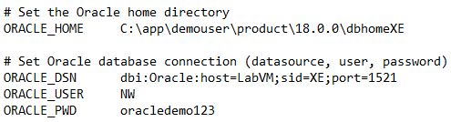

6. Confirm that all information entered is correct. The command below should display the version of your local Oracle database.

    ```cmd
    cd nw_migration
    ora2pg -t SHOW_VERSION -c config\ora2pg.conf
    ```

7. We will also need to populate connection information for our Postgre instance. We will use the role we created in the previous task.

    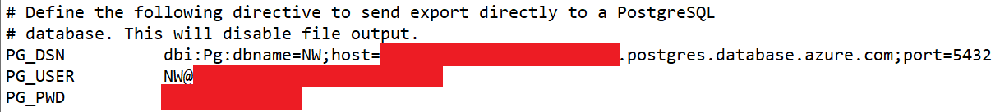

8. Now, specify the schema to migrate. In this scenario, we are migrating the **NW** schema.

    

### Task 7: Create a migration report

The migration report tells us the "man-hours" required to fully migrate to our application and components. The report will provide the user with a relative complexity value. In this task, we will retrieve the migration report for our migration.

1. Navigate to the `C:\ora2pg\nw_migration` directory in command prompt.

2. ora2pg provides a reporting functionality that displays information about the objects in the existing schema and the estimated effort required to ensure compatibility with PostgreSQL. The command below creates a report titled **6-23-report.html** in the reports folder (when executed within the `C:\ora2pg\nw_migration` directory).

    ```cmd
    ora2pg -c config\ora2pg.conf -t SHOW_REPORT --estimate_cost --dump_as_html > reports\6-23-report.html
    ```

    >**NOTE**: The report displays information for the provided schema--in our case, we placed schema information in `config\ora2pg.conf` before executing the command.

    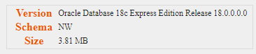

    Of particular interest is the migration level. In our case, it is B-5, which implicates code rewriting, since there are multiple stored procedures which must be altered.

    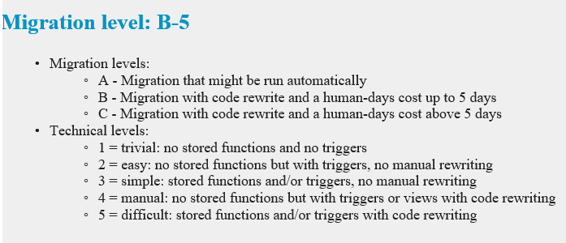

## Exercise 4: Migrate the Database and Application

Duration: 90 minutes

In this exercise, we will begin the migration of the database and the application. This includes migrating database objects, the data, application code, and finally, deploying to Azure App Service.

### Task 1: Migrate the basic database table schema using ora2pg

In this task, we will migrate the database table schema, using ora2pg and psql, which is a command-line utility that makes it easy to run SQL files against the database.

1. Exercise 3 covered planning and assessment steps.  To start the database migration, DDL statements must be created for all valid Oracle objects.

    >**NOTE**: In almost all migration scenarios, it is advised that table, index, and constraint schemas are kept in separate files. For data migration performance reasons, constraints should be applied to the target database only after tables are created and data copied. To enable this feature, open **config\ora2pg.conf** file. Set **FILE_PER_CONSTRAINT**, **FILE_PER_INDEX**, **FILE_PER_FKEYS**, and **FILE_PER_TABLE** to 1.

    

2. Call the following command in the `C:\ora2pg\nw_migration` directory to obtain object schemas (table schemas will be created in a file called **NW-psql.sql**).

    ```cmd
    ora2pg -c config\ora2pg.conf -o NW-psql.sql -t TABLE -b schema\tables\
    ```

    In our scenario, 13 tables are exported. If you see an unreasonably large number, verify that you provided a schema in the configuration file (see step 8 of the previous task). If all was successful, you will see four files in the **schema\tables** directory.

    

    >**NOTE**: Open the **schema\tables\NW-psql.sql** file. Notice that all table names are lowercase--using uppercase names for tables and/or columns will require quotations whenever referenced. Furthermore, ora2pg converts data types fairly well. If you have strong knowledge of the stored data, you can modify types to improve performance. You can export individual table schemas in separate files to facilitate the review.

3. Execute the PostgreSQL commands against the PostgreSQL database. You can use any PostgreSQL database client. One way to execute a SQL file against a PostgreSQL database is through the **psql** utility located at the `C:\Program Files (x86)\pgAdmin 4\v4\runtime` directory. Just as we did in task 4, append this location to the system PATH variable. Note that you will need to restart your command prompt windows for the change to take effect.

    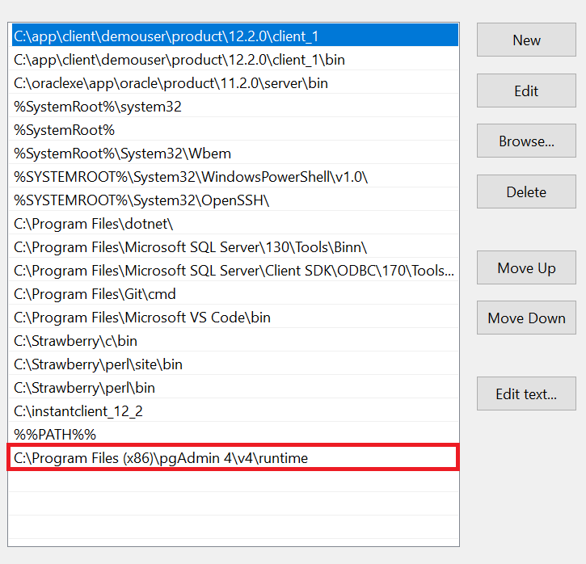

4. Reopen the command prompt in the `C:\ora2pg\nw_migration` directory.
    - Enter the following command to run the **NW-psql.sql** file to create tables in the **NW** database.
    - Enter your database's DNS name as the value passed to the -h flag.
    - If the connection is successful, you will be asked to enter your password.
    - Then, the command prompt should show a sequence of **CREATE TABLE** statements.

    ```cmd
    psql -U NW@[DB Name] -h [DB Name].postgres.database.azure.com -d NW < schema\tables\NW-psql.sql
    ```

### Task 2: Use Azure Database Migration Service to migrate table data

We will be using Azure Database Migration Service to populate our tables with data. In the Before-the-HOL-document, you created the service itself. However, to perform the actual migration, you will need to create a Migration Project, which we will do here. Then, we will then execute the project.

We will first need to give DMS access to our local Oracle database. This will require us to create an inbound port rule for the VM's Network Security Group, and an inbound port rule for the local Windows Defender Firewall.

1. Navigate to the **hands-on-lab-SUFFIX** resource group and select **LabVM-nsg**.

2. Under **Settings**, select **Inbound security rules**.

    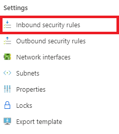

3. Select **+ Add**. Enter the parameters below, and select **Add** at the bottom of the card once you are ready.

    - **Source:** Any.
    - **Source port ranges:** *.
    - **Destination:** Any.
    - **Destination port ranges:** 1521.
    - **Protocol:** TCP.
    - **Action:** Allow.
    - **Priority:** Accept the default value.
    - **Name:** OracleDB.

    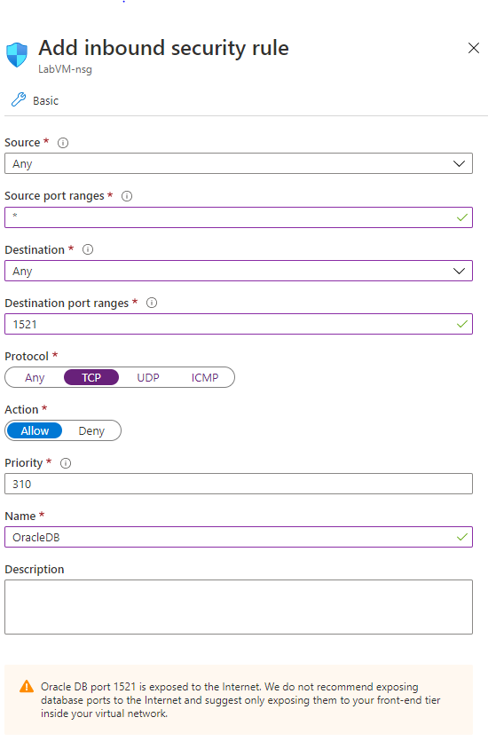

4. Navigate to your Lab VM. Enter **Windows Key + R** (or search for **Run**) and type **WF.msc**. Select **OK** once you are ready.

    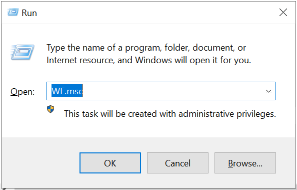

5. Under **Inbound Rules**, select **New Rule...**.

    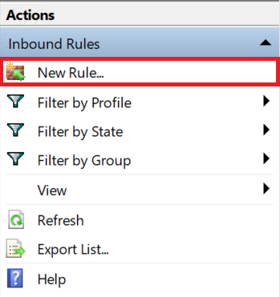

6. Create a **Port** rule.

    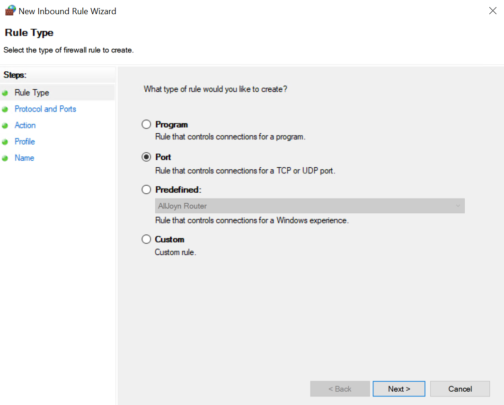

7. Open **TCP** port **1521**.

    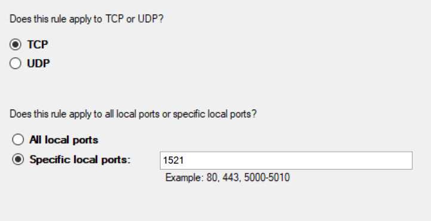

8. Allow the connection. Apply the rule for the **Domain**, **Private**, and **Public** network scenarios. Name the rule **Oracle DB Access DMS**.

9. We will need to enable **TLS 1.0/1.1** support in DMS. Navigate to your Database Migration Service *instance*, and under **Settings**, select **Configuration**.

    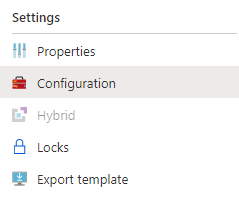

10. Under **Enable connections using TLS 1.0 and 1.1 security protocol**, verify that the slider is set to the **Enabled** position. **Save** the change once you are ready.

    >**NOTE**: A more secure method would be to enable TLS 1.2 on the Oracle instance. Refer to <https://docs.oracle.com/cd/E77767_01/doc.31/E69159/index.htm?toc.htm?209670.htm> to create and populate the correct registry keys.

    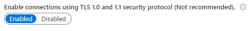

11. Navigate back to your Lab VM. Just as we set environment variables when installing ora2pg in Exercise 3, Task 4, set the following values as **System variables**:

    - **ORACLE_HOME**: C:\oraclexe\app\oracle\product\11.2.0\server. 
    - **ORACLE_SID**: XE.

    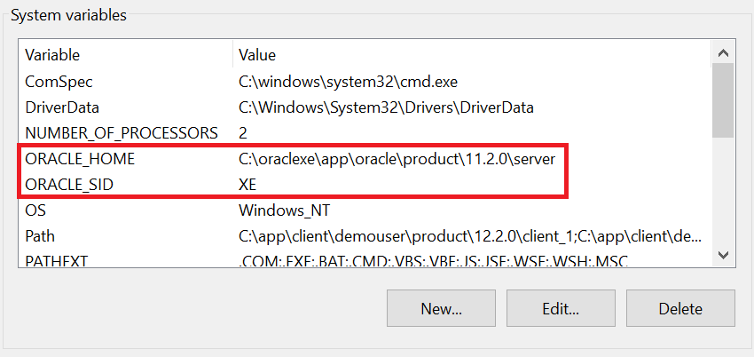

12. Open a new command prompt window. We will access our database with the *sysdba* role.

    ```cmd
    sqlplus / as sysdba
    ```

13. The first feature we will enable is support for Archive Redo Logs. To do this, first shut down the instance.

    ```sql
    SHUTDOWN IMMEDIATE;
    ```

14. When the command returns *ORACLE instance shut down*, enter the following.

    ```sql
    STARTUP MOUNT;
    ```

15. Enable log archiving mode.

    ```sql
    ALTER DATABASE ARCHIVELOG;
    ```

16. Open the database--the shutdown command of step 13 limits additional connections from forming.

    ```sql
    ALTER DATABASE OPEN;
    ```

    >**NOTE**: Run *SELECT log_mode FROM v$database;* If the previous steps were successful, you should see **ARCHIVELOG** as the result.

17. Now, we must enable supplemental logging at the database level. Enter the following command to do so. Since we are doing an online migration, supplemental logging captures changes that have occurred in the source database after migration began.

    ```sql
    ALTER DATABASE ADD SUPPLEMENTAL LOG DATA;
    ```

18. We will also need to enable supplemental logging for row identification information, like a table's primary key (a ROWID cannot be used to perform DML operations on the target). To perform this, enter the following.

    ```sql
    ALTER DATABASE ADD SUPPLEMENTAL LOG DATA (PRIMARY KEY, UNIQUE) COLUMNS;
    ```

    >**NOTE**: There are no tables in our database without a primary key. However, if one of your tables does not have a primary key, run *ALTER TABLE [TABLE NAME] ADD SUPPLEMENTAL LOG DATA (ALL) COLUMNS;*

19. Open `C:\oraclexe\app\oracle\product\11.2.0\server\network\ADMIN\listener.ora` in Notepad. Add the following to the **SID_LIST_LISTENER** list.

    ```text
    (SID_DESC =
      (SID_NAME = XE)
      (ORACLE_HOME = C:\oraclexe\app\oracle\product\11.2.0\server)
    )
    ```

    This is how the list should appear.

    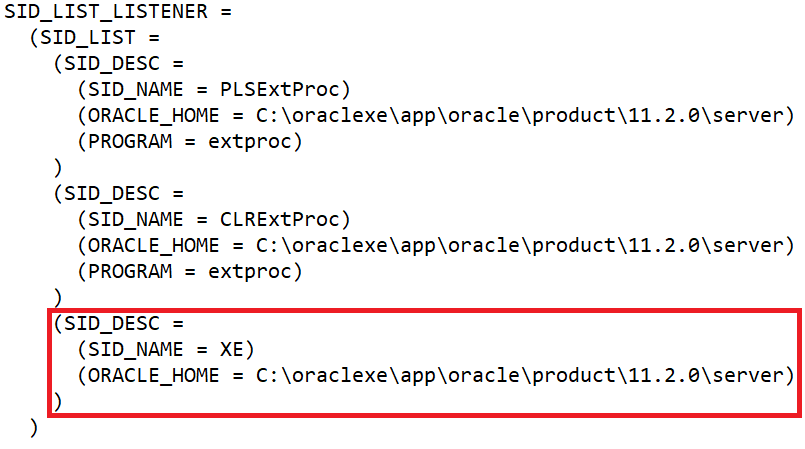

20. After making this change, open a command prompt window and enter the following command to restart the listener service.

    ```cmd
    lsnrctl reload
    ```

21. Open another command prompt and enter **sqlplus**. When prompted for your credentials, enter **NW** as the **user-name** and **oracledemo123** as the **password**. Then, execute each of the commands below, line-by-line. We first create a copy of the EmployeeTerritories table (temp_EmployeeTerritories), remove data from the existing table, change the type of the EmployeeID column of the EmployeeTerritories table to *number(10)*, copy data back into the table, and drop the table copy.

    ```sql
    CREATE TABLE temp_EmployeeTerritories as SELECT * FROM EmployeeTerritories;
    DELETE FROM EmployeeTerritories;
    ALTER TABLE EmployeeTerritories MODIFY EmployeeID number(10);
    INSERT INTO EmployeeTerritories SELECT * FROM temp_EmployeeTerritories;
    DROP TABLE temp_EmployeeTerritories;
    COMMIT;
    ```

22. We will also need to make datatype changes on tables in the PostgreSQL database. To do so, first connect to the instance.

    ```cmd
    psql -U NW@[DB Name] -h [DB Name].postgres.database.azure.com -d NW
    ```

    Then, enter each of the commands below. They will change the type of region.regionid and territories.regionid to *double precision*. Changing types is significantly easier because the region and territories tables do not contain data yet.

    ```sql
    ALTER TABLE region ALTER COLUMN regionid TYPE double precision;
    ALTER TABLE territories ALTER COLUMN regionid TYPE double precision;
    ```

23. Navigate to your wwi-dms-SUFFIX Database Migration Service. Then, in the toolbar, select **+ New Migration Project**.

    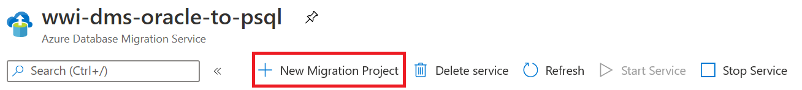

24. Enter the following information about the project. Once you have entered everything, select **Create**.

    - **Project name:** OnPremToAzurePostgreSql.
    - **Source server type:** Oracle.
    - **Target server type:** Azure Database for PostgreSQL.
    - **Choose type of activity:** Select Create project only and select **Save**.

    

25. Navigate to your resource group and select the migration project (OnPremToAzurePostgreSql). Select **+ New Activity** and **Online data migration [preview]**.

26. On the **Add Source Details** page, enter the following parameters. Then, select **Save**

    - **Mode:** Verify that it is **Standard mode**.
    - **Source server name:** Enter the IP address of your Lab VM.
    - **Server port:** Enter **1521**.
    - **Oracle SID:** Enter **XE**.
    - **User Name:** Enter **NW**.
    - **Password:** Type **oracledemo123**.

    >**NOTE**: If Azure fails to connect to your Oracle database, run *lsnrctl status* in command prompt. There should be a listener identified by your VM's hostname (LabVM).

    

27. The Data Migration Service will need the OCI driver to proceed. To do this, navigate to <https://www.oracle.com/database/technologies/instant-client/winx64-64-downloads.html>, and download the `instantclient-basiclite-windows.x64-12.2.0.1.0.zip` package. Verify that it is in your `Downloads` directory.

    >**NOTE**: During the ora2pg installation, you downloaded the Basic version of this package. However, we are downloading the Basic Light Package because it is what Microsoft recommends we use.

28. Right-click your Downloads directory, and select **Properties**. Under **Sharing**, select **Share...** When the **Network acccess** menu opens, simply select **Share** again.

    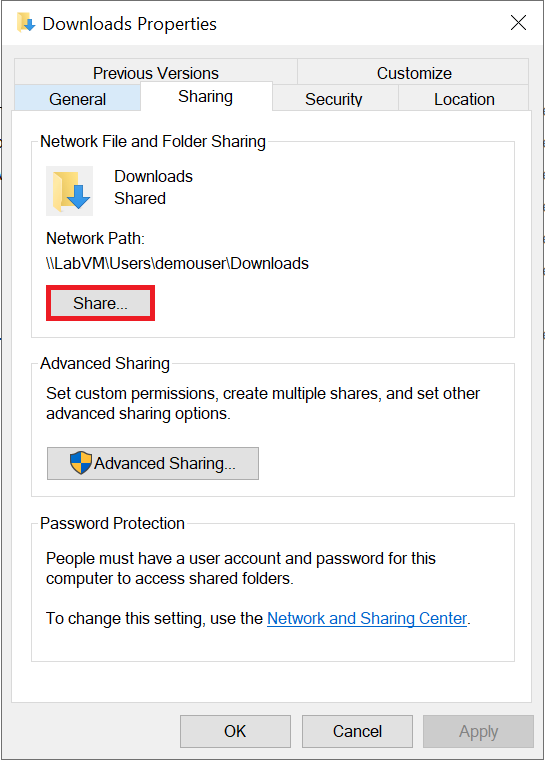

29. We will need to add an inbound port rule for TCP port 445, which is what SMB uses. Navigate to your Lab VM's NSG. **+ Add** an inbound port rule with the following parameters.

    - **Source:** Any
    - **Source port ranges:** *.
    - **Destination:** Any
    - **Destination port ranges:** 445
    - **Protocol:** TCP
    - **Action:** Allow
    - **Priority:** Accept the default value.
    - **Name:** SMB

    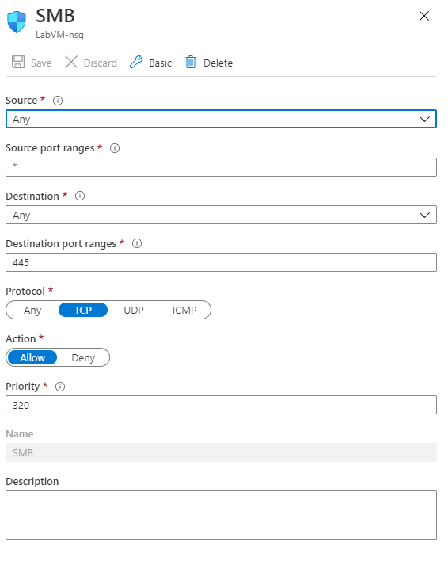

30. On the **Driver install detail** page of the migration project, enter the following parameters. Then, select **Save**.

    - **OCI driver path:** Enter `\\[LAB VM IP ADDRESS]\Users\demouser\Downloads\instantclient-basiclite-windows.x64-12.2.0.1.0.zip`.
  
    - **User Name:** Type **LabVM\demouser**.
    - **Password:** Type **Password.1!!**.

31. You will arrive at the **Migration target details** page. Enter the following parameters. Select **Save** once you are ready to continue.

    - **Target server name:** [DB Name].postgres.database.azure.com.
    - **Default Database:** postgres
    - **User Name:** NW@[DB Name]
    - **Password:** The password of your NW user.

32. At the **Map to target databases** page, verify that the source **NW** schema is being migrated to the **public** schema of the **NW** target database.

    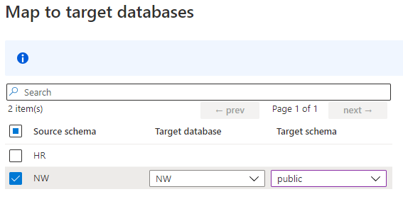

33. You are close. At the **Migration settings** page, expand **NW > Tables 13 of 13**. Verify that each table is correctly mapped to its equivalent in the PostgreSQL database. Select **Save**.

    

34. Finally, at the **Migration summary** page, enter a name for the migration--we will be using **NWOracleToPostgreSQL**--and select **Run migration**.

35. You will be redirected to the running migration activity. Assuming you did everything correctly, you will see **Ready to cutover** under **Migration details** after some time. Note that you may need to **Refresh** multiple times to observe the effect.

    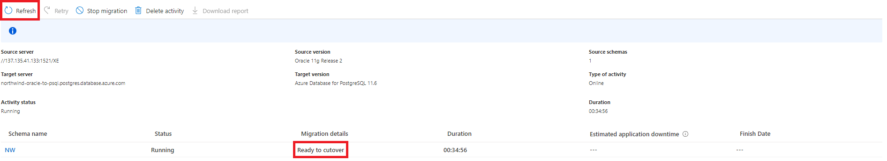

36. Select **NW** below **Schema name**. Then, select **Start Cutover** at the top left corner of the page.

    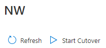

37. **Confirm** the pending changes and **Apply** the cutover. Wait for the cutover to finish.

    

38. Congratulations! You have successfully migrated data into the new database. If you return to the **NW** schema page, and select the **Full load** tab, you will see a count of the number of rows exported from a table in the Oracle database to its equivalent in the PostgreSQL database. This is our result for the first ten migrated tables.

    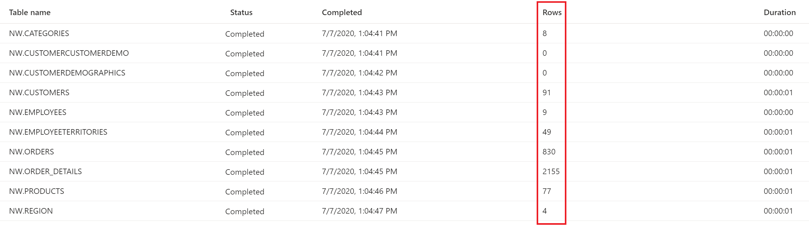

## Task 3: Finishing the table schema migration

We migrated the data before the constraints to reduce the time required to copy data into the tables. In addition, if foreign keys were present on the target tables, data migration would fail. So, in this task, we will add constraints, foreign keys, and indexes to the target tables.

1. Then, layer on constraints (not foreign keys).

    ```cmd
    psql -U NW@[DB Name] -h [DB Name].postgres.database.azure.com -d NW < schema\tables\CONSTRAINTS_NW-psql.sql
    ```

2. Now, Add foreign keys.

    ```cmd
    psql -U NW@[DB Name] -h [DB Name].postgres.database.azure.com -d NW < schema\tables\FKEYS_NW-psql.sql
    ```

3. Next, layer on the indexes.

    ```cmd
    psql -U NW@[DB Name] -h [DB Name].postgres.database.azure.com -d NW < schema\tables\INDEXES_NW-psql.sql
    ```

4. Before migrating views in the next task, let us verify that table data has been properly migrated. Open **pgAdmin** and connect to the database as the NW user. To use **Query Tool**, select **Query Tool** under the **Tools** dropdown.

    

5. Enter the following query into the editor.

    ```sql
    SELECT CONCAT(firstname, ' ', lastname) as name,
       territorydescription
    FROM employees e
     JOIN employeeterritories et ON e.employeeid = et.employeeid
     JOIN territories t ON et.territoryid = t.territoryid;
    ```

6. Now, execute the query by selecting the **execution** button on the toolbar.

    

7. If you were successful, you should see an output similar to the following. Notice the following result set, which consists of 49 rows. It is available under the **Data Output** tab.

    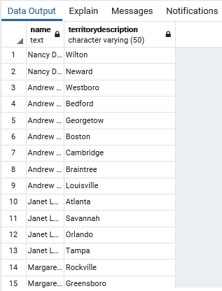

Next, let's take a look at migrating views.

### Task 4: Migrate Views

Views are not referenced by the sample application, but we are including this task here to show you how to do it manually. When we migrate stored procedures, we will show you how to enable an extension that greatly simplifies the migration of objects which reference Oracle-specific functions.  

1. Navigate to the  `C:\ora2pg\nw_migration\schema\views` directory, where we will run ora2pg and psql.

    ```cmd
    cd schema\views
    ora2pg -c ..\..\config\ora2pg.conf -t VIEW -o NW-views.sql
    ```

    >**NOTE**: Views are exported into individual files. The file specified in the command (NW-views.sql) references the individual files.

2. Before we invoke NW-views.sql, we will need to make changes to four files. This is because our application uses a to_date() function that is not supported in PostgreSQL. We will need to replace the command in the code with the equivalent DATE() function in Postgre. First, in **SALES_TOTALS_BY_AMOUNT_NW-views.sql**, replace the existing last line

    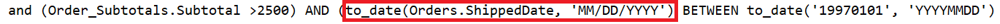

    with this

    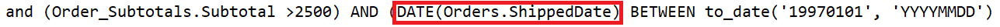

3. In **QUARTERLY_ORDERS_NW-views.sql**, replace the existing last line

    

    with this

    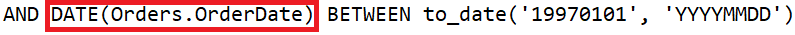

4. In **PRODUCT_SALES_FOR_1997_NW-views.sql**, replace the line before the last

    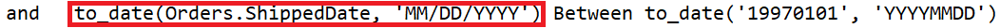

    with this

    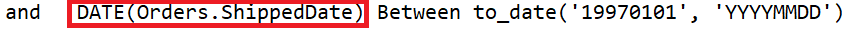

5. Finally, in **SALES_BY_CATEGORY_NW-views.sql**, replace the line before the last

    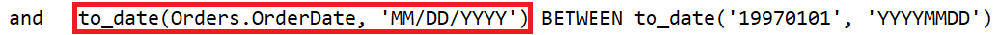

    with this

    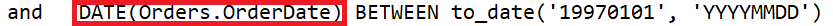

6. Now that all modifications are complete, run the NW-views.sql file in psql.

    ```cmd
    psql -U NW@[DB Name] -h [DB Name].postgres.database.azure.com -d NW < NW-views.sql
    ```

7. With that, we have migrated views.
    - Navigate to the **Query Editor** and test these migrated views.
    - Utilize the query below, which will show data where **productsales** is greater than 5000. You can envision how this would be useful in an organization to identify successful items in a given year (1997).

    ```sql
    SELECT *
    FROM product_sales_for_1997
    WHERE productsales > 5000;
    ```

8. When the query is executed, you should see the following result set, with 42 rows. This shows that we have successfully migrated the views.

    

Let's migrate stored procedures next.

### Task 5: Migrate the Stored Procedure

Our application utilizes a single stored procedure, so we must be able to migrate it. To do this, we will be using the **orafce** extension utility, which provides functions that are compatible with Oracle code. We will then call the procedure and view its results using a refcursor.

1. Only one stored procedure **NW.SALESBYYEAR** is in use by the application. So, we will export this stored procedure from the Oracle database for analysis. Run the command below in `C:\ora2pg\nw_migration`.

    ```cmd
    ora2pg -c config\ora2pg.conf -t PROCEDURE -a SALESBYYEAR -o NW-proc.sql -b schema\procedures\
    ```

2. Open `schema\procedures\NW-proc.sql`. Notice that ora2pg exported the Oracle procedure as a Postgre procedure. In some cases, ora2pg exports procedures as functions. Whether that is acceptable depends on if the object needs to return a value and if transactions must be defined within the object. Note that the exported stored procedure is defined as **SECURITY DEFINER**, removing support for transaction control.

    

    A second detail to keep in mind is NULLs vs. empty strings. In PostgreSQL, they are handled differently. This is a small distinction in Oracle that can be overlooked leading to incomplete query results.

3. We will need to edit the procedure's parameter list, and we can do this by using a refcursor. Replace the existing last parameter of the procedure

    

    with this

    

4. A useful PostgreSQL extension that facilitates greater compatibility with Oracle database objects is **orafce**, which is provided with Azure Database for PostgreSQL. To enable it: navigate to pgAdmin, enter your master password, and connect to your PostgreSQL instance. Then, enter the following command into the query editor and execute it.

    ```sql
    CREATE EXTENSION orafce;
    ```

5. Now, you will need to execute the **NW-proc.sql** file against the PostgreSQL instance.

    ```cmd
    psql -U NW@[DB Name] -h [DB Name].postgres.database.azure.com -d NW < schema\procedures\NW-proc.sql
    ```

6. Execute the following statements. Note that pgAdmin requires that each statement is executed independently.

    ```sql
    BEGIN;
    CALL salesbyyear('1996-01-01'::timestamp, '1999-01-01'::timestamp, 'cur_out');
    FETCH ALL FROM cur_out;
    COMMIT;
    ```

7. If all is successful, 809 rows should be returned. The following is an excerpt from the result set, which can be retrieved by executing the FETCH statement.

    

### Task 6: Create new Entity Data Models and update the application on the Lab VM

In this task, we will be recreating the ADO.NET data models to accurately represent our PostgreSQL database objects. Entity Framework leverages ADO.NET, allowing us to map database objects to classes.  

1. First, install the Entity Framework.

    - Navigate to the Package Manager console and enter the following command:

    ```cmd
    Install-Package EntityFramework
    ```

    

    >**NOTE**: We will be using Devart's dotConnect for PostgreSQL, which is an ADO.NET-compatible PostgreSQL driver. This will allow our application to connect to our Azure PostgreSQL instance.

2. Navigate to <https://www.devart.com/dotconnect/postgresql/download.html>.
    - Locate **dotConnect for PostgreSQL 7.17 Professional Trial**.
    - Select **Get Trial**.

    

3. Unless you have a Devart account, select **Sign-Up**.

    

4. Enter your information and select **Sign-Up**.

    

5. Now, you will be redirected to the downloads page.
    - Select **Download**.
    - Run the executable (no need to save).

6. Accept all defaults until **Select Components**. Unselect **SQL Server Business Intelligence Solutions** and **Samples**.

    

7. Continue to the **Ready to Install** screen. Select **Install**. Select **Finish** once setup has completed.

8. Reopen the Visual Studio solution. We will now modify the web.config file to use the Devart PostgreSQL driver.

    - Under the `<providers>` node below the `<entityFramework>` node, add the following statement. Note that you will need to change the assembly version if you use updated DLLs.

    ```xml
    <provider invariantName="Devart.Data.PostgreSql" type="Devart.Data.PostgreSql.Entity.PgSqlEntityProviderServices, Devart.Data.PostgreSql.Entity.EF6, Version=7.17.1666.0, Culture=neutral, PublicKeyToken=09af7300eec23701" />
    ```

    This is how the `<entityFramework>` section of the file should appear.

    

9. We will need to make another change to Web.config. Under the `<DbProviderFactories>` node below the `<system.data>` node, add the following statements (the second statement should be added as a single line). Again, enter your version of the DLL.

    ```xml
    <remove invariant="Devart.Data.PostgreSql" />
    <add name="dotConnect for PostgreSQL" invariant="Devart.Data.PostgreSql" description="Devart dotConnect for PostgreSQL" type="Devart.Data.PostgreSql.PgSqlProviderFactory, Devart.Data.PostgreSql, Version=7.17.1666.0, Culture=neutral, PublicKeyToken=09af7300eec23701" />
    ```

10. Now, add references to multiple assemblies.
    - Under the **Solution Explorer**, right-click **References**.
    - Select **Add Reference...**.  
    - Locate **Browse** on the left-hand side of the **Reference Manager** dialog box.
    - Select **Browse** at the bottom right corner of the box.

    

11. The first assembly we will need is **Devart.Data.dll**.
    - Navigate to `C:\Windows\assembly\GAC_MSIL\Devart.Data\[DATA DLL ASSEMBLY VERSION]`.
    - Select the DLL.
    - Select **Add**.

    

12. Now, we need **Devart.Data.PostgreSql.dll**.
    - Navigate to `C:\Windows\assembly\GAC_MSIL\Devart.Data.PostgreSql\[PostgreSQL DLL ASSEMBLY VERSION]`.
    - Select the object.
    - Select **Add**.

13. Finally, we need **Devart.Data.PostgreSql.Entity.EF6.dll**.
    - Navigate to `C:\Program Files (x86)\Devart\dotConnect\PostgreSQL\Entity\EF6`.
    - Select the correct DLL.

14. Now, you will need to rebuild the solution. Under **Build**, select **Rebuild Solution**.

    

15. After the solution rebuilds, delete the existing contents of the **Data** folder. Select all items, right-click, and select **Delete**.

16. Then, right-click the **Data** directory in the **Solution Explorer**.

    - Select **Add** and **New Item...**.
    - Then, select **ADO.NET Entity Data Model**.
    - Name it **DataContext**.
    - Finally, select **Add**.

    

17. On the **Choose Model Contents** page, select **Code First from database**.

    

18. On the **Choose Your Data Connection** page, select **New Connection...**.

19. Under the **Connection Properties** window, you will need to change your Data Source to **PostgreSQL Server (dotConnect for PostgreSQL)**.
    - Select **Change**.
    - Choose **PostgreSQL Server** as the **Data source**, and **dotConnect for PostgreSQL** as the **Data provider**.
    - Select **OK**.

    

20. The **Connection Properties** box should open. Enter the DNS name of your Azure PostgreSQL database as the **Host**. Enter **NW@[DB NAME]** as the **User Id**. Provide the user's **Password**. Then, select **Advanced...** at the bottom right corner of the box.

    

21. Navigate to **SSL**. Change **SSLMode** to **Prefer**. Also, under **Source**, change **Database** to **NW** and **Initial Schema** to **public**. Select **OK**.

    

22. Select **Test Connection**, and if the connection fails, verify that you entered all parameters correctly. If the connection succeeds, select **OK**.

23. Back at the **Choose Your Data Connection** page, select **Yes, include the sensitive data in the connection string**. Select **Next >**.

    

24. You will now be presented with the option to choose your desired database objects. Select **Tables**. This should select all tables in the public schema. Select **Finish**.

    

25. If all was successful, the new models should be located under the **Data** directory.

    

26. Since we recommend using lowercase table names in **PostgreSQL**, the resulting model classes are also in lowercase. This poses an issue because of the views and the controllers in our app reference uppercase class names and properties. We will demonstrate how to accommodate for this in the **category** model, the process of which can be repeated for other models.

    >**NOTE:** This action can be avoided if you use Devart's Entity Developer.

27. First, right-click the model file, and select **Properties**.
    - Change **File Name** from **category.cs** to **CATEGORY.cs**.
    - When asked to rename all references, select **Yes**. This action will rename the class and its constructor.

28. Now, we must capitalize property names while respecting the underlying database column names. Observe the inclusion of the data annotation and the uppercase property name. To capitalize a name, highlight it, and locate **Edit [in the top ribbon] > Advanced > Make Uppercase**. If a data annotation is already present, provide the name of the underlying column as the first argument.

    

    >**NOTE:** ICollections do not need to be modified in any way.

29. Finally, navigate to **DataContext.cs**. Capitalize the property names (e.g. convert categories to CATEGORIES). There are multiple other changes you will need to make, mentioned below in the **Additional Notes** section.

    >**Additional Notes**\
        - In EMPLOYEE.cs, capitalize the employee1 property, but do not provide a column attribute\
        - In ORDER.cs, do not capitalize or provide an attribute for any properties following SHIPCOUNTRY\
        - In ORDER_DETAILS.cs, do not capitalize and do not provide column attributes for the order and product properties\
        - In PRODUCT.cs, capitalize the category and supplier properties but do not provide attributes. Also, do not use CATEGORY as the property name--instead, write CATEGORy\
        - In TERRITORY.cs, do not capitalize or provide an attribute for any properties following REGIONID\
        - When in doubt if a column exists in the database, check the table schema created by ora2pg. Any columns in the database will require an attribute\
        **DataContext.cs changes:**\
            - Modify e.employee1 to e.EMPLOYEE1 (line 36)\
            - Modify e.reportsto to e.REPORTSTO (line 37)\
            - Replace e.unitprice with e.UNITPRICE (line 45)\
            - Replace e.freight with e.FREIGHT (line 49)\
            - Replace e.shipvia with e.SHIPVIA (line 74)

30. Navigate to **HomeController.cs**. Replace the existing contents of the file with the following.

    ```csharp
    using System.Data;
    using System.Data.SqlClient;
    using System.Linq;
    using System.Web.Mvc;
    using NorthwindMVC.Data;
    using NorthwindMVC.Models;
    using Oracle.ManagedDataAccess.Client;
    using Oracle.ManagedDataAccess.Types;
    using Devart.Data.PostgreSql;
    using System;
    using System.Collections.Generic;

    namespace NorthwindMVC.Controllers
    {
        public class HomeController : Controller
        {
            private DataContext db = new DataContext();

            public ActionResult Index()
            {
                // Oracle
                //var salesByYear = this.db.Database.SqlQuery<SALESBYYEAR>(
                //    "BEGIN NW.SALESBYYEAR(:P_BEGIN_DATE, :P_END_DATE, :CUR_OUT); END;",
                //    new OracleParameter("P_BEGIN_DATE", OracleDbType.TimeStamp, new OracleTimeStamp(1996, 1, 1),
                //                         ParameterDirection.Input),
                //    new OracleParameter("P_END_DATE", OracleDbType.TimeStamp, new OracleTimeStamp(1999, 12, 31),
                //                         ParameterDirection.Input),
                //    new OracleParameter("CUR_OUT", OracleDbType.RefCursor, ParameterDirection.Output)).ToList();

                //var salesByYear = this.db.Database.SqlQuery<SALESBYYEAR>(
                //    "exec [NW].[SALESBYYEAR] @p_begin_date, @p_end_date ",
                //    new SqlParameter("p_begin_date", "1996-1-1"),
                //    new SqlParameter("p_end_date", "1999-1-1")).ToList();

                // Create the command on the existing connection
                PgSqlConnection connection = (PgSqlConnection)this.db.Database.Connection;
                PgSqlCommand spCommand = connection.CreateCommand();
                PgSqlParameter p_begin_date, p_end_date, cur_OUT;

                spCommand.CommandText = "salesbyyear";
                spCommand.CommandType = CommandType.StoredProcedure;

                p_begin_date = spCommand.Parameters.Add("p_begin_date", PgSqlType.TimeStamp);
                p_end_date = spCommand.Parameters.Add("p_end_date", PgSqlType.TimeStamp);
                // cur_OUT will be cast to a PgSqlCursor later on
                cur_OUT = spCommand.Parameters.Add("cur_OUT", PgSqlType.VarChar);

                p_begin_date.Direction = ParameterDirection.Input;
                p_end_date.Direction = ParameterDirection.Input;
                // There are no OUT parameters in PostgreSQL -- just INOUT
                cur_OUT.Direction = ParameterDirection.InputOutput;

                connection.Open();

                spCommand.Prepare();

                p_begin_date.Value = new PgSqlTimeStamp(DateTime.Parse("Jan 1, 1996"));
                p_end_date.Value = new PgSqlTimeStamp(DateTime.Parse("Jan 1, 1999"));

                // The cursor is only accessible within the transaction in which its stored procedure is executed
                PgSqlTransaction t = connection.BeginTransaction();

                spCommand.ExecuteNonQuery();

                PgSqlCursor cursor = cur_OUT.PgSqlValue as PgSqlCursor;
                PgSqlDataReader dataReader = cursor.GetDataReader();

                List<SALESBYYEAR> salesByYear = new List<SALESBYYEAR>();

                while (dataReader.Read())
                {
                    SALESBYYEAR yearlySales = new SALESBYYEAR();
                    yearlySales.ShippedDate = (DateTime)dataReader.GetValue(0);
                    yearlySales.ORDERID = Convert.ToDecimal(dataReader.GetValue(1));
                    yearlySales.SUBTOTAL = Convert.ToDecimal(dataReader.GetValue(2));
                    yearlySales.YEAR = Convert.ToInt32(dataReader.GetValue(3));

                    salesByYear.Add(yearlySales);
                }

                var model = from r in salesByYear
                            orderby r.YEAR
                            group r by r.YEAR into grp
                            select new SalesByYearViewModel { Year = grp.Key, Count = grp.Count() };

                // Evaluates the LINQ query -- we want to pass data to our view
                List<SalesByYearViewModel> data = model.ToList<SalesByYearViewModel>();

                dataReader.Close();

                t.Commit();

                connection.Close();

                return this.View(data);
            }
        }
    }
    ```

31. We will unpack the contents of this controller.
    - First, we attach to the existing database connection and prepare to call the stored procedure by defining parameters. Since the stored procedure does not return data directly, we reference a refcursor (cur_OUT in the script), which allows us to extract data row by row (hence the while loop).
    - We then define and execute a LINQ query, which encapsulates its results in objects of type SalesByYearViewModel.
    - After this, we close the DataReader (which allows us to pull data from the refcursor), commit the transaction, close the connection, and display the `Home\Index.cshtml` view.

32. Open the file, `SALESBYYEAR.cs`, in the **Models** folder in **Solution ExplorerI**.

    

33. Change the types of the following properties:
    - Change the `SUBTOTAL` property from double to decimal.
    - Change the `YEAR` property from string to int.

    

34. Save the file.

35. Open the `SalesByYearViewModel.cs` file from the Models folder in the Solution Explorer.

    

36. Change the type of the `YEAR` property from string to int, then save the file.

    

37. Run the solution by selecting the green Start button on the toolbar.

    

38. If you were successful, the application should launch locally in Internet Explorer.

    

### Task 7: Deploy the application to Azure

We will deploy our built application to be served by IIS running in our Azure App Service instance. We will make use of the publish profile that we downloaded previously.

1. Devart's dotConnect has licensing agreements that must be met before deployment.
    - Select **License Information...** under **Tools > PostgreSQL**. The following wizard will open.
    - Select **Fix**.

    

2. Select **Next >** until you reach **Execute**. A **licenses.licx** file will be created, which contains information about **Devart.Data.PostgreSql**,**PgSqlConnection.dll**, and **Devart.Data.PostgreSql.dll**.

    

3. Select the option to **Rebuild Application** and then select **Finish**.

    

4. If you relaunch the wizard, another fix will have to be done, since **dotConnect** must know which applications and libraries reference its DLLs. Again, select **Fix**.

    

5. At the **Specify which executables are allowed to use the class library** page, **Add** *NorthwindMVC.dll* and *w3wp.exe*, the IIS worker process which serves requests. A new file titled licenses.config will be created with these details. Select **Next >**.

    

6. Again, select **Execute** and rebuild the service.

7. In Visual Studio's Solution Explorer, right-click the **NorthwindMVC** project (not the solution) and select **Publish...**.

8. The **Publish** window should open. Select **Import Profile**. Select **Next**.

    

9. Select **Browse** to locate the **Publish settings file**. Earlier, we saved our publish profile in `C:\handsonlab\MCW-Data-Platform-upgrade-and-migration\Hands-on lab\lab-files\starter-project` as `northwindapporacletopsql.PublishSettings`. Select **Finish**.

    

10. Verify that your app is published using the **Web Deploy** method. If so, accept the remaining settings and select **Publish**.

    

11. First, your application will build. Then, all relevant files will be copied and organized on the host such that all relevant assets are served to the client.

12. Once the build completes, navigate to your app's link. All operations will work as expected.

    

## After the hands-on lab

Duration: 10 mins

In this exercise, you will delete any Azure resources that were created in support of the lab. You should follow all steps provided after attending the Hands-on lab to ensure your account does not continue to be charged for lab resources.

### Task 1: Delete the resource group

1. Using the [Azure portal](https://portal.azure.com), navigate to the Resource group you used throughout this hands-on lab by selecting Resource groups in the left menu.

2. Search for the name of your research group, and select it from the list.

3. Select Delete in the command bar, and confirm the deletion by re-typing the Resource group name, and selecting Delete.

You should follow all steps provided after attending the Hands-on lab.
